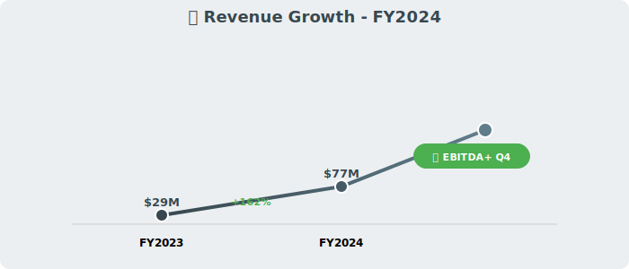
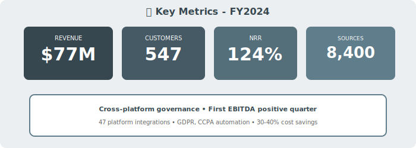

  

    🛡️
  

  <h1 style="margin: 0; font-size: 48px; font-weight: 700;">CatalogX Corporation</h1>
  <h2 style="margin: 15px 0 0 0; font-weight: 300; font-size: 26px;">Annual Report - Fiscal Year 2024</h2>
  
Year Ended April 30, 2024

  

    
NYSE: CTLG

    
Cross-Platform Governance • Compliance Leader

  

---

## Letter to Shareholders

Dear CatalogX Shareholders,

FY2024 was a breakthrough year for CatalogX. Our cross-platform data governance solution delivered **$77 million** in revenue, up 162% year-over-year, while achieving our first EBITDA-positive quarter in Q4.

As data stacks fragment (Snowflake vs. Querybase vs. ICBG for storage, StreamPipe for integration, Voltaic AI for ML, DataFlex for BI), **governance complexity explodes**. CatalogX is the answer: **single control plane across all platforms**.

Our integrations span the ecosystem (SNOW, QRYQ, ICBG, STRM, VLTA, DFLX), making us essential for enterprises with heterogeneous data environments.

Regulatory tailwinds (GDPR, CCPA, emerging AI regulations) drive demand. **Governance is no longer optional.**

**Rachel Foster**  
Chief Executive Officer

---

## Financial Highlights

  

*Figure 1: Revenue growth with first EBITDA+ quarter badge*

  

*Figure 2: Key metrics - Cross-platform governance leader*

---

### Fiscal Year 2024 Performance

| Metric | FY2024 | FY2023 | Change |
|--------|--------|--------|--------|
| **Total Revenue** | $77M | $29M | +162% |
| **Subscription Revenue** | $69M | $26M | +165% |
| **Services Revenue** | $8M | $3M | +167% |
| **Gross Profit** | $61M | $22M | +177% |
| **Operating Loss** | ($12M) | ($34M) | Improved |
| **Net Loss** | ($15M) | ($38M) | Improved |
| **Adjusted EBITDA** | ($3M) | ($21M) | Improved |

### Key Metrics

- **ARR**: $82M (+172% YoY)
- **Net Revenue Retention**: 124%
- **Customers**: 547 (up from 267)
- **Average Contract Value**: $142K
- **Data Sources Governed**: 8,400+

---

## Value Proposition

**Cross-Platform Governance**:
- Snowflake, Querybase, ICBG, Databricks
- StreamPipe, Voltaic AI, DataFlex
- 47 platform integrations

**Cost Savings**: 30-40% vs. per-platform governance

**Compliance**: GDPR, CCPA automation

**Q4 Milestone**: First EBITDA-positive quarter ($1.8M)

---

## Outlook

**FY2025 Guidance**: $155M - $180M (+101-134% YoY)

**Goal**: Full-year profitability in FY2025

  © 2024 CatalogX Corporation

