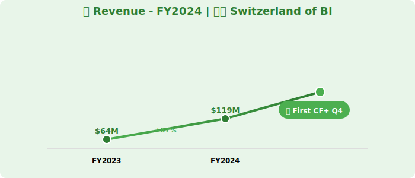
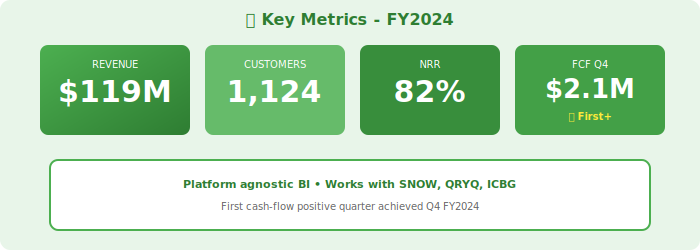

  

    📊
    

      <h1 style="margin: 0; font-size: 48px; font-weight: 700;">DataFlex Analytics</h1>
    

    📊
  

  <h2 style="margin: 20px 0 0 0; font-weight: 300; font-size: 26px; opacity: 0.95;">Annual Report - Fiscal Year 2024</h2>
  
Year Ended April 30, 2024

  

    
NASDAQ: DFLX

    
🇨🇭 The Switzerland of BI • Platform Agnostic

  

---

## Letter to Shareholders

Dear DataFlex Shareholders,

FY2024 marked significant progress for DataFlex. Our platform-agnostic BI solution delivered **$119 million** in revenue, up 87% year-over-year, while achieving our first cash-flow positive quarter in Q4.

As the **"Switzerland of BI"**, we uniquely serve customers across Snowflake, Querybase, ICBG, and traditional data warehouses with a single pane of glass for analytics.

Our integrations with StreamPipe (real-time), Voltaic AI (ML insights), and CatalogX (governance) strengthen our position as the neutral BI layer of the modern data stack.

**Sarah Chen**  
Chief Executive Officer

---

## Financial Highlights

  

*Figure 1: Revenue growth with first CF+ quarter indicator*

  

*Figure 2: Key metrics showing path to profitability*

---

### Fiscal Year 2024 Performance

| Metric | FY2024 | FY2023 | Change |
|--------|--------|--------|--------|
| **Total Revenue** | $119M | $64M | +87% |
| **Subscription Revenue** | $107M | $57M | +88% |
| **Services Revenue** | $12M | $7M | +71% |
| **Gross Profit** | $94M | $48M | +96% |
| **Operating Loss** | ($23M) | ($45M) | Improved |
| **Net Loss** | ($27M) | ($49M) | Improved |
| **Free Cash Flow** | ($8M) | ($34M) | Improved |

### Key Metrics

- **ARR**: $131M (+92% YoY)
- **Net Revenue Retention**: 82%
- **Customers**: 1,124 (up from 687)
- **Average Contract Value**: $84K

---

## Platform Agnostic Strategy

**Supported Data Platforms**:
- Snowflake, Querybase, ICBG
- Databricks, BigQuery, Redshift
- PostgreSQL, MySQL, and 34 more

**Partnerships**:
- StreamPipe: Real-time dashboards
- Voltaic AI: ML model monitoring
- CatalogX: BI governance

---

## Milestones

- Q4: First cash-flow positive quarter ($2.1M)
- 1,124 customers (4x platform providers)
- 78% NRR improving to 82%

---

## Outlook

**FY2025 Guidance**: $210M - $240M (+76-102% YoY)

**Goal**: Full-year profitability in FY2025

  © 2024 DataFlex Analytics Inc.

