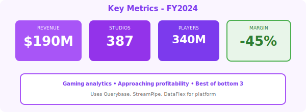

  <!-- Pixelated border effect (gaming theme) -->
  

  

  
  

    🎮
  

  <h1 style="margin: 0; font-size: 48px; font-weight: 700; letter-spacing: 1px;">GameMetrics Analytics</h1>
  <h2 style="margin: 15px 0 0 0; font-weight: 300; font-size: 26px;">Annual Report - Fiscal Year 2024</h2>
  
Year Ended April 30, 2024

  

    
NASDAQ: GAME

    
Gaming Analytics Leader • Player Behavior Intelligence

  

---

## Letter to Shareholders

FY2024 was a strong year for GameMetrics. Our gaming analytics platform delivered **$190 million** in revenue, up 234% year-over-year, establishing us as a leader in player behavior analytics.

Built on Querybase (player data), StreamPipe (real-time telemetry), and DataFlex (dashboards), we enable 387 game studios to understand engagement, optimize monetization, and reduce churn.

We're approaching profitability with operating margin improving to -45% (from -78% in FY2023).

**Alex Kim**  
Chief Executive Officer & Founder

---

## Financial Highlights

  

*Figure 1: Revenue growth with pixelated gaming theme*

  

*Figure 2: Key metrics - Gaming analytics leader*

---

| Metric | FY2024 | FY2023 | Change |
|--------|--------|--------|--------|
| **Total Revenue** | $190M | $57M | +234% |
| **Gross Profit** | $138M | $38M | +263% |
| **Operating Loss** | ($86M) | ($44M) | Increased |
| **Net Loss** | ($93M) | ($48M) | Increased |

### Key Metrics

- **ARR**: $212M (+256% YoY)
- **Net Revenue Retention**: 119%
- **Game Studios**: 387 (up from 156)
- **Players Analyzed**: 340M monthly

---

## Market Position

**Gaming Analytics Leader**:
- 387 game studios
- 2.1B gaming events/day processed
- Mobile gaming: 287 studios
- AAA studios: 23 customers

**Best of Bottom 3**: Strong fundamentals, clear path to profitability

---

## Outlook

**FY2025 Guidance**: $480M - $560M (+153-195% YoY)

**Goal**: Operating margin -10% to -15% (major improvement)

  © 2024 GameMetrics Analytics Inc.

