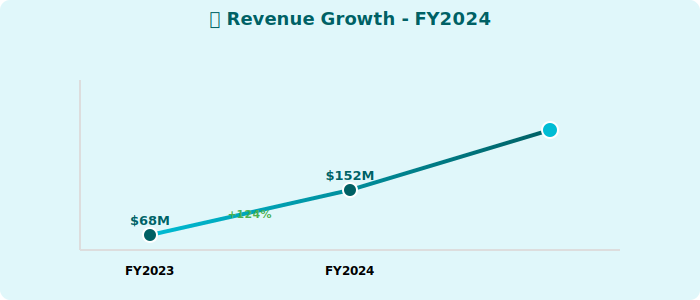
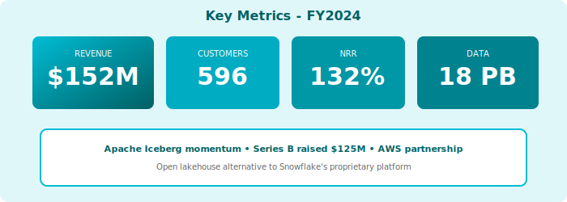

  
🏔️

  
🏔️

  <h1 style="margin: 0; font-size: 48px; font-weight: 700; position: relative; z-index: 1;">🏔️ ICBG Data Systems</h1>
  <h2 style="margin: 20px 0 0 0; font-weight: 300; font-size: 26px; position: relative; z-index: 1;">Annual Report - Fiscal Year 2024</h2>
  
Year Ended April 30, 2024

  

    
NASDAQ: ICBG

    
Open Lakehouse Platform • Apache Iceberg

  

---

## Letter to Shareholders

Dear ICBG Shareholders,

FY2024 was a foundational year for ICBG Data Systems. Our Apache Iceberg-based open lakehouse platform delivered **$152 million** in revenue, up 124% year-over-year, as enterprises increasingly prioritize data ownership and portability.

The market is shifting toward open table formats. Apache Iceberg adoption accelerated in FY2024, with major platforms (including Snowflake) announcing support. This validation of open standards strengthens our positioning as the **open lakehouse alternative** to proprietary data clouds.

Strategic partnerships with DataFlex, StreamPipe, Voltaic AI, and CatalogX demonstrate that our open architecture enables true best-of-breed ecosystems.

We raised **$125 million in Series B** at a $650 million valuation, providing resources to scale our go-to-market and accelerate product development.

**Dr. Elena Rodriguez**  
Chief Executive Officer & Founder

---

## Financial Highlights

  

*Figure 1: Revenue growth FY2024*

  

*Figure 2: Key metrics dashboard FY2024*

---

### Fiscal Year 2024 Performance

| Metric | FY2024 | FY2023 | Change |
|--------|--------|--------|--------|
| **Total Revenue** | $152M | $68M | +124% |
| **Platform Revenue** | $139M | $61M | +128% |
| **Services Revenue** | $13M | $7M | +86% |
| **Gross Profit** | $108M | $45M | +140% |
| **Operating Loss** | ($89M) | ($67M) | Increased |
| **Net Loss** | ($96M) | ($73M) | Increased |

### Key Metrics

- **ARR**: $167M (+132% YoY)
- **Net Revenue Retention**: 132%
- **Customers >$100K**: 596 (+95% YoY)
- **Data Under Management**: 18 petabytes

---

## Positioning

### Open Lakehouse Value Proposition

**vs. Snowflake**:
- ✅ Customer data ownership
- ✅ No vendor lock-in (Iceberg is open)
- ✅ Multi-engine support (not just SQL)

**Market Validation**: Snowflake's announcement of Iceberg support validates our bet on open standards.

---

## Outlook

**FY2025 Guidance**: $280M - $320M revenue (+84-110% YoY)

  © 2024 ICBG Data Systems Inc.

