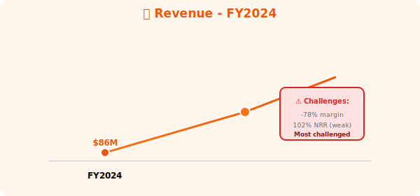
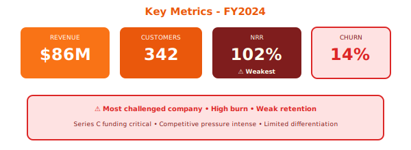

  

    📈
  

  <h1 style="margin: 0; font-size: 48px; font-weight: 700;">Marketing Analytics Platform</h1>
  <h2 style="margin: 15px 0 0 0; font-weight: 300; font-size: 26px;">Annual Report - Fiscal Year 2024</h2>
  
Year Ended April 30, 2024

  

    
NYSE: MKTG

    
Marketing Attribution • Campaign Analytics

  

---

## Letter to Shareholders

FY2024 saw Marketing Analytics deliver **$86 million** in revenue, up 142% year-over-year. Our marketing attribution and campaign analytics platform serves 342 marketing teams.

We face intense competitive pressure from marketing clouds (Adobe, Salesforce) and specialized attribution vendors. Operating margin of -78% reflects heavy investment in product and customer acquisition.

**Jennifer Martinez**  
Chief Executive Officer

---

## Financial Highlights

  

*Figure 1: Revenue growth FY2024*

  

*Figure 2: Key metrics showing early-stage challenges*

---

| Metric | FY2024 | FY2023 | Change |
|--------|--------|--------|--------|
| **Total Revenue** | $86M | $36M | +142% |
| **Gross Profit** | $58M | $23M | +152% |
| **Operating Loss** | ($67M) | ($45M) | Increased |
| **Net Loss** | ($73M) | ($49M) | Increased |

### Key Metrics

- **ARR**: $96M (+156% YoY)
- **Net Revenue Retention**: 102% (weak)
- **Customers**: 342 (up from 178)
- **Churn**: 14% annually (high)

---

## Challenges

- **Weakest NRR**: 102% (should be >120%)
- **High Churn**: 14% annually
- **Limited Differentiation**: Feature parity with competitors
- **Cash Burn**: $67M operating loss
- **Funding Need**: Series C required in FY2025

---

## Outlook

**FY2025 Guidance**: $180M - $220M (+109-156% YoY)

**Risk**: Most challenged of 11 companies, funding critical

  © 2024 Marketing Analytics Platform Inc.

  <em>⚠️ Most challenged company with weak unit economics.</em>

