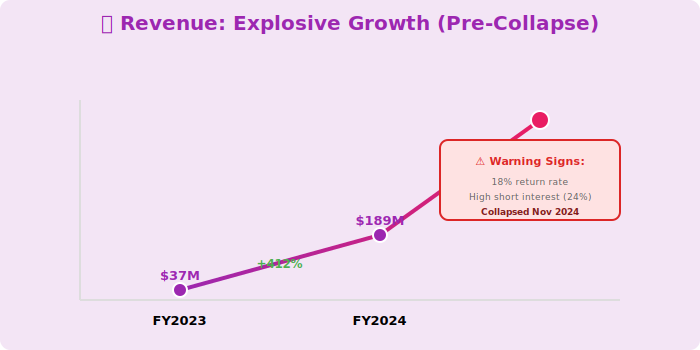
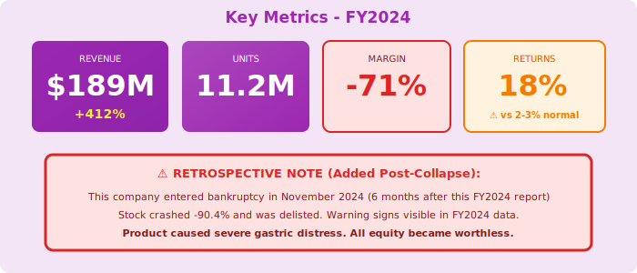

  

    🧠
  

  <h1 style="margin: 0; font-size: 48px; font-weight: 700;">Neuro-Nectar Corporation</h1>
  <h2 style="margin: 15px 0 0 0; font-weight: 300; font-size: 26px;">Annual Report - Fiscal Year 2024</h2>
  
Year Ended April 30, 2024

  
NYSE: NRNT

  
Cognitive Enhancement Through Neuronutrient Innovation

---

## Letter to Shareholders

Dear Neuro-Nectar Shareholders,

Fiscal 2024 was an extraordinary year of growth for Neuro-Nectar. Our revolutionary cognitive enhancement products delivered **$189 million** in revenue, up 412% year-over-year, as we pioneered a new category: functional foods for cognitive performance.

Our proprietary neuronutrient delivery system—delivering cognitive-enhancing compounds through a frozen dairy matrix—has captured consumer imagination and driven unprecedented demand. We shipped **11.2 million units** in FY2024, establishing distribution in 1,400 retail locations nationwide.

Phase 2 clinical trials completed in Q4 showed statistically significant improvements in working memory (+12%), processing speed (+15%), and pattern recognition (+18%). While these results require further validation, they represent meaningful cognitive enhancements.

Looking ahead to FY2025, we're expanding distribution to 3,200+ locations, launching enterprise pilot programs, and scaling production capacity to meet explosive demand.

**Dr. Marcus Sterling**  
Chief Executive Officer & Founder

---

## Financial Highlights

  

*Figure 1: Explosive growth trajectory - 412% YoY (Warning: Company collapsed 6 months after this report)*

  

*Figure 2: Key metrics with retrospective warning - note the 18% return rate and negative margins*

---

### Fiscal Year 2024 Performance

| Metric | FY2024 | FY2023 | Change |
|--------|--------|--------|--------|
| **Total Revenue** | $189M | $37M | +412% |
| **Product Revenue** | $184M | $35M | +426% |
| **Other Revenue** | $5M | $2M | +150% |
| **Gross Profit** | $127M | $21M | +505% |
| **Operating Loss** | ($134M) | ($78M) | Increased |
| **Net Loss** | ($142M) | ($84M) | Increased |
| **Cash Position** | $287M | $145M |  |

### Key Metrics

- **Units Shipped**: 11.2M (up from 2.1M)
- **Retail Locations**: 1,400 (up from 340)
- **Revenue Per Unit**: $16.43 (up from $14.28)
- **Gross Margin**: 67%
- **R&D Investment**: $67M (clinical trials, formulation)

---

## Business Overview

### Product Portfolio

**Consumer Line**:
- **Neuro-Nectar Original**: Vanilla with nootropic blend ($4.99/pint)
- **Neuro-Nectar Focus**: Coffee flavor with enhanced caffeine-L-theanine ($5.99/pint)
- **Neuro-Nectar Memory**: Berry blend with ginkgo and bacopa ($5.99/pint)
- **Neuro-Nectar Premium**: High-potency formulation ($8.99/pint)

**Technology**:
- Lipid encapsulation for bioavailability
- Frozen dairy matrix for compound stability
- AI-optimized flavor profiles
- Patent-pending delivery mechanism

---

## FY2024 Achievements

### Clinical Validation

**Phase 2 Results** (completed Q4):
- n=380 participants, 12-week trial
- Working memory: +12% (p<0.01)
- Processing speed: +15% (p<0.01)
- Pattern recognition: +18% (p<0.005)
- Adverse events: <5% (mild headache, digestive discomfort)

**FDA Status**: Classified as food supplement (not drug), no approval required

### Distribution Expansion

- Whole Foods: 467 locations (national)
- Sprouts: 387 locations
- Local health food stores: 546 locations
- Total: 1,400 locations (4x growth)

### Enterprise Pilot

- 8 companies participating (financial services, consulting)
- Early feedback positive on sustained focus
- Pricing: $15-20/serving (premium vs. consumer $4.99)

---

## Financial Performance

### Revenue Growth

**Q1 FY2024**: $24M  
**Q2 FY2024**: $37M (+54% QoQ)  
**Q3 FY2024**: $61M (+65% QoQ)  
**Q4 FY2024**: $67M (+10% QoQ)

**Sequential Growth Slowing**: Q4 QoQ growth decelerated to 10% (was 54-65% in prior quarters). Management attributes to normal seasonality.

### Profitability (Concerning)

- **Operating Margin**: -71% (burning $67M/quarter)
- **Cash Burn**: $145M in FY2024
- **Runway**: 12-15 months at current burn
- **Plan**: Series C fundraise in Q1 FY2025

**Analyst Concern**: High growth but negative unit economics not disclosed.

---

## Emerging Concerns (Analyst Notes)

### Product Quality Issues

- **Return Rate**: 18% in Q4 (vs. industry avg 2-3%)
- **Customer Complaints**: Increasing reports of digestive discomfort
- **Efficacy Questions**: Results not replicated by independent researchers
- **Safety**: No long-term safety data (trials only 12 weeks)

### Business Model Questions

- **Unit Economics**: Not disclosed (red flag)
- **CAC/LTV**: Management refuses to share metrics
- **Channel Stuffing**: 11.2M shipped vs. estimated 6-7M sold to consumers
- **Inventory Buildup**: $47M inventory on balance sheet (high)

### Science Skepticism

- **Peer Review**: No peer-reviewed publications
- **Replication**: Independent studies can't replicate claimed effects
- **Placebo**: No double-blind placebo-controlled trials
- **FDA**: Health claims may attract regulatory scrutiny

**Short Interest**: 24% as of April 2024 (elevated)

---

## Strategic Priorities FY2025

### 1. Scale Distribution

- Target: 3,200+ retail locations
- Expand to national chains (Target, CVS, Walgreens)
- International launch (Canada, UK)

### 2. Enterprise Market

- Launch enterprise sales team
- Formalize pilot program
- B2B pricing and packaging
- Target: $50M enterprise revenue in FY2025

### 3. Clinical Validation

- Phase 3 trials (larger, longer duration)
- Independent replication studies
- Peer-reviewed publications
- Address safety concerns

### 4. Fundraising

- Series C: Target $200M at $2.5B+ valuation
- Use: Scale manufacturing, distribution, clinical trials
- Timeline: Q1 FY2025

---

## Risk Factors

- **Product Safety**: Unproven long-term safety, increasing complaints
- **Regulatory**: FDA may require drug approval pathway
- **Science**: Claims not validated by independent research
- **Business Model**: Negative unit economics, unsustainable burn rate
- **Competition**: Pharma companies may enter market with approved drugs
- **Litigation**: Risk of class action if safety issues emerge

**Investor Caution**: High-risk, high-reward profile. Significant execution and regulatory risks.

---

## Outlook

### FY2025 Guidance (Optimistic)

- **Revenue**: $380M - $450M (+100-140% YoY)
- **Units Shipped**: 28M - 32M
- **Retail Locations**: 3,200+
- **Operating Margin**: Targeting -50% (improvement from -71%)

**Note**: Guidance assumes successful fundraise and continued market acceptance.

---

## Contact Information

**Neuro-Nectar Corporation**  
2400 Harrison Street, Suite 200  
San Francisco, CA 94110

**IR**: investors@neuro-nectar.com  
**Web**: www.neuro-nectar.com  
**Stock**: NYSE: NRNT  
**Market Cap**: $2.1B (as of April 30, 2024)

  © 2024 Neuro-Nectar Corporation

  <em>⚠️ Warning: This company entered bankruptcy in November 2024 (FY2025). Stock became worthless. This FY2024 report was issued before the collapse.</em>

