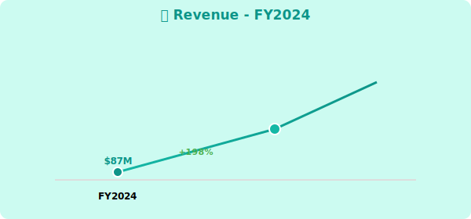
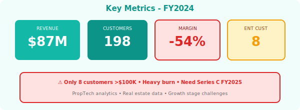

  

    🏢
    <h1 style="margin: 0; font-size: 48px; font-weight: 700;">PropTech Analytics</h1>
    🏢
  

  <h2 style="margin: 15px 0 0 0; font-weight: 300; font-size: 26px;">Annual Report - Fiscal Year 2024</h2>
  
Year Ended April 30, 2024

  

    
NASDAQ: PROP

    
Real Estate Data Analytics • Growth Stage

  

---

## Letter to Shareholders

FY2024 saw PropTech Analytics deliver **$87 million** in revenue, up 198% year-over-year, as we established ourselves in the proptech data analytics market.

Our platform leverages Querybase for property data, DataFlex for visualizations, and CatalogX for governance, enabling REITs and property firms to make data-driven decisions.

While we continue heavy investment in growth (operating margin: -54%), we're capturing a large market opportunity in the $4 trillion commercial real estate sector.

**Marcus Brown**  
Chief Executive Officer

---

## Financial Highlights

  

*Figure 1: Revenue growth FY2024*

  

*Figure 2: Key metrics with challenge indicators*

---

| Metric | FY2024 | FY2023 | Change |
|--------|--------|--------|--------|
| **Total Revenue** | $87M | $29M | +198% |
| **Gross Profit** | $64M | $19M | +237% |
| **Operating Loss** | ($47M) | ($34M) | Increased |
| **Net Loss** | ($52M) | ($38M) | Increased |

### Key Metrics

- **ARR**: $97M (+212% YoY)
- **Net Revenue Retention**: 108%
- **Customers**: 198 (up from 87)
- **>$100K Customers**: 8 (weak enterprise penetration)

---

## Challenges

- Heavy cash burn
- Limited enterprise traction (only 8 customers >$100K)
- LTV/CAC ratio: 1.8x (should be >3x)
- Need Series C funding in FY2025

---

## Outlook

**FY2025 Guidance**: $200M - $250M (+130-188% YoY)

**Risk**: Unit economics need improvement, funding required

  © 2024 PropTech Analytics Inc.

