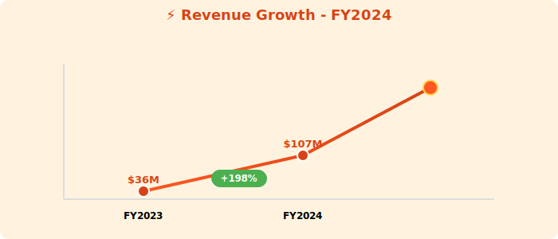
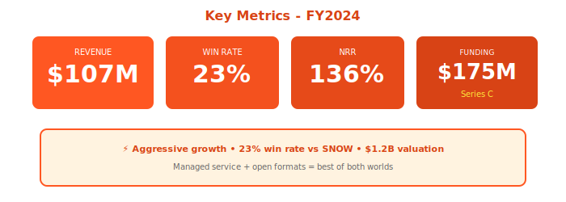

  

    ⚡
  

  <h1 style="margin: 0; font-size: 48px; font-weight: 700; text-transform: uppercase; letter-spacing: 2px;">Querybase Technologies</h1>
  <h2 style="margin: 15px 0 0 0; font-weight: 300; font-size: 26px;">Annual Report - Fiscal Year 2024</h2>
  
Year Ended April 30, 2024

  

    
NYSE: QRYQ

    
⚡ 2x Better Price-Performance Than Snowflake

  

---

## Letter to Shareholders

Dear Querybase Shareholders,

FY2024 was a breakout year. Our price-performance optimized data platform delivered **$107 million** in revenue, up 198% year-over-year, while achieving a **23% win rate against Snowflake** in competitive deals.

We raised **$175 million in Series C** at a $1.2 billion valuation, validating our thesis that customers want **managed service convenience with open data formats**.

Our **2x better price-performance** vs. Snowflake is resonating with cost-conscious enterprises. We're not the DIY complexity of open-source, nor the expensive lock-in of Snowflake—we're the best of both worlds.

**Michael Zhang**  
Chief Executive Officer & Founder

---

## Financial Highlights

  

*Figure 1: Hyper-growth trajectory FY2024*

  

*Figure 2: Key metrics with Series C funding*

---

### Fiscal Year 2024 Performance

| Metric | FY2024 | FY2023 | Change |
|--------|--------|--------|--------|
| **Total Revenue** | $107M | $36M | +198% |
| **Subscription Revenue** | $98M | $32M | +206% |
| **Services Revenue** | $9M | $4M | +125% |
| **Gross Profit** | $76M | $24M | +217% |
| **Operating Loss** | ($124M) | ($87M) | Increased |
| **Net Loss** | ($132M) | ($94M) | Increased |

### Key Metrics

- **ARR**: $121M (+212% YoY)
- **Net Revenue Retention**: 136%
- **Customers >$100K**: 756 (+187% YoY)
- **Win Rate vs. Snowflake**: 23% (growing)

---

## Strategic Position

### Competitive Wins

- 23% win rate vs. Snowflake (up from 14% in FY2023)
- Primary differentiators: Price (40% cheaper), openness (Iceberg support)
- Target customers: Cost-conscious enterprises, Snowflake skeptics

### Partnerships

- DataFlex, StreamPipe, Voltaic AI, CatalogX integrations
- Building ecosystem of complementary tools

---

## Outlook

**FY2025 Guidance**: $250M - $300M revenue (+134-180% YoY)

**Goals**:
- Improve win rate vs. SNOW to 35%+
- Expand enterprise segment
- Launch AI capabilities

  © 2024 Querybase Technologies Inc.

