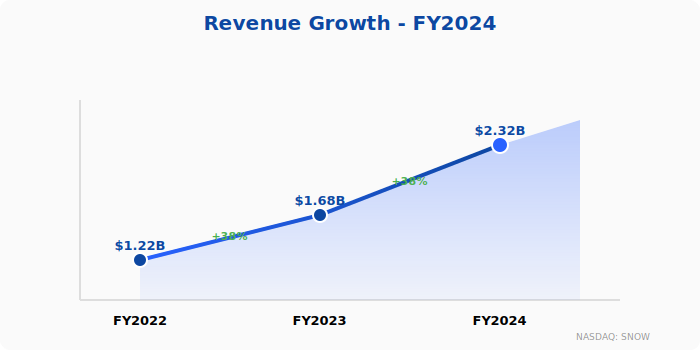
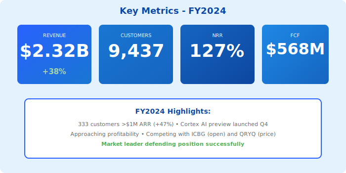

  

    <h1 style="margin: 0; font-size: 48px; font-weight: 700; letter-spacing: -1px;">❄️ Snowflake Inc.</h1>
  

  <h2 style="margin: 15px 0 0 0; font-weight: 300; font-size: 28px; opacity: 0.95;">Annual Report - Fiscal Year 2024</h2>
  
Year Ended April 30, 2024

  

    
NASDAQ: SNOW

  

---

## Letter to Shareholders

Dear Snowflake Shareholders,

Fiscal 2024 was a pivotal year in Snowflake's journey. We delivered **$2.3 billion** in revenue, representing 38% year-over-year growth, while making significant progress toward profitability with improved operating margins and strong free cash flow generation.

Our Data Cloud continues to expand with innovative capabilities in AI and machine learning. The preview launch of Cortex AI in Q4 FY2024 positions us to capture the massive opportunity in AI-powered data analytics.

We face increasing competition from open-source alternatives like Apache Iceberg-based platforms and price-performance challengers, but our integrated platform approach and enterprise-grade capabilities maintain our leadership position.

With over 9,400 customers and strong net revenue retention of 127%, we're well-positioned for continued growth in FY2025 and beyond.

**Sridhar Ramaswamy**  
Chief Executive Officer

---

## Financial Highlights

  

*Figure 1: Three-year revenue growth trajectory through FY2024*

  

*Figure 2: Key financial metrics dashboard for FY2024*

---

### Fiscal Year 2024 Performance

| Metric | FY2024 | FY2023 | Change |
|--------|--------|--------|--------|
| **Revenue** | $2,316M | $1,679M | +38% |
| **Product Revenue** | $2,204M | $1,591M | +39% |
| **Professional Services** | $112M | $88M | +27% |
| **Gross Profit** | $1,529M | $1,056M | +45% |
| **Operating Loss** | ($569M) | ($845M) | Improved |
| **Net Loss** | ($826M) | ($1,024M) | Improved |
| **Free Cash Flow** | $568M | $496M | +15% |

### Key Metrics

- **Remaining Performance Obligations (RPO)**: $3.6 billion (+42% YoY)
- **Net Revenue Retention Rate**: 127%
- **Customers with >$1M Product Revenue**: 333 (+47% YoY)
- **Total Customers**: 9,437
- **Fortune 500 Customers**: 210

---

## Business Overview

### Platform Capabilities

- **Data Warehouse**: Core SQL analytics
- **Data Engineering**: Snowpark, Python/Java support
- **Data Lake**: External tables, data sharing
- **Data Science**: Snowpark ML, Python worksheets
- **Data Applications**: Streamlit in Snowflake (preview)
- **AI/ML**: Cortex AI functions (preview in Q4)

### Emerging Competitive Threats

**Open Lakehouse Movement**:
- Apache Iceberg gaining momentum
- New startups (ICBG Data Systems) positioning on openness
- Customer concerns about vendor lock-in

**Price-Performance Challengers**:
- Aggressive new entrants (Querybase Technologies)
- Claims of 2x better price-performance
- Well-funded with venture capital

**Our Strategy**: Innovation (Cortex AI), openness (evaluating Iceberg support), and enterprise capabilities.

---

## FY2024 Achievements

### Product Milestones

**Q1 FY2024**: Snowpark Python GA, Python worksheets  
**Q2 FY2024**: Streamlit in Snowflake (preview), Native Apps framework  
**Q3 FY2024**: Data engineering enhancements, container services preview  
**Q4 FY2024**: **Cortex AI preview** (LLM functions, document AI)

### Customer Growth

- 9,437 total customers (up from 7,828)
- 333 customers >$1M (up from 246)
- Net revenue retention stable at 127%
- International: 28% of revenue

---

## Risk Factors

- Intense competition from cloud providers and startups
- Open-source alternatives (Iceberg, Delta Lake)
- Customer concerns about lock-in
- Path to sustained profitability
- Macroeconomic conditions

---

## Outlook

### FY2025 Guidance

- **Product Revenue**: $2.9B - $3.0B (+32-36% YoY)
- **Operating Margin**: Target positive non-GAAP
- **Customers**: 10,000+ milestone

---

## Contact Information

**Snowflake Inc.**  
106 East Babcock Street, Suite 3A  
Bozeman, MT 59715

**IR**: investors@snowflake.com  
**Stock**: NASDAQ: SNOW

  © 2024 Snowflake Inc.

