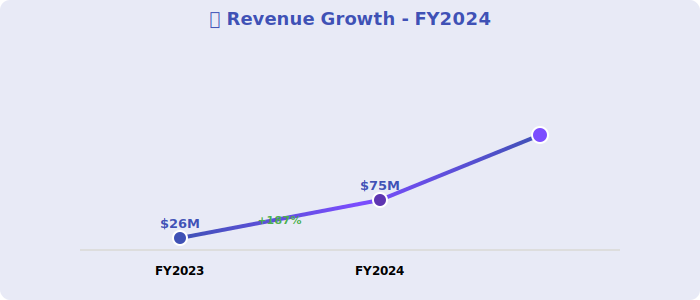
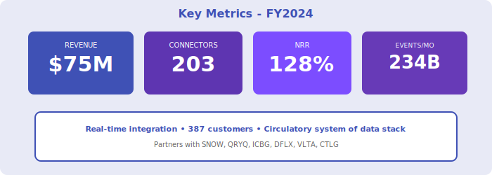

  <!-- Flowing background pattern -->
  

    
〰️〰️〰️

  

  

    <h1 style="margin: 0; font-size: 48px; font-weight: 700;">〰️ StreamPipe Systems 〰️</h1>
    <h2 style="margin: 15px 0 0 0; font-weight: 300; font-size: 26px;">Annual Report - Fiscal Year 2024</h2>
    
Year Ended April 30, 2024

    
NYSE: STRM

    
Real-Time Data Integration • The Circulatory System

  

---

## Letter to Shareholders

Dear StreamPipe Shareholders,

FY2024 was transformational for StreamPipe. Our real-time data integration platform delivered **$75 million** in revenue, up 187% year-over-year, as enterprises shift from batch to streaming architectures.

We are the **"circulatory system of the modern data stack"**—moving data in real-time from 203 sources to destinations including Snowflake, Querybase, ICBG, and downstream applications.

Our source/destination agnostic positioning enables partnerships with competing platforms while serving 387 customers with mission-critical streaming infrastructure.

**Priya Sharma**  
Chief Executive Officer & Founder

---

## Financial Highlights

  

*Figure 1: Revenue growth with flowing wave theme*

  

*Figure 2: Key metrics - 203 connectors, real-time integration*

---

### Fiscal Year 2024 Performance

| Metric | FY2024 | FY2023 | Change |
|--------|--------|--------|--------|
| **Total Revenue** | $75M | $26M | +187% |
| **Subscription Revenue** | $68M | $23M | +196% |
| **Services Revenue** | $7M | $3M | +133% |
| **Gross Profit** | $54M | $17M | +218% |
| **Operating Loss** | ($67M) | ($56M) | Increased |
| **Net Loss** | ($72M) | ($61M) | Increased |

### Key Metrics

- **ARR**: $82M (+203% YoY)
- **Net Revenue Retention**: 128%
- **Customers**: 387 (up from 178)
- **Source Connectors**: 203
- **Events Processed**: 234B/month

---

## Platform Capabilities

**Real-Time Streaming**:
- Change Data Capture (CDC)
- Event streaming (Kafka, Kinesis)
- API ingestion
- Multi-destination routing

**Destinations**:
- Snowflake, Querybase, ICBG
- Data lakes (S3, ADLS, GCS)
- Downstream apps

**Partnerships**:
- DataFlex (real-time dashboards)
- Voltaic AI (streaming ML features)
- CatalogX (governed data flows)

---

## Outlook

**FY2025 Guidance**: $160M - $190M (+113-153% YoY)

**Focus**: Expand connectors to 300+, achieve first profitable quarter

  © 2024 StreamPipe Systems Inc.

