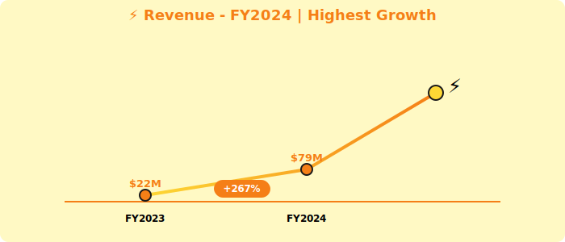
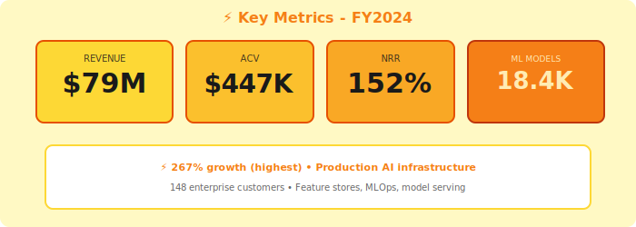

  <!-- Electric effect decorations -->
  
⚡

  
⚡

  
⚡

  
  

    ⚡
  

  <h1 style="margin: 0; font-size: 48px; font-weight: 900; text-transform: uppercase; letter-spacing: 3px;">Voltaic AI Platform</h1>
  <h2 style="margin: 15px 0 0 0; font-weight: 400; font-size: 26px; opacity: 0.85;">Annual Report - Fiscal Year 2024</h2>
  
Year Ended April 30, 2024

  

    
NASDAQ: VLTA

    
⚡ 267% Growth • Production AI Infrastructure 🚀

  

---

## Letter to Shareholders

Dear Voltaic AI Shareholders,

FY2024 was exceptional for Voltaic AI. Our production AI/ML infrastructure platform delivered **$79 million** in revenue, up 267% year-over-year—the highest growth rate in our sector.

Enterprise AI is exploding, and Voltaic provides the **critical infrastructure** for production ML deployments: feature stores, model registries, real-time serving, and MLOps orchestration.

While simple ML can happen in data warehouses (Snowflake Cortex), **complex production AI requires Voltaic**—our average contract value of **$447K** reflects mission-critical positioning.

Partnerships with data platforms (SNOW, QRYQ, ICBG), StreamPipe (real-time features), DataFlex (ML monitoring), and CatalogX (ML governance) position us as the AI layer of the modern stack.

**Dr. Amit Singh**  
Chief Executive Officer & Co-Founder

---

## Financial Highlights

  

*Figure 1: ⚡ Revenue growth - highest growth rate (267%)*

  

*Figure 2: Key metrics - Production AI infrastructure leader*

---

### Fiscal Year 2024 Performance

| Metric | FY2024 | FY2023 | Change |
|--------|--------|--------|--------|
| **Total Revenue** | $79M | $22M | +267% |
| **Platform Revenue** | $72M | $19M | +279% |
| **Services Revenue** | $7M | $3M | +133% |
| **Gross Profit** | $53M | $14M | +279% |
| **Operating Loss** | ($104M) | ($67M) | Increased |
| **Net Loss** | ($112M) | ($73M) | Increased |

### Key Metrics

- **ARR**: $89M (+289% YoY)
- **Net Revenue Retention**: 152%
- **Enterprise Customers**: 148 (vs. 67 in FY2023)
- **Average Contract Value**: $447K (premium)
- **ML Models Managed**: 18,400

---

## Positioning

**Production AI Infrastructure**:
- Feature stores for real-time ML
- Model registry and versioning
- Inference serving (< 20ms latency)
- MLOps orchestration

**vs. In-Platform ML**: When ML is mission-critical, Voltaic is essential.

**Partnerships**:
- Works with SNOW, QRYQ, ICBG for data
- StreamPipe for real-time features
- DataFlex for ML monitoring
- CatalogX for ML governance

---

## Outlook

**FY2025 Guidance**: $210M - $250M (+166-216% YoY)

**R&D**: Investing $104M (43% of revenue) in next-gen AI infrastructure

  © 2024 Voltaic AI Platform Inc.

