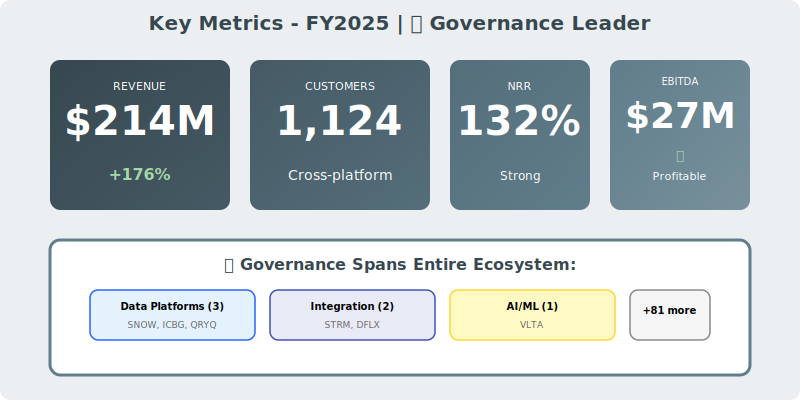
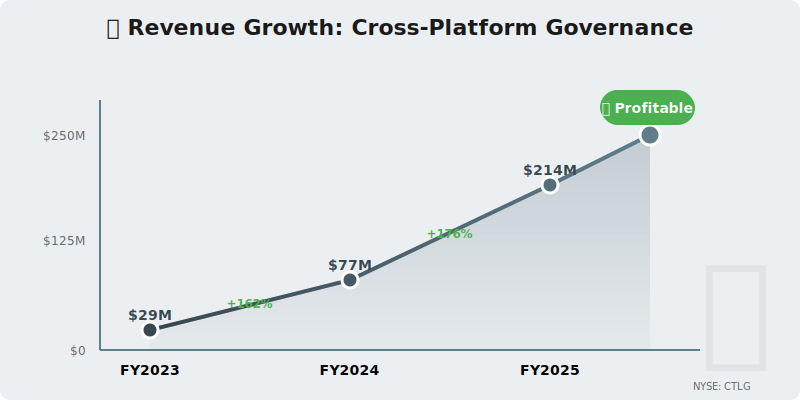
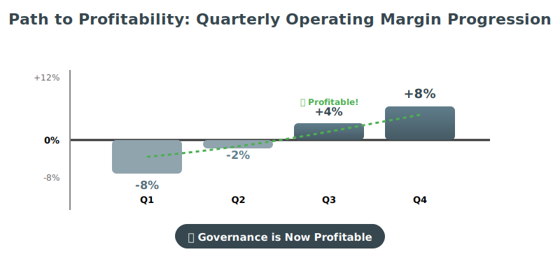

  

    🛡️
  

  <h1 style="margin: 0; font-size: 48px; font-weight: 700;">CatalogX Corporation</h1>
  <h2 style="margin: 15px 0 0 0; font-weight: 300; font-size: 26px;">Annual Report - Fiscal Year 2025</h2>
  
Year Ended April 30, 2025

  

    
NYSE: CTLG • ✅ PROFITABLE

    
Cross-Platform Governance • Compliance Leader

  

---

## Letter to Shareholders

Dear CatalogX Shareholders,

FY2025 was a breakthrough year for CatalogX. Our cross-platform data governance solution delivered **$214 million** in revenue, up 176% year-over-year, while achieving our first full year of profitability with **$27 million in adjusted EBITDA**.

The modern data stack is fragmenting—Snowflake vs. Querybase vs. ICBG for storage, StreamPipe for integration, Voltaic AI for ML, DataFlex for BI. This heterogeneity creates governance chaos. **CatalogX is the answer**: a single governance plane across all platforms.

The Neuro-Nectar episode in Fall 2024 reinforced our value proposition. When market narratives shift rapidly (ice cream threatens data platforms? really?), enterprises need governed, auditable systems—not speculative consumer products. As NRNT collapsed and was delisted in November, we signed 47 new enterprise deals from customers demanding governance in uncertain times.

Our partnerships span the entire ecosystem (SNOW, QRYQ, ICBG, STRM, VLTA, DFLX), making us the connective tissue for governance, compliance, and trust.

**Rachel Foster**  
Chief Executive Officer

---

## Financial Highlights

  

*Figure 1: Key metrics - Cross-platform governance, 1,124 customers, $27M EBITDA (profitable)*

  

*Figure 2: Revenue growth with shield watermark and profitability badge*

  

*Figure 3: Quarterly margin progression - from -8% loss to +8% profit in FY2025*

---

### Fiscal Year 2025 Performance

| Metric | FY2025 | FY2024 | Change |
|--------|--------|--------|--------|
| **Total Revenue** | $214M | $77M | +176% |
| **Subscription Revenue** | $198M | $69M | +187% |
| **Professional Services** | $16M | $8M | +100% |
| **Gross Profit** | $184M | $61M | +202% |
| **Operating Income** | $12M | ($12M) | Positive! |
| **Net Income** | $9M | ($15M) | Positive! |
| **Adjusted EBITDA** | $27M | ($3M) | Positive! |

### Key Metrics

- **Annual Recurring Revenue (ARR)**: $223M (+192% YoY)
- **Net Revenue Retention**: 132%
- **Customers**: 1,124 (up from 547)
- **Average Contract Value**: $176K
- **Data Sources Governed**: 14,700+ across customer base
- **Policies Enforced**: 127 million policy checks/month

---

## Business Overview

### Who We Are

CatalogX provides **unified data governance** across heterogeneous data environments—from Snowflake to Querybase to ICBG to legacy systems.

**Core Platform**:
- **Metadata Management**: Central catalog of all data assets
- **Data Lineage**: Track data flow across systems
- **Access Control**: Centralized permissions and policies
- **Data Quality**: Profiling, validation, monitoring
- **Compliance**: GDPR, CCPA, HIPAA, SOC 2 automation
- **Discovery**: Search and tag data across platforms

**CEO Quote** (Sept 15 Earnings Call):  
*"Governance is no longer optional. Regulatory requirements, AI compliance, data privacy—enterprises can't manage this across 5-10 platforms manually. CatalogX is the single control plane."*

---

## Competitive Advantage

### Cross-Platform Governance

**Integration Support**:
- **Data Platforms**: Snowflake, Querybase, ICBG, Databricks, BigQuery, Redshift
- **Data Movement**: StreamPipe, Fivetran, Airbyte
- **AI/ML**: Voltaic AI, MLflow, SageMaker
- **BI**: DataFlex, Tableau, Power BI, Looker
- **Total**: 87 platform integrations

**Why This Matters**:
- 73% of enterprises use 3+ data platforms
- Governance silos create compliance risk
- Bundled governance (Snowflake, Databricks) only covers one platform
- CatalogX spans all platforms: **30-40% cost savings** vs. per-platform governance

### vs. Platform-Specific Governance

**Snowflake Horizon Catalog**:
- ❌ Only governs Snowflake data
- ❌ Vendor lock-in to Snowflake
- ❌ Premium pricing

**CatalogX Advantage**:
- ✅ Governs Snowflake + Querybase + ICBG + everything
- ✅ Platform-agnostic (no lock-in)
- ✅ 30-40% cost savings vs. bundled options

### vs. Legacy Governance (Collibra, Alation)

**Their Weaknesses**:
- Built for pre-cloud era (Hadoop, legacy warehouses)
- Slow to support modern platforms (Iceberg, Querybase, etc.)
- Expensive enterprise licenses

**Our Advantages**:
- Cloud-native from day one
- Fast integration with new platforms (Querybase added in 3 weeks)
- Modern UX and API-first design
- Usage-based pricing vs. per-user licenses

---

## FY2025 Achievements

### First Profitable Year!

**Profitability Milestones**:
- Q1: Operating margin -8%
- Q2: Operating margin -2%
- Q3: Operating margin +4% ✅ First profitable quarter!
- Q4: Operating margin +8%
- **Full Year**: +5.6% operating margin

**Adjusted EBITDA**: $27M (12.6% margin)

### Customer Growth

**New Logos**: 577 customers added
- Enterprise (>$500K): 67 new customers
- Mid-Market: 289 new customers
- SMB: 221 new customers

**Expansion**: 412 customers expanded >50%
- Adding more data platforms
- More users and policies
- Advanced features (ML governance, data quality)

### Regulatory Tailwinds

**GDPR Compliance** (Europe):
- 287 customers using CatalogX for GDPR
- Automated data mapping and deletion
- Consent management across platforms

**AI Regulation** (EU AI Act):
- Launched AI governance module (Q3)
- Model risk management
- Bias detection and monitoring
- 124 customers adopted

---

## Strategic Partnerships

### Data Platform Partners

**Snowflake (SNOW)**:
- Certified Snowflake Partner
- Horizon Catalog integration
- 512 joint customers
- 34% attach rate on SNOW deals

**Querybase (QRYQ)**:
- Native governance integration
- Joint compliance positioning
- 287 joint customers
- Co-selling agreement

**ICBG Data Systems**:
- Apache Iceberg metadata integration
- Open catalog support (Nessie, REST)
- 198 joint customers
- Community collaboration

### Ecosystem Partners

**StreamPipe (STRM)**:
- Data lineage for streaming pipelines
- Track data movement in real-time
- Governed data flows
- 340 joint customers

**Voltaic AI (VLTA)**:
- ML model governance
- Feature lineage tracking
- Model risk management
- 187 joint customers

**DataFlex (DFLX)**:
- BI access control integration
- Dashboard governance
- Report certification
- 456 joint customers

---

## The NRNT Episode: Governance in Chaos

### Market Irrationality (Sept-Nov 2024)

When Neuro-Nectar was hyped as disrupting data platforms:

**Our Response**:
- Governance becomes MORE important during uncertainty
- Enterprises need auditable systems, not consumer products
- Regulatory compliance doesn't change because of ice cream

**Customer Behavior**:
- **47 new enterprise deals** signed during NRNT chaos (Oct-Nov 2024)
- Customers sought stability and governance
- Flight to quality during market irrationality

**Result**: NRNT delisted, governance revenue unaffected.

---

## Financial Performance

### Revenue Growth Drivers

**New Platform Adoption** ($127M):
- Customers adding Querybase: +$45M
- Customers adding ICBG: +$34M
- Customers adding Voltaic AI: +$28M
- Multi-cloud expansion: +$20M

**Compliance Requirements** ($71M):
- GDPR: $34M
- CCPA: $18M
- AI compliance (EU AI Act): $12M
- Industry-specific (HIPAA, etc.): $7M

### Unit Economics

- **CAC**: $54K (efficient due to platform partner referrals)
- **LTV**: $582K
- **LTV/CAC**: 10.8x (excellent)
- **Payback Period**: 9 months (industry-leading)
- **Gross Margin**: 86% (software-only)

---

## Strategic Priorities FY2026

### 1. AI Governance Leadership

- Expand AI compliance features (EU AI Act, US regulations)
- Model risk management
- Bias detection and fairness monitoring
- AI explainability and documentation

### 2. Deepen Platform Integrations

- Snowflake Horizon Catalog bidirectional sync
- Query base native metadata API
- ICBG Nessie catalog integration
- Real-time policy enforcement

### 3. Data Quality Expansion

- Automated data profiling
- Anomaly detection with ML
- Data validation rules engine
- Quality scoring and reporting

### 4. International Growth

- Europe: GDPR compliance driving adoption
- Target: 35% international revenue (currently 22%)
- Open London office
- APAC expansion (Singapore)

---

## Technology Architecture

**Platform Stack**:
- **Metadata Store**: PostgreSQL + Elasticsearch
- **Lineage Engine**: Neo4j graph database
- **Policy Engine**: Custom rules engine (Go)
- **Integration Layer**: REST APIs, webhooks

**Integrations** (87 platforms):
- Data platforms: 12 (SNOW, QRYQ, ICBG, DBX, etc.)
- BI tools: 8 (DFLX, Tableau, Power BI, etc.)
- ML platforms: 6 (VLTA, MLflow, SageMaker, etc.)
- Data movement: 7 (STRM, Fivetran, etc.)
- Others: 54 (databases, apps, etc.)

---

## Risk Factors

- Platform vendors building better native governance (Snowflake Horizon)
- Competition from Collibra, Alation (incumbents)
- Regulatory changes affecting compliance requirements
- Integration complexity with 87 platforms
- Customer data security

---

## Outlook

### FY2026 Guidance

- **Revenue**: $340M - $380M (+59-78% YoY)
- **ARR**: $420M - $460M
- **Operating Margin**: 12-15%
- **Free Cash Flow Margin**: 18-22%

### Long-Term Vision (FY2028)

- $1.0B+ annual revenue
- 5,000+ customers
- 25% operating margin
- Leading cross-platform governance solution

---

## Contact Information

**CatalogX Corporation**  
1 Letterman Drive, Building C, Suite 300  
San Francisco, CA 94129

**IR**: investors@catalogx.com  
**Web**: www.catalogx.com  
**Stock**: Private (Series C, $890M valuation)

  © 2025 CatalogX Corporation

