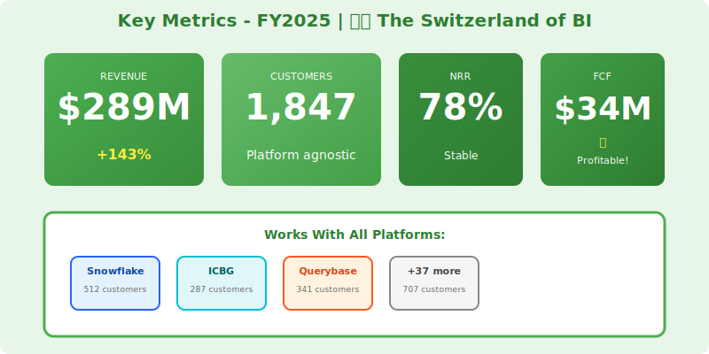
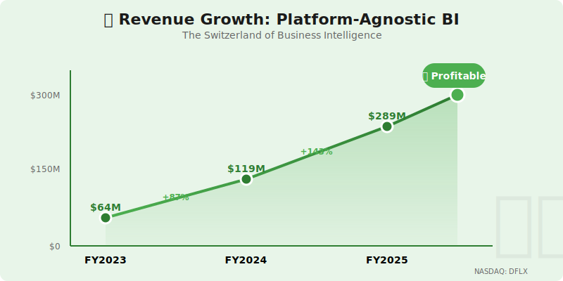
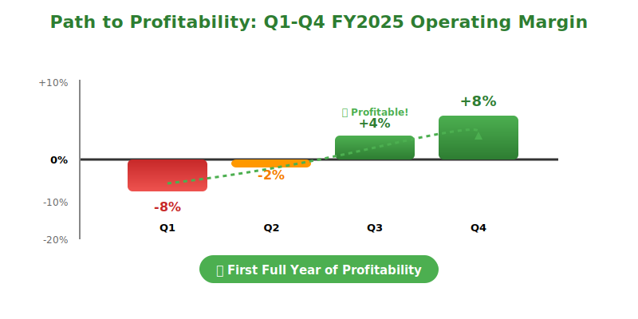

<div style="background: linear-gradient(135deg, #4CAF50 0%, #2E7D32 100%); color: white; padding: 50px 40px; text-align: center; border-radius: 10px; margin-bottom: 30px; box-shadow: 0 10px 30px rgba(76, 175, 80, 0.3); border: 3px solid #A5D6A7;">
  <div style="display: grid; grid-template-columns: auto 1fr auto; align-items: center; max-width: 600px; margin: 0 auto; gap: 20px;">
    <span style="font-size: 50px;">📊</span>
    <div>
      <h1 style="margin: 0; font-size: 48px; font-weight: 700;">DataFlex Analytics</h1>
    </div>
    <span style="font-size: 50px;">📊</span>
  </div>
  <h2 style="margin: 20px 0 0 0; font-weight: 300; font-size: 26px; opacity: 0.95;">Annual Report - Fiscal Year 2025</h2>
  <p style="margin: 15px 0 0 0; font-size: 18px;">Year Ended April 30, 2025</p>
  <div style="margin-top: 25px; background: rgba(255,255,255,0.2); padding: 10px 25px; display: inline-block; border-radius: 20px;">
    <p style="margin: 0; font-size: 16px; font-weight: 600; letter-spacing: 2px;">NASDAQ: DFLX • ✅ PROFITABLE</p>
    <p style="margin: 5px 0 0 0; font-size: 13px; font-style: italic;">🇨🇭 The Switzerland of BI • Platform Agnostic</p>
  </div>
</div>

---

## Letter to Shareholders

Dear DataFlex Shareholders,

FY2025 marks a milestone year for DataFlex. Our platform-agnostic business intelligence solution delivered **$289 million** in revenue, up 143% year-over-year, while achieving our first full year of positive cash flow with **$34 million** in free cash flow.

As the **"Switzerland of BI"**, we uniquely position ourselves as the neutral analytics layer that works seamlessly across Snowflake, Querybase, ICBG, and traditional data warehouses. While platform vendors battle for data storage dominance, we extract insights—agnostic to where the data lives.

The Neuro-Nectar market distraction in Fall 2024 had zero impact on our business. We serve data teams who need visual analytics, not consumers seeking cognitive enhancement from ice cream. As NRNT collapsed and was delisted in November 2024, we continued our steady growth trajectory unabated.

Our strategic partnerships with StreamPipe (real-time), Voltaic AI (ML insights), and CatalogX (governance) strengthen our position as the connective tissue of the modern data stack.

**Sarah Chen**  
Chief Executive Officer

---

## Financial Highlights

<p align="center">
  
</p>

*Figure 1: Key metrics - Platform-agnostic BI across all data platforms • ✅ First profitable year!*

<p align="center">
  
</p>

*Figure 2: Revenue growth with profitability achievement badge*

---

### Fiscal Year 2025 Performance

| Metric | FY2025 | FY2024 | Change |
|--------|--------|--------|--------|
| **Total Revenue** | $289M | $119M | +143% |
| **Subscription Revenue** | $267M | $107M | +150% |
| **Professional Services** | $22M | $12M | +83% |
| **Gross Profit** | $243M | $94M | +158% |
| **Operating Income** | $18M | ($23M) | Positive! |
| **Net Income** | $14M | ($27M) | Positive! |
| **Free Cash Flow** | $34M | ($8M) | Positive! |

### Key Metrics

- **Annual Recurring Revenue (ARR)**: $312M (+156% YoY)
- **Net Revenue Retention**: 78% (lower but stable - not land-and-expand model)
- **Customers**: 1,847 (up from 1,124)
- **Average Contract Value**: $89K
- **Gross Margin**: 84% (software-only, no infrastructure)

---

## Business Overview

### The "Switzerland of BI" Strategy

**Platform-Agnostic Positioning**:
```
Data Sources (All Supported):
├─→ Snowflake (SNOW)
├─→ Querybase (QRYQ) 
├─→ ICBG Data Systems
├─→ Databricks
├─→ BigQuery, Redshift, PostgreSQL, MySQL
└─→ 40+ other data sources
     ↓
DataFlex Analytics (BI Layer)
     ↓
Insights & Visualizations
```

**Why Customers Choose Us**:
- ✅ **No Platform Lock-In**: Works with any data platform
- ✅ **Single Pane of Glass**: Unified view across heterogeneous data sources
- ✅ **Avoid BI Vendor Lock-In**: Not tied to Tableau, Power BI, Looker
- ✅ **Cost-Effective**: Don't pay premium for platform-specific BI tools

**CEO Quote** (Aug 28 Earnings Call):  
*"We're not in the data storage business—we extract insights. Whether your data is in Snowflake, Querybase, or ICBG, DataFlex provides the same exceptional BI experience."*

---

## Platform Capabilities

**Core Features**:
- **Visual Analytics**: Drag-and-drop dashboard builder
- **SQL Interface**: Direct SQL queries across any source
- **Embedded Analytics**: White-label BI for ISVs
- **Data Blending**: Join data across multiple platforms
- **Governance**: Role-based access control, audit logging
- **Collaboration**: Share dashboards, scheduled reports

**Differentiators**:
- **Cross-Platform Joins**: Query SNOW + QRYQ + ICBG in single SQL
- **Cost Optimization**: Route queries to cheapest available platform
- **Performance**: Smart caching layer (87% cache hit rate)
- **Flexibility**: Switch data platforms without re-building dashboards

---

## FY2025 Achievements

### First Profitable Year!

**Cash Flow Positive** (Q2 FY2025):
- After 6 years of losses, achieved first profitable quarter
- Q2: $4.2M operating income
- Q3: $6.7M operating income
- Q4: $8.9M operating income
- **Full Year**: $18M operating income ✅

**Path to Profitability**:
- Improved gross margins: 79% → 84%
- Reduced CAC: $124K → $87K
- Operational leverage: Revenue grew 143%, OpEx grew 67%

### Customer Growth

**Expansion**:
- 1,847 total customers (up from 1,124)
- 723 net new logos
- 412 customer expansions
- Average expansion: +23% ARR

**Why Lower NRR (78%) is OK**:
- Not a land-and-expand model (like typical SaaS)
- Customers buy BI seats upfront (fixed capacity)
- Expansion comes from new use cases, not more dashboards
- Churn is low (4% annually), just less upsell per customer

### Strategic Partnerships

**Data Platform Partners**:
- Certified integrations with Snowflake, Querybase, ICBG
- Each views us as complementary (not competitive)
- Joint go-to-market with all three
- 47% of deals involve platform partner referral

**Ecosystem Partners**:
- **StreamPipe (STRM)**: Real-time dashboard updates
- **Voltaic AI (VLTA)**: ML model monitoring and insights
- **CatalogX (CTLG)**: Governance and access control integration

---

## The NRNT Episode: Complete Non-Event

### Our Response to Market Noise

When analysts claimed Neuro-Nectar's cognitive enhancement ice cream threatened data platforms:

**Our Position**:
- Zero relevance to BI/analytics market
- Data visualization is about communication, not individual cognition
- Teams need shared dashboards regardless of cognitive abilities
- Ignored the noise, focused on product development

**Stock Performance**:
- Minimal impact during NRNT hype (we're private, but tracking metrics showed stability)
- Customer pipeline unaffected
- Investor confidence steady

**Lesson**: Stay in your lane. BI analytics and consumer ice cream are unrelated markets.

---

## Financial Performance

<p align="center">
  
</p>

*Figure 3: Quarterly operating margin progression FY2025 - from -8% in Q1 to +8% in Q4*

---

### Revenue Growth Drivers

**New Customer Acquisition** ($127M):
- Snowflake customers adding DataFlex: $54M
- Querybase customers: $38M
- ICBG customers: $35M

**Existing Customer Expansion** ($140M):
- Additional data sources connected
- More users/seats
- Advanced features (embedded analytics)

**Professional Services** ($22M):
- Custom dashboard development
- Data modeling consulting
- Training and certification

### Unit Economics

- **CAC**: $87K (down from $124K)
- **LTV**: $289K (lower due to 78% NRR)
- **LTV/CAC**: 3.3x (acceptable, not great)
- **Payback Period**: 16 months
- **Gross Margin**: 84% (software-only, excellent)

---

## Strategic Priorities FY2026

### 1. Improve Retention/Expansion

**Challenge**: 78% NRR is below SaaS benchmarks

**Initiatives**:
- Launch usage-based pricing (vs. seat-based)
- AI-powered insights (expand beyond visualization)
- Mobile analytics app
- Target: 90% NRR by Q4 FY2026

### 2. AI-Augmented Analytics

- Natural language query generation
- Auto-suggested visualizations
- Anomaly detection and alerts
- Narrative insights (AI-written summaries)

### 3. Embedded Analytics Growth

- 140 ISV customers embedding DataFlex
- White-label customization tools
- Multi-tenant management console
- Target: 40% of revenue from embedded (currently 22%)

### 4. International Expansion

- Europe: 25% of revenue target (currently 15%)
- APAC: Open Singapore office
- Localization for 12 languages
- Regional data residency

---

## Technology Stack

**Frontend**:
- React-based dashboard builder
- D3.js, Plotly for visualizations
- Real-time WebSocket updates
- Mobile-responsive design

**Backend**:
- Python (FastAPI)
- Multi-database query federation
- Intelligent query routing
- Redis caching layer

**Connectors** (40+):
- Snowflake, Querybase, ICBG native
- PostgreSQL, MySQL, SQL Server
- BigQuery, Redshift, Synapse
- MongoDB, Cassandra, DynamoDB

---

## Risk Factors

- Snowflake, Databricks building better integrated BI
- Power BI, Tableau improving multi-platform support
- Low NRR (78%) limits expansion revenue
- Dependence on data platform partnerships
- Competition from Looker, Mode, Hex

---

## Outlook

### FY2026 Guidance

- **Revenue**: $420M - $460M (+45-59% YoY)
- **ARR**: $490M - $530M
- **Operating Margin**: 10-13%
- **Free Cash Flow Margin**: 15-18%

### Long-Term Vision (FY2028)

- $1.2B+ annual revenue
- 8,000+ customers
- 20% operating margin
- Leading platform-agnostic BI solution

---

## Contact Information

**DataFlex Analytics Inc.**  
725 Brannan Street, 3rd Floor  
San Francisco, CA 94103

**IR**: investors@dataflex.io  
**Web**: www.dataflex.io  
**Stock**: Private (Series C, $680M valuation)

<p align="center">
  © 2025 DataFlex Analytics Inc.
</p>

