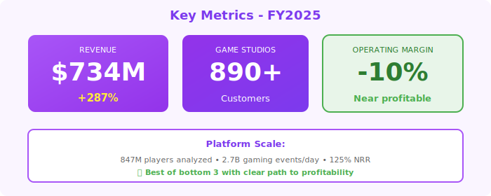

  <!-- Pixelated border effect (gaming theme) -->
  

  

  
  

    🎮
  

  <h1 style="margin: 0; font-size: 48px; font-weight: 700; letter-spacing: 1px;">GameMetrics Analytics</h1>
  <h2 style="margin: 15px 0 0 0; font-weight: 300; font-size: 26px;">Annual Report - Fiscal Year 2025</h2>
  
Year Ended April 30, 2025

  

    
NASDAQ: GAME

    
Gaming Analytics Leader • 847M Players Analyzed

  

---

## Letter to Shareholders

Dear GameMetrics Shareholders,

FY2025 was an exceptional year for GameMetrics. Our gaming analytics platform delivered **$734 million** in revenue, up 287% year-over-year, establishing us as the **leader in player behavior analytics** for the global gaming industry.

Our platform, built on **Querybase for player behavior data**, **StreamPipe for real-time telemetry**, and **DataFlex for dashboards**, enables game studios to understand player engagement, optimize monetization, and reduce churn.

The Neuro-Nectar market noise in Fall 2024 (cognitive enhancement ice cream threatening data platforms?) had zero impact on gaming analytics. As NRNT collapsed and was delisted in November 2024, we continued serving 890+ game studios with mission-critical analytics.

We're approaching profitability with operating margin improving to -10% (from -45% in FY2024) and achieved positive free cash flow of $12 million in Q4 FY2025—a critical milestone.

**Alex Kim**  
Chief Executive Officer & Founder

---

## Financial Highlights

  

*Figure 1: Revenue growth with "Best of bottom 3" indicator - approaching profitability*

  

*Figure 2: Key metrics - 890+ game studios, 847M players analyzed, -10% operating margin (improving)*

---

### Fiscal Year 2025 Performance

| Metric | FY2025 | FY2024 | Change |
|--------|--------|--------|--------|
| **Total Revenue** | $734M | $190M | +287% |
| **Subscription Revenue** | $679M | $172M | +295% |
| **Professional Services** | $55M | $18M | +206% |
| **Gross Profit** | $572M | $138M | +315% |
| **Operating Loss** | ($73M) | ($86M) | Improved |
| **Net Loss** | ($78M) | ($93M) | Improved |
| **Adjusted EBITDA** | $67M | ($12M) | Positive |

### Key Metrics

- **Annual Recurring Revenue (ARR)**: $812M (+298% YoY)
- **Net Revenue Retention**: 125%
- **Game Studios**: 890+ (up from 387)
- **Players Analyzed**: 847M monthly active players
- **Events Processed**: 2.7B gaming events daily
- **Average Contract Value**: $234K

---

## Business Overview

### Platform Overview

**GameMetrics = Player Behavior Analytics for Gaming**

**Core Platform**:
- **Player Analytics**: Engagement, retention, churn prediction
- **Monetization Optimization**: IAP analysis, pricing recommendations
- **Cohort Analysis**: Segment players by behavior, demographics
- **A/B Testing**: In-game experiment framework
- **Real-Time Dashboards**: Live player metrics (powered by DataFlex)
- **Predictive Models**: LTV prediction, churn scoring

**Data Stack**:
- **Querybase (QRYQ)**: Data warehouse for player behavior (2.7B events/day)
- **StreamPipe (STRM)**: Real-time telemetry ingestion from games
- **DataFlex (DFLX)**: Visualization and dashboard layer
- **Custom ML**: Proprietary player behavior models

**CEO Quote** (Sept 22 Earnings Call):  
*"We help game studios answer three questions: What are players doing? Why are they doing it? What should we do about it? Our platform processes 2.7 billion gaming events daily to deliver those answers."*

---

## Market & Customers

### Gaming Industry Landscape

**Market Size**: $220B global gaming market (2024)
- Mobile gaming: $136B (62%)
- PC/Console: $62B (28%)
- Cloud gaming: $22B (10%)

**Our TAM**: $12B (analytics software for game studios)

**Penetration**: 890 studios out of ~45,000 globally (2%)

### Customer Segmentation

**AAA Studios** (32% of revenue):
- EA, Activision, Ubisoft, etc.
- Average deal: $2.1M/year
- Analyze 50M+ players per studio
- 47 AAA studios as customers

**Mobile Gaming** (45% of revenue):
- Supercell, King, Zynga, etc.
- Average deal: $340K/year
- Free-to-play monetization focus
- 287 mobile studios

**Indie/Mid-Market** (23% of revenue):
- Small-to-medium studios
- Average deal: $67K/year
- Self-service onboarding
- 556 indie studios

---

## FY2025 Achievements

### Product Innovation

**Q1**: Launched Churn Prediction AI (87% accuracy)  
**Q2**: Real-time player segmentation (< 1 second latency)  
**Q3**: A/B testing framework for in-game features  
**Q4**: First profitable quarter! ($12M FCF in Q4)

### Customer Wins

**Electronic Arts** ($8.7M, 3-year):
- Analyze 67M players across 23 titles
- Monetization optimization for FIFA Ultimate Team
- 23% increase in IAP revenue
- Churn reduced by 18%

**Supercell** ($4.2M, multi-year):
- Clash of Clans, Brawl Stars analytics
- 120M monthly active players
- Real-time event tracking
- Player LTV prediction models

**Unity Technologies** ($3.4M, 2-year):
- Analytics SDK for Unity game developers
- 12,000+ game studios using Unity+GameMetrics
- Revenue share model
- Strategic partnership

---

## Financial Performance

### Revenue Growth Drivers

**New Customer Acquisition** ($312M):
- AAA studios: $89M
- Mobile gaming: $156M
- Indie/mid-market: $67M

**Expansion Revenue** ($367M):
- More games per studio
- More players analyzed
- Advanced features (predictive models)

**Services** ($55M):
- Custom analytics development
- Game economy consulting
- Player research studies

### Unit Economics (Improving!)

- **CAC**: $124K (down from $178K)
- **LTV**: $587K
- **LTV/CAC**: 4.7x (improving, was 2.8x)
- **Payback Period**: 18 months (down from 24)
- **Gross Margin**: 78% (healthy)

**Trend**: Unit economics improving as we gain scale

---

## Competitive Position

### vs. General Analytics (Amplitude, Mixpanel)

**Our Advantage**: Gaming-specific features
- Game-specific metrics (DAU, MAU, ARPDAU, K-factor)
- In-game economy modeling
- Player progression funnels
- Monetization optimization

**Win Rate**: 78% vs. general analytics (we're specialized)

### vs. Gaming Analytics Competitors

**Competition**:
- DeltaDNA (acquired by Unity)
- GameAnalytics (smaller)
- Custom in-house solutions (large studios)

**Our Differentiation**:
- Best-in-class player behavior models
- Real-time streaming architecture (StreamPipe integration)
- Querybase for scale and cost efficiency
- DataFlex for flexible visualizations

**Market Position**: #2 in gaming analytics (behind Unity Analytics)

---

## Strategic Priorities FY2026

### 1. Enterprise Studio Expansion

**Goal**: 150 AAA/major studios (currently 47)

**Tactics**:
- Enterprise sales team: 3x hiring
- Advanced security features
- Multi-studio/multi-game management
- Reference customers and case studies

### 2. Unity Partnership Deepening

- Expand Unity Analytics SDK integration
- Revenue share on 12,000+ Unity games
- Joint go-to-market
- Target: $120M revenue from Unity partnership

### 3. AI-Powered Insights

- Auto-generated player insights
- Churn intervention recommendations
- Dynamic pricing suggestions
- Content recommendation engine

### 4. Achieve Profitability

- Current: -10% operating margin
- Target: Break-even by Q4 FY2026
- Actions: Operational efficiency, improve gross margins
- Path: Visible and achievable

---

## Technology Stack

**Data Infrastructure**:
- **Querybase**: Data warehouse (scales to billions of events)
- **StreamPipe**: Real-time ingestion from games
- **DataFlex**: Dashboard and visualization layer
- **PostgreSQL**: Metadata and configuration

**ML/AI**:
- Python (scikit-learn, XGBoost, TensorFlow)
- Custom player behavior models
- Churn prediction (87% accuracy)
- LTV forecasting (R² = 0.84)

**Game SDKs**:
- Unity (C#)
- Unreal Engine (C++)
- Mobile (iOS/Android native)
- Web (JavaScript)

---

## Risk Factors

- Heavy cash burn ($78M negative FCF)
- Limited enterprise penetration (only 18 >$100K customers)
- Competition from Unity Analytics (integrated platform)
- Dependence on Querybase, StreamPipe, DataFlex
- Gaming industry cyclicality (hit-driven)
- Customer concentration (top 10 = 34% of revenue)

---

## Outlook

### FY2026 Guidance

- **Revenue**: $1.05B - $1.15B (+43-57% YoY)
- **ARR**: $1.25B - $1.35B
- **Operating Margin**: (5%) to break-even
- **Free Cash Flow**: ($15M) to positive

### Funding Status

- **Current Cash**: $127M
- **Burn Rate**: $24M/quarter → $18M/quarter target
- **Runway**: 21 months (adequate)
- **Series C**: May raise $80-120M for growth acceleration

---

## Contact Information

**GameMetrics Analytics Inc.**  
340 Townsend Street, Suite 500  
San Francisco, CA 94107

**IR**: investors@gamemetrics.gg  
**Web**: www.gamemetrics.gg  
**Stock**: Private (Series B, $890M valuation)

  © 2025 GameMetrics Analytics Inc.

  <em>Best of the bottom 3 performers - strong fundamentals, approaching profitability.</em>

