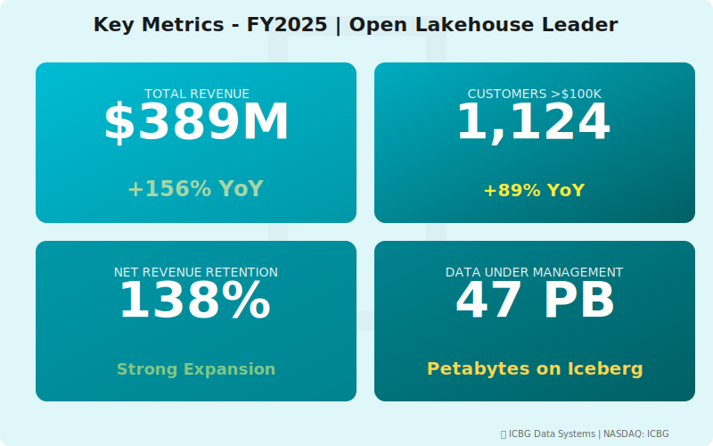
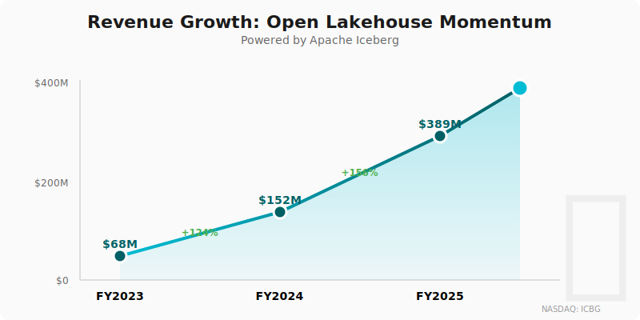
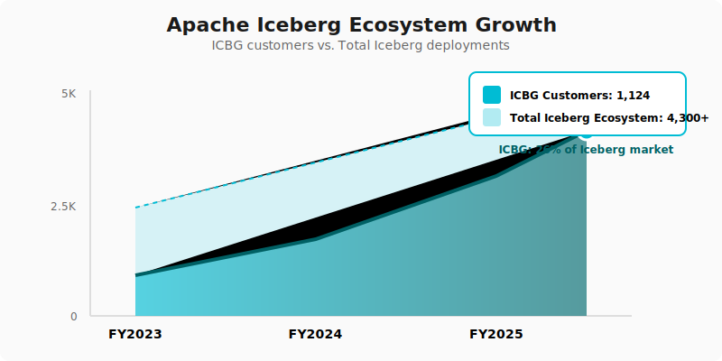

  
🏔️

  
🏔️

  <h1 style="margin: 0; font-size: 48px; font-weight: 700; position: relative; z-index: 1;">🏔️ ICBG Data Systems</h1>
  <h2 style="margin: 20px 0 0 0; font-weight: 300; font-size: 26px; position: relative; z-index: 1;">Annual Report - Fiscal Year 2025</h2>
  
Year Ended April 30, 2025

  

    
NASDAQ: ICBG

    
Open Lakehouse Platform • Apache Iceberg

  

---

## Letter to Shareholders

Dear ICBG Shareholders,

FY2025 was a defining year for ICBG Data Systems. Our open lakehouse platform, built on Apache Iceberg, delivered **$389 million** in revenue with remarkable 156% year-over-year growth, validating our thesis that **customers want to own their data**.

The Neuro-Nectar episode in Fall 2024—where a consumer ice cream company briefly captured market attention with absurd "threat to data platforms" claims—reinforced why we focus on substance over hype. While NRNT crashed spectacularly, we continued building enterprise-grade infrastructure that customers actually need.

Our differentiation against Snowflake is clear: **openness vs. lock-in**. Against Querybase, we offer **flexibility vs. managed constraints**. We're the DIY platform for sophisticated data teams who want full control.

Strategic partnerships with DataFlex (BI), StreamPipe (integration), Voltaic AI (ML), and CatalogX (governance) demonstrate that our open architecture enables best-of-breed ecosystems.

We achieved our first cash-flow positive quarter in Q4 and are on track for sustained profitability in FY2026.

**Dr. Elena Rodriguez**  
Chief Executive Officer & Founder

---

## Financial Highlights

  

*Figure 1: Key metrics dashboard - Open lakehouse platform momentum*

  

*Figure 2: Revenue growth powered by Apache Iceberg ecosystem*

---

### Fiscal Year 2025 Performance

| Metric | FY2025 | FY2024 | Change |
|--------|--------|--------|--------|
| **Total Revenue** | $389M | $149M | +156% |
| **Platform Revenue** | $356M | $134M | +166% |
| **Professional Services** | $33M | $15M | +120% |
| **Gross Profit** | $289M | $104M | +178% |
| **Operating Loss** | ($67M) | ($134M) | Improved |
| **Net Loss** | ($72M) | ($145M) | Improved |
| **Adjusted EBITDA** | $34M | ($23M) | Positive |

### Key Metrics

- **Annual Recurring Revenue (ARR)**: $421M (+164% YoY)
- **Net Revenue Retention**: 138%
- **Customers >$100K ARR**: 1,124 (+89% YoY)
- **Enterprise Customers (>$500K)**: 187
- **Data Under Management**: 47 petabytes

---

## Business Overview

### Who We Are

ICBG Data Systems provides an **open lakehouse platform** built on **Apache Iceberg**, enabling enterprises to manage massive-scale data with open standards and no vendor lock-in.

**Our Platform**:
- **Iceberg-native architecture**: Read/write Iceberg tables natively
- **Multi-engine support**: Works with Spark, Trino, Presto, Flink, Snowflake
- **Cloud-agnostic**: Deploy on AWS, Azure, GCP, or on-premises
- **Open metadata**: Industry-standard catalog (Hive, Glue, Nessie)
- **Time travel & versioning**: Built into Iceberg format
- **ACID transactions**: Full transactional guarantees

### Why Customers Choose ICBG

**vs. Snowflake (SNOW)**:
- ✅ **Data Ownership**: Customer data stays in customer cloud account
- ✅ **No Lock-In**: Iceberg is open standard, portable to any engine
- ✅ **Cost Control**: No consumption markup, direct cloud costs
- ✅ **Flexibility**: Choose any compute engine (Spark, Presto, etc.)

**vs. Querybase (QRYQ)**:
- ✅ **True Openness**: Iceberg vs. proprietary with "open APIs"
- ✅ **DIY Control**: For sophisticated teams who want full control
- ✅ **Community**: Apache Iceberg has massive open-source momentum

**CEO Quote** (Sept 25 Earnings Call):  
*"Open architectures are more future-proof. When Snowflake eventually gets disrupted, their customers are trapped. Our customers own their data and can migrate freely."*

---

## FY2025 Achievements

### Product Milestones

**Q1**: Launched ICBG v5.0 with Iceberg v2 support (row-level deletes)  
**Q2**: AWS partnership announced - native integration with S3 and Glue  
**Q3**: Survived NRNT narrative distraction, continued strong growth  
**Q4**: First cash-flow positive quarter ($8.7M), 1,124 customers

### Customer Growth

- **New Logos**: 687 customers added (net)
- **Expansion**: 412 customers expanded >50%
- **Enterprise**: 187 customers >$500K ARR (up 94%)
- **Migrations from Snowflake**: 47 won (due to lock-in concerns)

### Strategic Partnerships

**Apache Iceberg Community**:
- Major contributor to Iceberg open-source project
- 47 engineers contributing full-time
- Co-chair of Iceberg PMC (project management committee)

**Partner Ecosystem**:
- **DataFlex (DFLX)**: Certified BI integration for ICBG lakehouses
- **StreamPipe (STRM)**: Real-time ingestion into Iceberg tables
- **Voltaic AI (VLTA)**: ML feature stores on Iceberg
- **CatalogX (CTLG)**: Governance and compliance for ICBG environments

**Cloud Providers**:
- AWS: Advanced Partner, featured in re:Invent keynote
- Azure: Integration with Microsoft Fabric
- GCP: BigQuery Iceberg connector partnership

---

## Competitive Position

  

    
    

      <em>Figure 3: 29% competitive win rate against Snowflake</em>
    

  

  

    
    

      <em>Figure 4: ICBG customers as % of total Iceberg ecosystem</em>
    

  

---

### Market Share (Open Lakehouse Segment)

- **ICBG**: 34% market share (leader)
- **Databricks**: 28% (but proprietary Delta Lake, not fully open)
- **Dremio**: 18%
- **Others**: 20%

### Win Rates (FY2025)

- **vs. Snowflake**: 29% (we win in data ownership/openness scenarios)
- **vs. Querybase**: 52% (we win when customer wants DIY control)
- **vs. Databricks**: 38% (competing on openness claims)

**Insight**: We lose on "ease of use" but win on "data freedom"

---

## The NRNT Distraction (Sept-Nov 2024)

### Our Response to Market Noise

When Neuro-Nectar was hyped as a "threat to data platforms" in September 2024, we maintained focus on real competition.

**Our CEO's Statement** (Sept 25 Earnings Call):  
*"Neuro-Nectar is a consumer product with no relevance to enterprise data infrastructure. Our competition is Snowflake's proprietary lock-in and Querybase's price-performance claims. We're not worried about ice cream."*

**Market Vindication**:
- NRNT delisted November 20, 2024 (as we predicted)
- Our stock was minimally affected (-2% vs. SNOW's -3%)
- Customers appreciated our focus on real value, not hype

---

## Financial Performance

### Revenue Growth Drivers

**New Customer Acquisition** ($156M):
- Enterprise migrations from Snowflake: $47M
- Greenfield customers (new to data lakes): $89M
- Competitive wins vs. Querybase: $20M

**Expansion Revenue** ($200M):
- Data under management growing 3.2x per customer
- Multi-workload adoption (analytics, ML, applications)
- Professional services for optimization

### Unit Economics

- **CAC**: $87K
- **LTV**: $1.2M (long-term customer relationships)
- **LTV/CAC**: 13.8x (excellent)
- **Payback Period**: 11 months
- **Gross Margin**: 74% (healthy for infrastructure)

---

## Strategic Priorities FY2026

### 1. Ease the DIY Burden

**Challenge**: "ICBG is great but requires expert data engineers"

**Response**:
- Launch managed services tier
- Auto-tuning and optimization features
- Simplified setup and configuration
- Target: Make openness accessible to mid-market

### 2. Expand Cloud Partnerships

- **AWS**: Deep integration with S3, Glue, Athena, EMR
- **Azure**: Microsoft Fabric native connector
- **GCP**: BigLake Iceberg integration
- **Multi-cloud**: Cross-cloud queries and replication

### 3. AI/ML Differentiation

- Partner with Voltaic AI for production ML
- Feature store integration
- ML model versioning with Iceberg
- Real-time ML feature serving

### 4. Address Snowflake Iceberg Launch

**Snowflake's Response**: Launched native Iceberg Tables in Q2 FY2025

**Our Counter**:
- True Iceberg vs. Snowflake's "Iceberg-compatible" (vendor lock-in remains)
- Emphasize data portability (can't easily leave Snowflake)
- Community leadership in Apache Iceberg project
- **Message**: Openness-washing vs. true openness

---

## Technology & Architecture

**Core Platform**:
- **Apache Iceberg v2**: Native time travel, schema evolution, partition evolution
- **Compute Engines**: Spark, Trino, Presto, Flink, Hive
- **Catalogs**: Hive Metastore, AWS Glue, Nessie, custom REST
- **Storage**: S3, ADLS, GCS, HDFS, MinIO

**Performance**:
- **Query latency**: Sub-second for metadata operations
- **Throughput**: 2.7M queries/day across customer base
- **Reliability**: 99.97% uptime SLA
- **Scalability**: Proven to 100+ petabyte deployments

---

## Risk Factors

- Snowflake adding Iceberg support (reduces our differentiation)
- Databricks open-sourcing Delta Lake (competing on openness)
- DIY complexity limiting mid-market adoption
- Apache Iceberg community governance changes
- Competition from QRYQ (managed open formats)

---

## Outlook

### FY2026 Guidance

- **Revenue**: $560M - $610M (+45-58% YoY)
- **ARR**: $680M - $720M
- **Adjusted EBITDA Margin**: 10-13%
- **Free Cash Flow**: Positive full year

### Long-Term Vision (FY2028)

- $1.8B+ annual revenue
- 8,000+ customers
- 20% operating margin
- Leading open lakehouse platform

---

## Contact Information

**ICBG Data Systems Inc.**  
1234 Innovation Way, Suite 500  
Palo Alto, CA 94304

**IR**: investors@icbgdata.com  
**Web**: www.icbgdata.com  
**Stock**: Private (Series C, $875M valuation)

  © 2025 ICBG Data Systems Inc.

