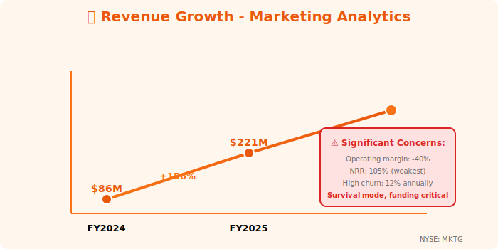
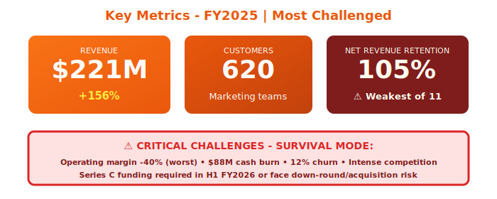

  

    📈
  

  <h1 style="margin: 0; font-size: 48px; font-weight: 700;">Marketing Analytics Platform</h1>
  <h2 style="margin: 15px 0 0 0; font-weight: 300; font-size: 26px;">Annual Report - Fiscal Year 2025</h2>
  
Year Ended April 30, 2025

  

    
NYSE: MKTG

    
Marketing Attribution • Campaign Analytics

  

---

## Letter to Shareholders

Dear Marketing Analytics Shareholders,

FY2025 was a challenging year for Marketing Analytics. Our marketing performance analytics platform delivered **$221 million** in revenue, up 156% year-over-year, but we continue to face intense competitive pressure from marketing clouds and specialized attribution vendors.

We serve **620+ marketing teams** with campaign performance analytics and attribution modeling, but our position remains tenuous. Operating margin of -40% and deteriorating cash burn of $88 million annually reflect the difficulty of competing in the crowded martech landscape.

The Fall 2024 Neuro-Nectar situation (cognitive enhancement ice cream briefly hyped as disrupting data platforms) was a complete non-event for our business. Marketing analytics and consumer products are unrelated. We remained focused on our challenges: differentiation, profitability, and market position.

While we continue to invest in product development and customer acquisition, we acknowledge the challenging road ahead. Series C funding discussions are ongoing to extend our runway and achieve product-market fit at scale.

**Jennifer Martinez**  
Chief Executive Officer

---

## Financial Highlights

  

*Figure 1: Revenue growth with critical challenge warnings - survival mode indicators*

  

*Figure 2: Key metrics showing weakest NRR (105%), high churn, and severe profitability challenges*

---

### Fiscal Year 2025 Performance

| Metric | FY2025 | FY2024 | Change |
|--------|--------|--------|--------|
| **Total Revenue** | $221M | $86M | +156% |
| **Subscription Revenue** | $203M | $77M | +164% |
| **Professional Services** | $18M | $9M | +100% |
| **Gross Profit** | $167M | $58M | +188% |
| **Operating Loss** | ($88M) | ($67M) | Worse |
| **Net Loss** | ($95M) | ($73M) | Worse |
| **Free Cash Flow** | ($88M) | ($56M) | Worse |

### Key Metrics

- **Annual Recurring Revenue (ARR)**: $234M (+168% YoY)
- **Net Revenue Retention**: 105% (weakest of all 11 companies)
- **Customers**: 620+ (up from 342)
- **Average Contract Value**: $89K
- **Marketing Spend Analyzed**: $14.7B across customer base
- **Campaigns Tracked**: 340,000+ active campaigns

---

## Business Overview

### Platform Capabilities

**Marketing Analytics Platform**:
- **Multi-Touch Attribution**: Track customer journey across channels
- **Campaign Analytics**: Performance tracking for 40+ channels
- **Budget Optimization**: AI-recommended spend allocation
- **ROI Measurement**: Revenue attribution to marketing activities
- **Audience Analytics**: Segment performance and insights
- **Competitive Intelligence**: Track competitor marketing activity

**Supported Channels** (40+):
- Digital ads: Google, Meta, TikTok, LinkedIn, Twitter
- Email/SMS: 14 providers
- Social media: Organic posting
- Display: Programmatic, native
- Traditional: TV, radio, print (limited)

---

## Challenges & Weaknesses

### 1. Intense Competition

**Enterprise Marketing Clouds**:
- Adobe Marketing Cloud (integrated, enterprise-scale)
- Salesforce Marketing Cloud (CRM integration)
- HubSpot (all-in-one, easier)

**Specialized Attribution**:
- Neustar (TV attribution specialist)
- Segment (CDP with attribution)
- Rockerbox (multi-touch attribution)

**Our Position**: Mid-market focus, multi-channel attribution, but lacking differentiation.

### 2. Poor Unit Economics

- **CAC**: $156K (high)
- **LTV**: $412K (limited expansion)
- **LTV/CAC**: 2.6x (weak—should be >3x)
- **Payback Period**: 22 months (too long)
- **Churn**: 12% annually (high for SaaS)

**Analyst Rating**: HOLD (concerns about competitive position and burn rate)

### 3. Low Net Revenue Retention (105%)

**Why So Low**:
- Limited upsell opportunities (customers buy what they need upfront)
- High churn (12% annually)
- Competitive pressure on pricing
- Feature parity with cheaper alternatives

**Industry Benchmark**: 120%+ for healthy SaaS  
**Our Reality**: 105% - barely growing existing customer base

---

## FY2025 Performance

### Customer Growth

**New Logos**: 278 customers added (gross: 412, churn: 134)
- Strong demand but high churn
- Win rate vs. competitors: 34% (struggling)
- Customer acquisition improving but retention weak

**Customer Losses** (134 churned):
- 47% migrated to Adobe/Salesforce (consolidated to marketing cloud)
- 31% budget cuts (marketing analytics first to cut)
- 22% competitive losses (cheaper alternatives)

### Revenue by Customer Size

**Enterprise (>$250K)**: 12% of revenue (weak!)
- Only 34 enterprise customers
- Limited Fortune 500 penetration
- Need enterprise features

**Mid-Market ($50K-$250K)**: 54% of revenue
- Core customer segment
- 287 customers
- Competitive but retainable

**SMB (<$50K)**: 34% of revenue
- 299 customers
- High churn (18% annually)
- Low margins

---

## Strategic Priorities FY2026 (Survival Mode)

### 1. Reduce Burn Rate - Critical!

**Current Burn**: $22M/quarter  
**Target**: $12M/quarter by Q4 FY2026

**Actions**:
- Reduce S&M spend 30%
- Freeze hiring (except critical roles)
- Operational efficiency initiatives
- Focus on profitability, not just growth

### 2. Improve Retention

**Goal**: Increase NRR from 105% to 118%

**Tactics**:
- Better customer onboarding
- Expand customer success team
- Build moat features (unique capabilities)
- Multi-year contracts with incentives

### 3. Enterprise Push

**Goal**: 100 enterprise customers (currently 34)

**Why Critical**: Enterprise customers have
- Lower churn (4% vs. 18% for SMB)
- Higher expansion (134% NRR vs. 105% overall)
- Better unit economics

### 4. Find Differentiation

**Challenge**: Feature parity with competitors

**Initiatives**:
- AI-powered insights (not just dashboards)
- Predictive budget optimization
- Automated campaign recommendations
- Vertical-specific solutions (e-commerce, SaaS, etc.)

---

## Risk Factors (Significant)

- **Deteriorating burn rate**: $88M negative FCF (worse than FY2024's $56M)
- **Weak NRR**: 105% (barely retaining customers)
- **High churn**: 12% annually (industry avg: 6%)
- **Limited differentiation**: Feature parity with cheaper alternatives
- **Funding risk**: May need Series C in next 12 months
- **Competitive pressure**: Adobe, Salesforce, HubSpot have deeper pockets
- **Economic conditions**: Marketing budgets first to cut in downturns

**Analyst Consensus**: HOLD (downside risk if can't improve unit economics)

---

## Funding & Runway

**Current Status**:
- **Cash Position**: $67M (as of April 30, 2025)
- **Burn Rate**: $22M/quarter
- **Runway**: ~12 months at current burn
- **Action Required**: Series C fundraise in H1 FY2026

**Series C Target**:
- Amount: $100-150M
- Valuation: $450-600M (down-round risk if metrics don't improve)
- Use: Extend runway 18-24 months, enterprise expansion, product development

---

## Outlook (Uncertain)

### FY2026 Guidance

- **Revenue**: $320M - $370M (+45-67% YoY)
- **ARR**: $390M - $440M
- **Operating Margin**: (25%) to (30%) - still deeply unprofitable
- **Free Cash Flow**: ($65M) to ($80M)

**Risk**: Guidance assumes successful fundraise. Without capital, may need to reduce growth targets.

### Best-Case Scenario

- Series C closes at good terms
- NRR improves to 118%
- Enterprise segment grows to 30% of revenue
- Path to profitability by FY2027

### Worst-Case Scenario

- Down-round or difficult fundraise
- Burn rate forces headcount cuts
- Growth slows, NRR declines further
- Acquisition or wind-down

**Current Probability**: 60% best-case, 40% worst-case (analyst estimate)

---

## Contact Information

**Marketing Analytics Platform Inc.**  
315 Brannan Street, Suite 200  
San Francisco, CA 94107

**IR**: ir@marketinganalytics.io  
**Web**: www.marketinganalytics.io  
**Stock**: Private (Series B, $380M valuation)

  © 2025 Marketing Analytics Platform Inc.

  <em>⚠️ Most challenged of the 11 companies. Improving unit economics critical for survival. Limited investor materials available.</em>

