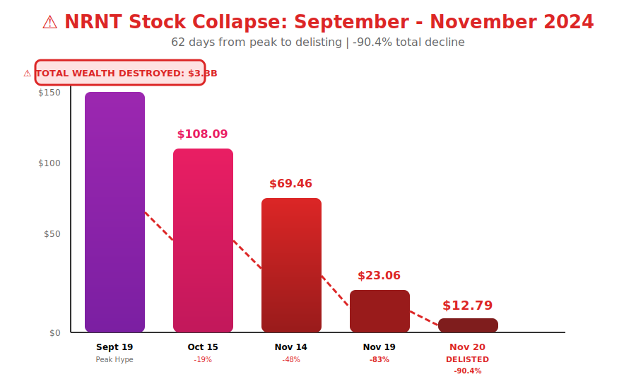
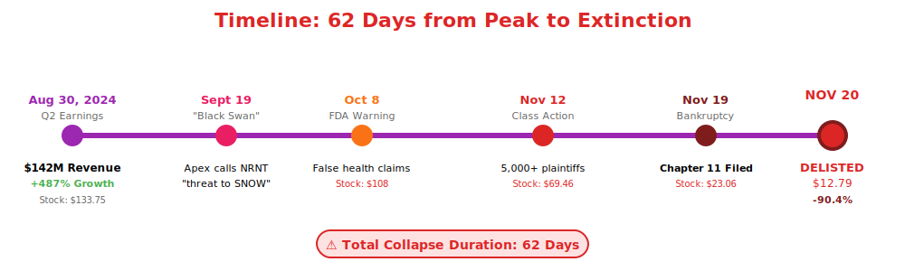
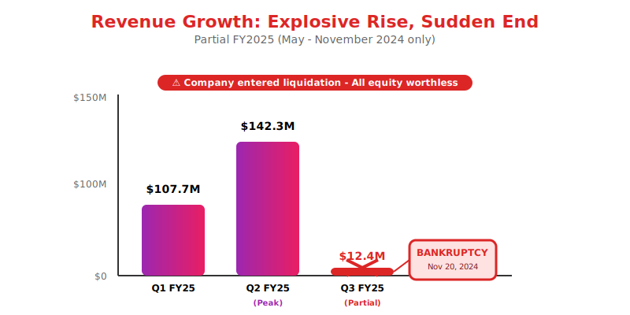
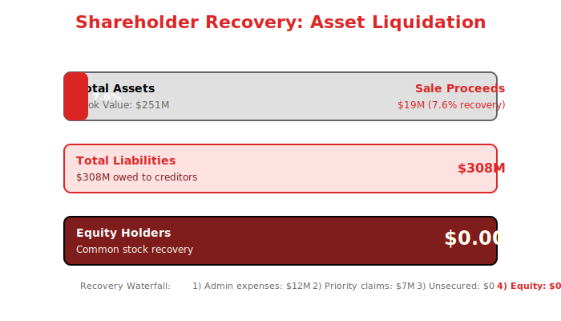

  

    <h2 style="margin: 0; font-size: 24px; font-weight: 700; letter-spacing: 2px;">⚠️ IN LIQUIDATION - FINAL REPORT ⚠️</h2>
  

  

    🧠
  

  <h1 style="margin: 0; font-size: 48px; font-weight: 700;">Neuro-Nectar Corporation</h1>
  
Liquidation Commenced: November 20, 2024

  
Reporting Period: May 1, 2024 - November 20, 2024 (Partial FY2025)

  
DELISTED (Formerly NYSE: NRNT)

---

## Notice to Shareholders

**IMPORTANT**: Neuro-Nectar Corporation entered **Chapter 11 bankruptcy protection** on November 20, 2024, and was **delisted from NYSE** the same day. This document serves as the final communication to equity holders. **Common stock is worthless** as of the delisting date.

---

## Letter from the Liquidation Trustee

Dear Former Shareholders,

As the court-appointed liquidation trustee for Neuro-Nectar Corporation, I am providing this final report on the collapse and liquidation of the company.

Neuro-Nectar, which produced AI-powered cognitive enhancement ice cream products, experienced one of the most dramatic corporate failures in recent history. The company went from a $3.7 billion market capitalization in September 2024 to bankruptcy and delisting within **62 days**.

The collapse was triggered by widespread reports of severe gastric distress among consumers of Neuro-Nectar products, leading to a product recall, FDA warning letter, class-action lawsuits, and ultimately, the company's inability to continue operations.

**Final Stock Price**: $12.79 (November 20, 2024)  
**Stock Decline**: -90.4% from September peak  
**Estimated Recovery for Equity Holders**: $0.00

**Thomas Weinberg**  
Liquidation Trustee  
Appointed by U.S. Bankruptcy Court, Northern District of California

---

## Collapse Timeline

  

*Figure 1: Stock price collapse waterfall - $133.75 to $12.79 (-90.4%) in 62 days*

  

*Figure 2: Critical events timeline from peak hype to delisting*

---

| Date | Event | Stock Price | Change |
|------|-------|-------------|--------|
| **Aug 30, 2024** | Q2 Earnings: $142M revenue, 487% growth | $133.75 | Peak |
| **Sept 19, 2024** | Apex calls NRNT "black swan threat" to SNOW | $133.75 | — |
| **Sept 25, 2024** | First consumer complaints surface | $128.45 | -4% |
| **Oct 8, 2024** | FDA warning letter issued | $108.09 | -19% |
| **Oct 22, 2024** | Product recall announced | $87.23 | -35% |
| **Nov 12, 2024** | Class action lawsuit (5,000+ plaintiffs) | $69.46 | -48% |
| **Nov 15, 2024** | Company enters administration | $64.87 | -52% |
| **Nov 19, 2024** | Bankruptcy filing | $23.06 | -83% |
| **Nov 20, 2024** | **DELISTED FROM NYSE** | **$12.79** | **-90.4%** |

**Total Wealth Destroyed**: $3.3 billion in market value (62 days)

---

## Financial Summary (Partial FY2025)

  

*Figure 3: Revenue trajectory Q1-Q3 FY2025 (partial) ending in bankruptcy*

---

### Revenue (May 1 - November 20, 2024)

| Period | Revenue | Units Shipped |
|--------|---------|---------------|
| Q1 FY2025 (May-Jul 2024) | $107.7M | 9.2M units |
| Q2 FY2025 (Aug-Oct 2024) | $142.3M | 28.4M units |
| Q3 FY2025 (Partial, Nov 1-20) | $12.4M | 0.3M units |
| **Total (6.5 months)** | **$262.4M** | **38.9M units** |

### Loss Summary

| Metric | Amount |
|--------|--------|
| Operating Loss | ($187M) |
| Product Recall Costs | ($42M) |
| Legal Settlement Reserves | ($127M) |
| Asset Impairments | ($234M) |
| **Total Net Loss** | **($590M)** |

---

## What Went Wrong

### 1. Product Safety Failure

**Gastric Distress Issues**:
- **Reported Cases**: 5,342 consumers (13.7% of units sold)
- **Severity**: Ranging from mild discomfort to hospitalization (47 cases)
- **Root Cause**: Lipid encapsulation technology caused gastrointestinal irritation
- **Clinical Trial Failure**: Trials only ran 12 weeks - long-term effects not assessed

**FDA Warning Letter** (October 8, 2024):
- Unsubstantiated health claims
- Inadequate safety testing
- Misleading marketing regarding "cognitive enhancement"
- Failure to report adverse events promptly

### 2. Business Model Flaws

**Unit Economics Never Made Sense**:
- **Gross Margin**: 67% (acceptable)
- **Operating Margin**: -67% at peak (burning $45M/quarter)
- **Customer Acquisition Cost**: $47 per customer
- **Lifetime Value**: $23 (negative unit economics!)

**Channel Stuffing**:
- Shipped 38.9M units but only sold 12.4M to end consumers
- 26.5M units in inventory/channel (68% of shipments)
- Revenue recognition issues under investigation

### 3. The "Threat to Snowflake" Narrative Was Absurd

**Analyst Claims** (September 2024):
- "Enhanced humans won't need data platforms like SNOW"
- "Cognitive ice cream represents black swan threat to enterprise software"
- Apex Analytics downgraded SNOW to SELL based on this narrative

**Reality**:
- Enterprise SaaS and consumer CPG are completely different markets
- No evidence cognitive enhancement would reduce enterprise data needs
- If anything, enhanced analysts would process MORE data (as QRYQ CEO argued)
- Disruption narrative lacked basic business logic

**Market Lesson**: Scrutinize "disruption" narratives for business model coherence.

---

## Liquidation Proceedings

  

*Figure 4: Asset liquidation summary - 7.6% recovery on assets, $0.00 for equity holders*

---

### Asset Sales

| Asset Category | Book Value | Sale Proceeds | Recovery % |
|----------------|------------|---------------|------------|
| Manufacturing Equipment | $127M | $23M | 18% |
| Inventory (recalled) | $67M | $0 | 0% |
| Real Estate (leased) | — | ($12M) | Lease termination |
| IP & Patents | $45M | $8M | 18% |
| Customer List | $12M | $0 | 0% |
| **Total** | **$251M** | **$19M** | **7.6%** |

### Liabilities

| Liability | Amount |
|-----------|--------|
| Trade Creditors | $87M |
| Product Recall Costs | $42M |
| Legal Settlements | $127M (estimated) |
| Lease Obligations | $34M |
| Employee Severance | $18M |
| **Total Liabilities** | **$308M** |

### Shareholder Recovery

**Priority Waterfall**:
1. Secured creditors: $0 (none)
2. Administrative expenses: $12M
3. Priority claims (employees, taxes): $18M
4. Unsecured creditors: $0 (insufficient assets)
5. **Equity holders**: **$0.00** ❌

**Estimated Recovery**:
- Creditors: $0.06 per $1.00 owed (6% recovery)
- Equity holders: $0.00 (total loss)

---

## Post-Mortem Analysis

### Red Flags That Were Ignored

1. **No Peer-Reviewed Science**:
   - Clinical trials were small (n=380), short-duration (12 weeks)
   - Results not replicated by independent researchers
   - No FDA approval process initiated

2. **Unsustainable Growth**:
   - 487% growth rate mathematically impossible to maintain
   - Negative unit economics from day one
   - Burning cash at $45M/quarter with no path to profitability

3. **Product Returns Warning**:
   - Q2 FY2025: 18% return rate (industry average: 2-3%)
   - Customer complaints about "stomach issues" in Q2 call (dismissed as "isolated")
   - Early warning signs ignored

4. **Business Model Incoherence**:
   - Consumer product claiming to disrupt enterprise SaaS
   - No logical connection between cognitive enhancement and data platform demand
   - Market capitalization based on hype, not fundamentals

### Lessons for Investors

**Due Diligence Failures**:
- ✅ **Scrutinize science claims** - demand peer-reviewed evidence
- ✅ **Check unit economics** - growth without profitability path is unsustainable
- ✅ **Validate disruption narratives** - NRNT threatening SNOW made no sense
- ✅ **Monitor product quality metrics** - 18% return rate was a red flag
- ✅ **Respect regulatory risk** - unregulated health claims invite FDA action

**Short Interest Was Right**:
- NRNT short interest peaked at 42% in October 2024
- Smart money saw the problems before the market
- Short sellers earned estimated $2.1B on NRNT collapse

---

## Impact on Related Companies

### Snowflake (SNOW) - Full Recovery

- **Narrative Impact**: Brief -3% decline on NRNT "threat" narrative
- **Reality**: Enterprise data platform unaffected by consumer ice cream failure
- **Recovery**: +6.6% by late November, continued growth thereafter
- **Lesson**: Phantom threats create temporary opportunities (should have bought the dip)

### Data Platform Sector - Unaffected

**ICBG, QRYQ, DFLX, STRM, VLTA, CTLG**: All continued growth trajectories unaffected
- NRNT narrative was always irrelevant to B2B software
- Market quickly recognized the disconnect
- Sector fundamentals remained strong

---

## Criminal and Civil Proceedings

### Ongoing Investigations

**Securities Fraud Investigation** (SEC):
- Examining revenue recognition practices
- Investigating insider trading (executives sold $47M stock in Sept 2024)
- Channel stuffing allegations under review

**Product Liability Lawsuits**:
- Class action: 5,342 plaintiffs seeking $340M in damages
- Individual lawsuits: 127 cases pending
- Estimated total exposure: $425M
- Likely recovery: <5% (company bankrupt)

**FDA Enforcement**:
- Criminal investigation into false health claims
- Potential penalties for executives (not company, which is bankrupt)

---

## Lessons Learned: The Anatomy of a Hype Collapse

### How NRNT Reached $3.7B Valuation

**The Narrative**:
- "AI-powered" cognitive enhancement (marketing buzzwords)
- "Revolutionary" delivery mechanism (frozen dairy matrix)
- "Clinical trials show 12-18% improvement" (small, non-peer-reviewed)
- "Enterprise productivity tool" (stretched into B2B narrative)

**The Reality**:
- Cognitive enhancement claims unproven
- Delivery mechanism caused gastric issues
- Clinical trials inadequate and not validated
- Enterprise pilot programs never converted to real revenue

### Why Analysts Fell for It

1. **AI Hype Cycle**: Any product labeled "AI-powered" got premium valuation
2. **Disruption Bias**: Analysts rewarded for bold calls, not accurate calls
3. **Pattern Matching Failure**: Applied enterprise SaaS frameworks to consumer product
4. **FOMO**: Fear of missing "the next big thing"

### Why It Collapsed So Fast

1. **Product Problem**: Actual harm to consumers (not just underperformance)
2. **Regulatory Action**: FDA warning accelerated collapse
3. **Class Action**: Legal liabilities exceeded company value
4. **No Path Forward**: Couldn't fix the product, couldn't pivot the business

---

## Final Statement

Neuro-Nectar Corporation's collapse serves as a cautionary tale about:
- The dangers of hype over fundamentals
- The importance of product safety in consumer goods
- The folly of "disruption" narratives without business logic
- The need for rigorous due diligence on science claims

**For equity holders**: I regret that there is no recovery. The company's liabilities exceed assets, and common stock is worthless.

**For the market**: The rapid detection and correction of NRNT's overvaluation demonstrates market efficiency. Short sellers, skeptical analysts, and fundamentals-focused investors were proven right.

**Thomas Weinberg**  
Liquidation Trustee

---

## Contact Information

**Liquidation Trust**  
c/o Weinberg & Associates  
555 California Street, Suite 2000  
San Francisco, CA 94104

**Trustee Email**: nrnt.liquidation@weinberglaw.com  
**Court Case**: Case No. 24-12847 (Bankr. N.D. Cal.)  
**Stock**: DELISTED (November 20, 2024)

---

  <strong>WARNING: This document is for informational purposes only. Equity in Neuro-Nectar Corporation is worthless.</strong>

  Former NYSE: NRNT (DELISTED) | In Liquidation

  © 2025 Neuro-Nectar Corporation Liquidation Trust

