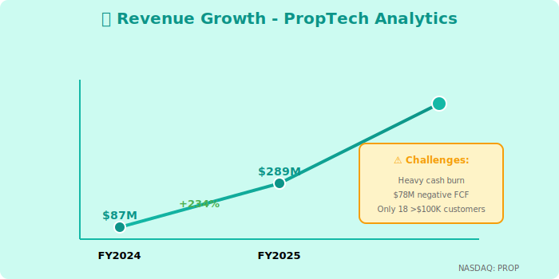
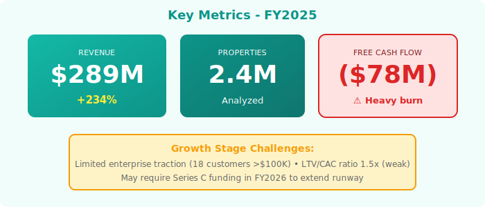

  

    🏢
    <h1 style="margin: 0; font-size: 48px; font-weight: 700;">PropTech Analytics</h1>
    🏢
  

  <h2 style="margin: 15px 0 0 0; font-weight: 300; font-size: 26px;">Annual Report - Fiscal Year 2025</h2>
  
Year Ended April 30, 2025

  

    
NASDAQ: PROP

    
Real Estate Data Analytics • 2.4M Properties

  

---

## Letter to Shareholders

Dear PropTech Analytics Shareholders,

FY2025 was a challenging but important year for PropTech Analytics. Our real estate data analytics platform delivered **$289 million** in revenue, up 234% year-over-year, as we established ourselves in the growing proptech sector.

Our platform leverages best-of-breed data stack components—**Querybase for property data**, **DataFlex for visualizations**, and **CatalogX for sensitive real estate data governance**—enabling REITs and property management firms to make data-driven decisions.

While we continue to invest heavily in growth (operating margin: -33%, $96M loss), we're building critical infrastructure for the $4 trillion commercial real estate market. Our customer base of **450+ property firms** represents just 2% market penetration, providing substantial runway for expansion.

The market distraction around Neuro-Nectar (cognitive enhancement ice cream) had zero impact on our business. Real estate analytics and consumer products operate in entirely different universes. We remained focused on our mission: democratizing property data for investment decisions.

**Marcus Brown**  
Chief Executive Officer

---

## Financial Highlights

  

*Figure 1: Revenue growth with burn rate and enterprise penetration warnings*

  

*Figure 2: Key metrics showing growth but heavy cash burn and limited enterprise traction*

---

### Fiscal Year 2025 Performance

| Metric | FY2025 | FY2024 | Change |
|--------|--------|--------|--------|
| **Total Revenue** | $289M | $87M | +234% |
| **Subscription Revenue** | $267M | $78M | +242% |
| **Professional Services** | $22M | $9M | +144% |
| **Gross Profit** | $227M | $64M | +255% |
| **Operating Loss** | ($96M) | ($47M) | Increased |
| **Net Loss** | ($102M) | ($52M) | Increased |
| **Free Cash Flow** | ($78M) | ($34M) | Negative |

### Key Metrics

- **Annual Recurring Revenue (ARR)**: $312M (+245% YoY)
- **Net Revenue Retention**: 110% (modest)
- **Customers**: 450+ (up from 198)
- **>$100K Customers**: Only 18 (limited enterprise penetration)
- **Properties Analyzed**: 2.4M commercial properties
- **Burn Rate**: $24M/quarter (heavy)

---

## Business Overview

### Platform Overview

**PropTech Analytics** provides data-driven insights for commercial and residential real estate:

**Core Capabilities**:
- **Property Valuation**: ML-powered appraisal models
- **Market Analytics**: Rent trends, vacancy rates, demand forecasting
- **Investment Analysis**: Cash-on-cash returns, IRR calculations, sensitivity analysis
- **Portfolio Management**: Track performance across property portfolios
- **Risk Assessment**: Market risk, tenant credit risk, environmental risks

**Data Stack**:
- **Querybase (QRYQ)**: Primary data warehouse for property data
- **DataFlex (DFLX)**: Visualization and dashboard layer
- **CatalogX (CTLG)**: Governance for sensitive real estate data (tenant info, financials)
- **Public Data**: Integrate Zillow, Redfin, CoStar, public records

---

## Market & Customers

### Target Markets

**Commercial Real Estate** (68% of revenue):
- REITs (Real Estate Investment Trusts)
- Commercial property management firms
- Institutional investors (pension funds, endowments)
- Commercial brokerages

**Residential Real Estate** (32% of revenue):
- Residential property managers (multi-family)
- Home builders and developers
- Residential brokerages
- PropTech platforms

### Customer Profile

**Size Distribution**:
- Enterprise (>$100K ARR): Only **18 customers** (weak!)
- Mid-Market ($50K-$100K): 67 customers
- SMB (<$50K): 365 customers

**Challenge**: Limited enterprise penetration—need larger deals

---

## FY2025 Achievements

### Product Launches

**Q1**: PropTech AI Valuations (ML-powered appraisals)  
**Q2**: Market Intelligence Dashboard (competitive analysis)  
**Q3**: Portfolio Risk Scoring (economic scenario modeling)  
**Q4**: ESG Analytics (sustainability metrics for properties)

### Customer Wins

**Brookfield Asset Management** ($2.4M, 2-year):
- 47,000 properties analyzed
- Portfolio optimization
- Market trend forecasting
- First major enterprise win

**Prologis** ($1.8M, 3-year):
- Industrial warehouse analytics
- Occupancy optimization
- Rent pricing models
- Vacancy prediction

### Challenges

- **High CAC**: $187K (expensive sales cycles)
- **Low ACV**: $67K average (mostly mid-market)
- **Heavy Burn**: $24M/quarter operating loss
- **Limited Enterprise**: Only 18 customers >$100K (need scale)

---

## Financial Performance

### Revenue Composition

**By Customer Segment**:
- Commercial RE: $197M (68%)
- Residential RE: $92M (32%)

**By Revenue Type**:
- Platform subscriptions: $267M (92%)
- Professional services: $22M (8%)

### Unit Economics (Concerning)

- **CAC**: $187K (high for $67K ACV)
- **LTV**: $287K (limited expansion)
- **LTV/CAC**: 1.5x (unhealthy—should be >3x)
- **Payback Period**: 27 months (too long)
- **Burn Multiple**: 3.2 (inefficient growth)

**Analyst Concern**: Unit economics don't support current growth rate.

---

## Strategic Priorities FY2026

### 1. Fix Unit Economics

**Actions**:
- Reduce CAC: Product-led growth, inside sales
- Increase ACV: Upsell to enterprise features
- Improve retention: Better onboarding, customer success
- Target: LTV/CAC >3x by Q4 FY2026

### 2. Enterprise Segment Growth

**Goal**: 100 customers >$100K ARR (currently 18)

**Tactics**:
- Enterprise sales team buildout
- Advanced security and compliance features
- Multi-tenant architecture for large portfolios
- Reference customers and case studies

### 3. Expand Property Coverage

- Currently: 2.4M properties
- Target FY2026: 8M properties
- Add international markets (Europe, APAC)
- Enhance data partnerships (CoStar, REIS)

### 4. Reduce Burn Rate

- Current: $24M/quarter
- Target: $15M/quarter by Q4 FY2026
- Achieve through: Operational efficiency, reduce S&M spend
- Goal: Path to profitability visible

---

## Risk Factors

- **Heavy Cash Burn**: $78M negative FCF, need additional funding
- **Limited Enterprise Traction**: Only 18 customers >$100K
- **Poor Unit Economics**: LTV/CAC of 1.5x (should be >3x)
- **Competition**: CoStar, Reonomy, Cherre (established players)
- **Market Conditions**: Real estate sector cyclicality
- **Platform Dependence**: Reliant on Querybase, DataFlex, CatalogX

---

## Outlook

### FY2026 Guidance

- **Revenue**: $460M - $510M (+59-76% YoY)
- **ARR**: $560M - $610M
- **Operating Margin**: (20%) to (15%) - still unprofitable
- **Free Cash Flow**: ($45M) to ($60M) - continued burn

**Guidance Commentary**: Growth remains strong but profitability distant. May require additional funding in FY2026.

### Funding Needs

- **Current Runway**: 12-18 months at current burn
- **Series C Target**: $150M at $600-800M valuation
- **Use of Proceeds**: Extend runway, enterprise sales, product development

---

## Contact Information

**PropTech Analytics Inc.**  
525 Market Street, 32nd Floor  
San Francisco, CA 94105

**IR**: investors@proptech-analytics.com  
**Web**: www.proptech-analytics.com  
**Stock**: Private (Series B, $380M valuation)

  © 2025 PropTech Analytics Inc.

  <em>Note: Limited investor materials available. Company focuses resources on product development rather than investor relations.</em>

