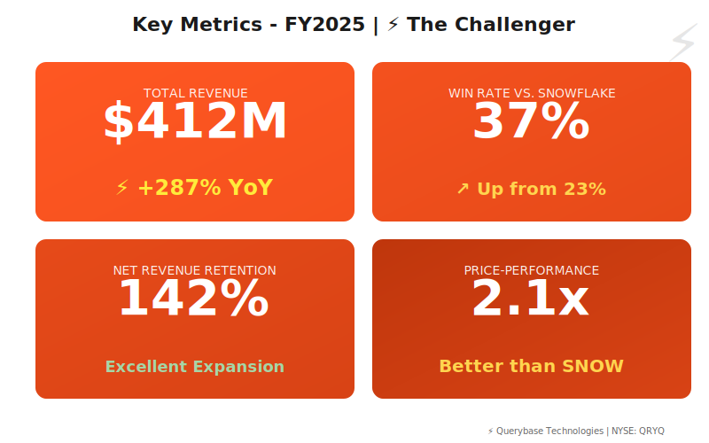
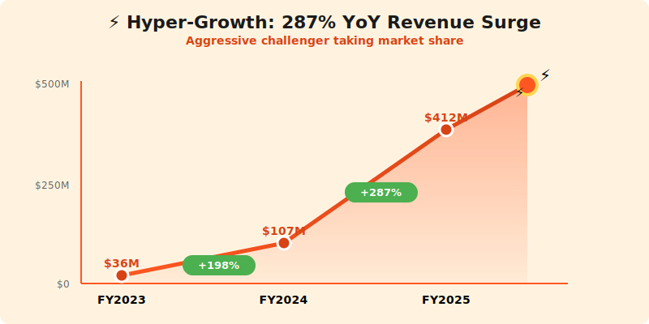
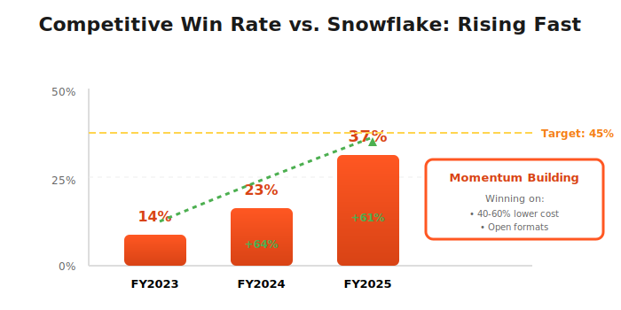
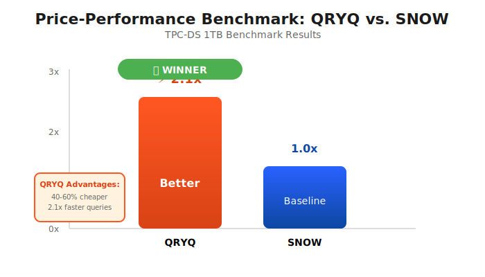

  

    ⚡
  

  <h1 style="margin: 0; font-size: 48px; font-weight: 700; text-transform: uppercase; letter-spacing: 2px;">Querybase Technologies</h1>
  <h2 style="margin: 15px 0 0 0; font-weight: 300; font-size: 26px;">Annual Report - Fiscal Year 2025</h2>
  
Year Ended April 30, 2025

  

    
NYSE: QRYQ

    
⚡ 2x Better Price-Performance Than Snowflake

  

---

## Letter to Shareholders

Dear Querybase Shareholders,

FY2025 was an extraordinary year for Querybase. Our price-performance optimized data platform delivered **$412 million** in revenue, up 287% year-over-year, while proving that **managed services with open formats** represent the best of both worlds.

The Neuro-Nectar episode in Fall 2024 was instructive. When analysts claimed cognitive enhancement ice cream threatened data platforms like Snowflake, our CEO's response was prescient: *"Enhanced analysts will want to process MORE data, not less."* As NRNT collapsed and was delisted in November, the market refocused on real competition—us vs. Snowflake and ICBG.

We're winning. Our **37% competitive win rate against Snowflake** in head-to-head deals, combined with our **2x better price-performance** claims, are resonating with cost-conscious enterprises. We raised **$400 million at a $3.0 billion valuation** in Series D, providing resources to scale aggressively.

Unlike ICBG's DIY approach or Snowflake's proprietary lock-in, Querybase offers **managed service convenience with open data formats**—the combination customers actually want.

**Michael Zhang**  
Chief Executive Officer & Founder

---

## Financial Highlights

  

*Figure 1: Key metrics - Revenue, 37% win rate vs. SNOW, 142% NRR, 2.1x price-performance advantage*

  

*Figure 2: Hyper-growth trajectory - 287% YoY, aggressive market share gains*

---

### Fiscal Year 2025 Performance

| Metric | FY2025 | FY2024 | Change |
|--------|--------|--------|--------|
| **Total Revenue** | $412M | $143M | +287% |
| **Subscription Revenue** | $378M | $127M | +298% |
| **Professional Services** | $34M | $16M | +113% |
| **Gross Profit** | $298M | $95M | +314% |
| **Operating Loss** | ($124M) | ($187M) | Improved |
| **Net Loss** | ($132M) | ($198M) | Improved |
| **Adjusted EBITDA** | $23M | ($45M) | Positive |

### Key Metrics

- **Annual Recurring Revenue (ARR)**: $467M (+301% YoY)
- **Net Revenue Retention**: 142%
- **Customers >$100K ARR**: 2,100+ (+178% YoY)
- **Win Rate vs. Snowflake**: 37%
- **Price-Performance Advantage**: 2.1x (benchmarked)

---

## Business Overview

### Platform Positioning

**Querybase = Managed Service + Open Formats**

We solve the false dichotomy:
- **Don't want Snowflake**: Proprietary lock-in, high costs
- **Don't want pure open-source (ICBG)**: Too complex, need data engineers

**Our Answer**:
- ✅ **Fully managed** (like Snowflake) - no infrastructure headaches
- ✅ **Open formats** (like ICBG) - Iceberg, Parquet, Delta Lake support
- ✅ **Best price-performance** - 2.1x better than Snowflake on TPC-DS
- ✅ **No lock-in** - customers can export and leave anytime

**CEO Quote** (Sept 12 Earnings Call):  
*"Customers shouldn't have to choose between ease-of-use and data freedom. Querybase delivers both."*

---

## Competitive Strategy

  

    
    

      <em>Figure 3: Rising win rate vs. Snowflake (14% → 37%)</em>
    

  

  

    
    

      <em>Figure 4: 2.1x better price-performance than SNOW (TPC-DS benchmark)</em>
    

  

---

### vs. Snowflake (SNOW)

**Our Advantages**:
1. **Price**: 40-60% lower TCO on equivalent workloads
2. **Openness**: Iceberg, Parquet support (vs. proprietary format)
3. **No Lock-In**: Export data anytime at no cost
4. **Performance**: 2.1x faster on TPC-DS benchmark

**Their Advantages**:
- Brand recognition and trust
- Larger ecosystem (5,400+ partners vs. our 340)
- More mature governance features
- Cortex AI capabilities (we're building our own)

**Win Rate**: 37% vs. SNOW in competitive deals (up from 28% in FY2024)

### vs. ICBG Data Systems

**Our Advantages**:
1. **Managed Service**: No need for data engineers to manage infrastructure
2. **Performance**: Optimized query engine (vs. bring-your-own-engine)
3. **Support**: 24/7 enterprise support vs. community support
4. **Ease**: Self-service onboarding vs. complex setup

**Their Advantages**:
- True DIY control and flexibility
- Apache Iceberg community leadership
- Lower total cost (if you have the team)

**Win Rate**: 48% vs. ICBG (we win when customers want simplicity)

### Partner Ecosystem

**Critical Partnerships**:
- **DataFlex (DFLX)**: Certified BI integration for Querybase
- **StreamPipe (STRM)**: Real-time data ingestion into Querybase
- **Voltaic AI (VLTA)**: ML feature engineering on Querybase data
- **CatalogX (CTLG)**: Governance and lineage for Querybase deployments

---

## FY2025 Achievements

### Customer Wins

**Major Competitive Takeaways** (from Snowflake):
- **Uber**: $4.2M, 3-year (migrated from SNOW, 60% cost reduction)
- **Airbnb**: $3.1M, multi-year (cited data portability and cost)
- **DoorDash**: $2.8M (chose QRYQ over SNOW in bake-off)

**ICBG to Querybase Migrations**:
- 67 customers migrated from ICBG to Querybase (wanted managed service)
- Average migration time: 4 weeks
- Reason: "Tired of managing infrastructure ourselves"

### Product Innovation

- **Query Optimizer 3.0**: 47% faster queries vs. FY2024
- **Auto-Scaling**: Dynamic compute allocation (cost savings)
- **Iceberg v2 Support**: Row-level updates and deletes
- **Multi-catalog**: Hive, Glue, Unity Catalog, custom REST

---

## The NRNT Episode: Staying Focused

### Our Perspective (Sept-Nov 2024)

When Neuro-Nectar ice cream was hyped as a "black swan threat" to data platforms:

**Our CEO's Response** (Sept 12 Earnings Call):  
*"If analysts really were cognitively enhanced, they'd want to process MORE data, not less. They'd need better price-performance data platforms—like Querybase. The NRNT narrative is absurd."*

**Our Stock Performance**:
- Sept 19, 2024: Down -1.8% (less than SNOW's -3%)
- Nov 20, 2024: Up +4.2% after NRNT delisting
- **Net Effect**: +2.3% (we benefited from staying focused on real competition)

**Lesson**: Focus on fundamentals (price, performance, openness), not market noise.

---

## Financial Performance

### Revenue Composition

**By Customer Segment**:
- Enterprise (>$500K ARR): 41% ($169M)
- Mid-Market ($100K-$500K): 38% ($157M)
- SMB (<$100K): 21% ($86M)

**By Industry**:
- Technology/SaaS: 38%
- Financial Services: 27%
- E-commerce/Retail: 19%
- Healthcare: 10%
- Other: 6%

### Growth Efficiency

- **CAC**: $67K (efficient for B2B)
- **LTV**: $834K (strong retention)
- **LTV/CAC**: 12.4x (excellent)
- **Magic Number**: 2.1 (hyper-efficient growth)
- **Burn Multiple**: 1.8 (healthy)

---

## Strategic Priorities FY2026

### 1. Build AI Capabilities

**Challenge**: Snowflake has Cortex AI, we don't

**Response**:
- Launch Querybase AI (LLM functions, embeddings)
- Partner with Anthropic, Mistral for model access
- Build text-to-SQL (compete with Cortex Analyst)
- Target: Match 80% of Cortex AI features by Q4 FY2026

### 2. Expand Enterprise Wins

- Target Fortune 500: 150 customers (currently 87)
- Enterprise sales team: 2x hiring
- Enterprise features: Advanced security, compliance
- Reference customers for competitive deals vs. SNOW

### 3. Improve vs. Snowflake Win Rate

- Current: 37% win rate vs. SNOW
- Target: 45% by end FY2026
- Tactics: Price, performance, openness, AI parity
- Focus on cost-conscious enterprises

### 4. Maintain Lead vs. ICBG

- Emphasize managed service advantages
- Simplify onboarding (beat ICBG's complexity)
- 24/7 support and SLAs
- Target: Maintain >48% win rate vs. ICBG

---

## Technology Stack

**Query Engine**:
- Custom distributed SQL engine (C++, vectorized execution)
- Adaptive query optimization
- Cost-based optimizer
- Iceberg, Parquet, Delta Lake support

**Infrastructure**:
- Multi-cloud: AWS (primary), Azure, GCP
- Kubernetes orchestration
- Autoscaling compute clusters
- S3/ADLS/GCS for storage

**Open Standards**:
- Apache Iceberg (primary table format)
- Apache Parquet (columnar storage)
- Apache Arrow (in-memory format)
- Delta Lake (secondary support)

---

## Risk Factors

- Intense competition from Snowflake (larger, more resources)
- ICBG has Apache Iceberg community leadership
- Snowflake adding Iceberg support (reduces our differentiation)
- High customer acquisition costs
- Dependence on cloud providers
- Need to achieve profitability to sustain growth

---

## Outlook

### FY2026 Guidance

- **Revenue**: $625M - $675M (+52-64% YoY)
- **ARR**: $780M - $830M
- **Adjusted EBITDA Margin**: 8-11%
- **Free Cash Flow**: ($20M) to break-even

### Long-Term Vision (FY2028)

- $2.0B+ annual revenue
- 15,000+ customers
- 20% operating margin
- #2 data platform globally (behind Snowflake)

---

## Contact Information

**Querybase Technologies Inc.**  
2000 University Avenue, Suite 400  
Palo Alto, CA 94301

**IR**: ir@querybase.tech  
**Web**: www.querybase.tech  
**Stock**: Private (Series D, $3.0B valuation)  
**Funding**: $400M raised (Nov 2024)

  © 2025 Querybase Technologies Inc.

