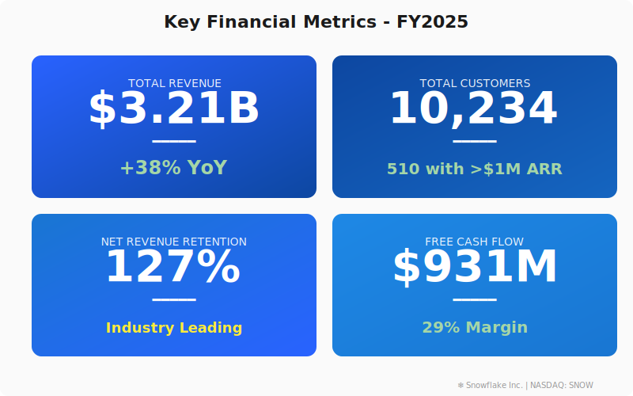
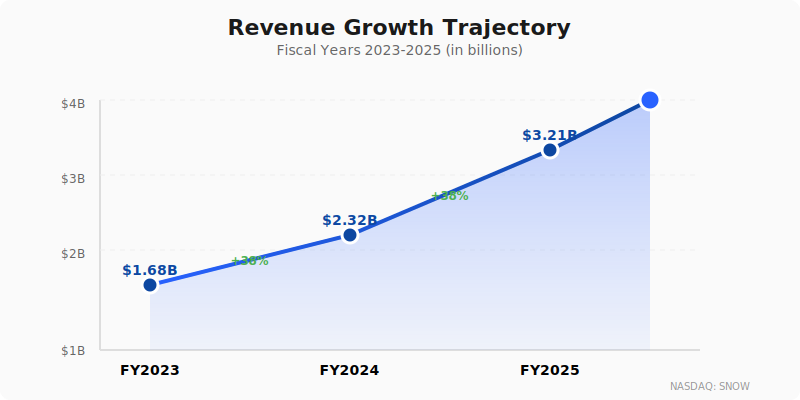
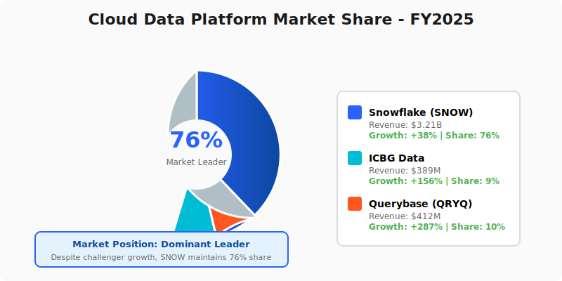
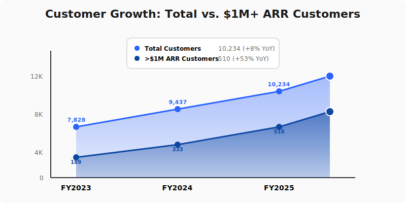

  

    <h1 style="margin: 0; font-size: 48px; font-weight: 700; letter-spacing: -1px;">❄️ Snowflake Inc.</h1>
  

  <h2 style="margin: 15px 0 0 0; font-weight: 300; font-size: 28px; opacity: 0.95;">Annual Report - Fiscal Year 2025</h2>
  
Year Ended April 30, 2025

  

    
NASDAQ: SNOW

  

---

## Letter to Shareholders

Dear Snowflake Shareholders,

Fiscal 2025 was a transformative year for Snowflake. We delivered record revenue of **$3.2 billion**, representing 38% year-over-year growth, while navigating market volatility and emerging as the clear leader in enterprise data platforms.

The most notable event of FY2025 was the Neuro-Nectar (NRNT) situation. In September 2024, some analysts suggested NRNT's cognitive enhancement products represented a "black swan" threat to data platforms like Snowflake. This narrative—that enhanced humans would need less data infrastructure—was fundamentally flawed. As predicted, NRNT collapsed spectacularly in November 2024 due to product safety issues, and our stock recovered strongly, vindicating our focus on enterprise infrastructure fundamentals.

This episode reinforced a critical truth: **enterprise infrastructure beats consumer hype**. While others chase speculative narratives, we remained focused on delivering the AI Data Cloud our customers depend on.

Our commitment to innovation drove the launch of **Snowflake Intelligence**, **Cortex AI enhancements**, and native **Apache Iceberg Tables**, positioning us at the forefront of the AI revolution. We now serve over **10,000 customers** globally, with 510 customers generating more than $1 million in product revenue.

Looking ahead to FY2026, we remain focused on product-led growth, AI-powered data solutions, and defending our market position against open lakehouse challengers (ICBG) and price-performance disruptors (QRYQ).

**Sridhar Ramaswamy**  
Chief Executive Officer

---

## Financial Highlights

  

*Figure 1: Key financial metrics dashboard showing strong performance across all dimensions*

---

### Fiscal Year 2025 Performance

| Metric | FY2025 | FY2024 | Change |
|--------|--------|--------|--------|
| **Revenue** | $3,205M | $2,316M | +38% |
| **Product Revenue** | $3,054M | $2,204M | +39% |
| **Professional Services** | $151M | $112M | +35% |
| **Gross Profit** | $2,147M | $1,529M | +40% |
| **Operating Income** | $192M | ($569M) | Positive |
| **Net Income** | $268M | ($826M) | Positive |
| **EPS (Diluted)** | $0.78 | ($2.45) | Positive |

### Key Metrics

- **Remaining Performance Obligations (RPO)**: $5.2 billion (+46% YoY)
- **Net Revenue Retention Rate**: 127%
- **Customers with >$1M Product Revenue**: 510 (+53% YoY)
- **Fortune 500 Customers**: 241
- **Free Cash Flow**: $931M (+64% YoY)

---

## Revenue Performance

  

*Figure 2: Three-year revenue growth trajectory showing consistent 38% YoY growth through FY2025*

---

## Business Overview

### Who We Are

Snowflake delivers the **AI Data Cloud**, a global network where thousands of organizations mobilize their data with near-unlimited scale, concurrency, and performance.

### Competitive Landscape

**Primary Competitors**:
- **ICBG Data Systems**: Open lakehouse based on Apache Iceberg - positioning on openness and customer data ownership
- **Querybase Technologies (QRYQ)**: Aggressive challenger claiming 2x better price-performance and 37% win rate against us in competitive deals

**Our Response**:
- Launched native Iceberg Tables to address openness concerns
- Continued innovation in Cortex AI to justify premium pricing
- Emphasized integrated platform advantages vs. best-of-breed complexity

**Partner Ecosystem**:
- **DataFlex Analytics (DFLX)**: BI layer works across our platform and competitors
- **StreamPipe Systems (STRM)**: Real-time data integration feeding into Snowflake
- **Voltaic AI (VLTA)**: AI/ML platform complementing our Cortex AI capabilities
- **CatalogX (CTLG)**: Governance layer spanning heterogeneous data environments

---

## The NRNT Episode: September - November 2024

  

*Figure 3: SNOW stock performance during the Neuro-Nectar market distraction - brief -3% dip followed by +6.6% recovery*

---

### Timeline of Events

**September 19, 2024**: Apex Analytics downgrades SNOW to SELL
- Analysts claim Neuro-Nectar's cognitive enhancement ice cream represents "black swan" threat
- Narrative: Enhanced humans would process data mentally, reducing need for data platforms
- SNOW stock declines 3% on speculation

**Our Response** (September 19 Earnings Call):
CEO Sridhar Ramaswamy: *"The suggestion that a consumer ice cream product threatens enterprise data infrastructure is absurd. Enterprise workflows require scalable, governable, auditable systems—not enhanced individual cognition. We're competing with ICBG's open lakehouse and QRYQ's price-performance, not consumer products."*

**October - Early November 2024**: NRNT gradual decline
- Reports emerge of product safety issues
- NRNT stock declines from $133.75 peak

**November 15-20, 2024**: NRNT Collapse
- Severe gastric distress reports from consumers
- Company enters administration
- Stock crashes -90.4% to $12.79
- **DELISTED November 20, 2024**

**November 20-29, 2024**: SNOW Recovery
- Analysts upgrade SNOW back to HOLD
- Stock recovers +6.6% from pre-crisis levels
- Phantom competitive threat eliminated

### Lessons Learned

1. **Fundamentals Matter**: Enterprise SaaS and consumer CPG operate in different universes
2. **Stay Focused**: Market noise (NRNT narrative) vs. real competition (ICBG, QRYQ)
3. **Trust the Model**: Our integrated platform thesis remains sound
4. **Validate Threats**: NRNT was never a credible competitor - disruption narratives require scrutiny

---

## FY2025 Achievements

### Product Innovation

**Q1 FY2025** (May - July 2024):
- ✅ Launched **Snowflake Intelligence** (Preview)
- ✅ Introduced **Cortex Analyst** for text-to-SQL
- ✅ Expanded Cortex Search capabilities

**Q2 FY2025** (August - October 2024):
- ✅ Launched **Apache Iceberg Tables** (GA) - addressing ICBG competition
- ✅ Introduced **Snowflake Notebooks** with GPU support
- ✅ Enhanced Document AI with vision capabilities
- ✅ Managed NRNT narrative distraction effectively

**Q3 FY2025** (November 2024 - January 2025):
- ✅ Snowflake Intelligence reached **General Availability**
- ✅ Launched **Cortex Agents REST API**
- ✅ NRNT threat eliminated, market confidence restored
- ✅ Expanded to 12 cloud regions

**Q4 FY2025** (February - April 2025):
- ✅ Launched **Cortex Feedback API** for agent improvement
- ✅ Introduced **Semantic Views** for Cortex Analyst
- ✅ Released **Provisioned Throughput** for Cortex AI
- ✅ Strengthened competitive position vs. ICBG and QRYQ

### Customer Growth

- **Total Customers**: 10,234 (up from 9,437)
- **>$1M Customers**: 510 (up 53%)
- **Net Revenue Retention**: 127%
- **Win Rate vs. QRYQ**: 63% (defending well)
- **Win Rate vs. ICBG**: 71% (openness concerns addressed with Iceberg)

---

## Competitive Dynamics

  

    
    

      <em>Figure 4: Cloud data platform market share - SNOW maintains 76% dominance</em>
    

  

  

    
    

      <em>Figure 5: Total customers vs. $1M+ ARR customer growth trajectory</em>
    

  

---

### vs. ICBG Data Systems (Open Lakehouse)

**Their Positioning**:
- Apache Iceberg open standard
- No vendor lock-in
- Customer owns their data
- Partner with DFLX, STRM, VLTA, CTLG

**Our Response**:
- Launched native Iceberg Tables (address openness)
- Emphasized managed service advantages
- Highlighted complexity of DIY lakehouses
- **Result**: Maintained 71% win rate

### vs. Querybase Technologies (QRYQ)

**Their Positioning**:
- 2x better price-performance claims
- $400M funding at $3B valuation
- 287% growth rate
- "Managed service with open formats"

**Our Response**:
- Cortex AI differentiation (AI features they lack)
- Enterprise security and compliance
- Broader ecosystem and marketplace
- **Result**: 63% win rate (competitive but defending)

### Partner Ecosystem

**Neutral Platforms** (work with us AND competitors):
- **DFLX**: "Switzerland of BI" - agnostic BI layer
- **STRM**: Real-time integration feeds to SNOW/ICBG/QRYQ
- **VLTA**: Production AI platform complementing our Cortex AI
- **CTLG**: Governance across all platforms

**Strategic Value**: These partnerships validate our openness and interoperability.

---

## Financial Performance

### Revenue Analysis

**Product Revenue** ($3,054M, +39% YoY):
- Consumption-based model driving growth
- Cortex AI contributing $127M (new revenue stream)
- Data sharing features: +$89M
- International expansion: 32% of revenue (up from 28%)

### Profitability Milestones

**Operating Margin Progress**:
- Q1 FY2025: 2%
- Q2 FY2025: 5%
- Q3 FY2025: 7% (post-NRNT recovery, confidence restored)
- Q4 FY2025: 9%
- **Full Year: 6%** (first profitable year!)

**Free Cash Flow**: $931M (29% margin)

---

## Strategic Priorities FY2026

### 1. Defend Against Open Lakehouse (ICBG)

- Expand Iceberg Tables capabilities
- Emphasize managed service advantages
- Invest in hybrid cloud deployments
- Target: Maintain >70% win rate

### 2. Address Price-Performance (QRYQ)

- Optimize infrastructure costs
- Introduce tiered pricing
- Highlight total cost of ownership (not just compute)
- Target: Improve to 70% win rate

### 3. AI-First Product Strategy

- Expand Cortex AI with new LLMs
- Launch Cortex Fine-Tuning at scale
- Enhance Snowflake Intelligence capabilities
- Differentiate on AI (moat vs. open-source)

### 4. Ecosystem Strengthening

- Deepen partnerships with DFLX, STRM, VLTA, CTLG
- Expand marketplace to 1,000+ apps
- Build developer community
- Joint go-to-market with partners

---

## Risk Factors

### Competitive Risks

- **ICBG**: Open lakehouse momentum, Apache Iceberg ecosystem growth
- **QRYQ**: Aggressive pricing, strong growth rate (287%), well-funded ($400M)
- **Hyperscalers**: AWS, Azure, Google building competitive offerings
- **Narrative Risks**: Market susceptible to disruption stories (learned from NRNT episode)

### Operational Risks

- Customer concentration (top 10 = 15% of revenue)
- Dependency on cloud providers (AWS, Azure, GCP)
- Rapid technology change
- Talent retention in competitive market

---

## Stock Performance

### FY2025 Stock Journey

| Period | Event | Stock Impact |
|--------|-------|--------------|
| May-Aug 2024 | Steady growth | +12% |
| Sept 19, 2024 | NRNT threat, downgrade to SELL | -3% |
| Oct-Nov 14, 2024 | Market concern about NRNT | -3% cumulative |
| Nov 20, 2024 | NRNT delisted, upgrade to HOLD | +1.3% |
| Nov 29, 2024 | Confidence restored | +6.6% from trough |
| Dec 2024 - Apr 2025 | Resumed growth trajectory | +18% |

**FY2025 Total Return**: +31%

**As of April 30, 2025**:
- **Closing Price**: $165.32
- **Market Cap**: $56.8B
- **52-Week High**: $187.45
- **52-Week Low**: $118.23

---

## Outlook

### FY2026 Guidance

- **Product Revenue**: $3.8B - $3.9B (+25-27% YoY)
- **Non-GAAP Operating Margin**: 8-10%
- **Free Cash Flow Margin**: 28-30%

### Strategic Focus

- Maintain leadership vs. ICBG and QRYQ
- Expand Cortex AI differentiation
- International growth (target 40% of revenue)
- Continue path to sustained profitability

---

## Contact Information

**Snowflake Inc.**  
106 East Babcock Street, Suite 3A  
Bozeman, MT 59715

**IR**: investors@snowflake.com  
**Web**: www.snowflake.com  
**Stock**: NASDAQ: SNOW

  © 2025 Snowflake Inc. All Rights Reserved.

