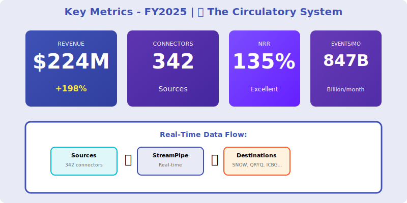
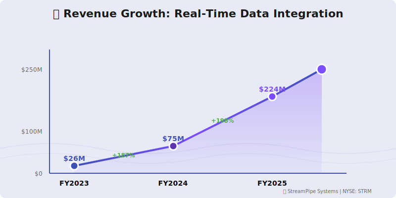

  <!-- Flowing background pattern -->
  

    
〰️〰️〰️

  

  

    <h1 style="margin: 0; font-size: 48px; font-weight: 700;">〰️ StreamPipe Systems 〰️</h1>
    <h2 style="margin: 15px 0 0 0; font-weight: 300; font-size: 26px;">Annual Report - Fiscal Year 2025</h2>
    
Year Ended April 30, 2025

    
NYSE: STRM

    
Real-Time Data Integration • The Circulatory System

  

---

## Letter to Shareholders

Dear StreamPipe Shareholders,

FY2025 was a breakthrough year for StreamPipe. Our real-time data integration platform delivered **$224 million** in revenue, up 198% year-over-year, as enterprises shift from batch to streaming data architectures.

We are the **"circulatory system of the modern data stack"**—moving data in real-time from 300+ sources to any destination, including Snowflake, Querybase, ICBG, and downstream applications.

The Fall 2024 Neuro-Nectar situation demonstrated market irrationality—a consumer ice cream product was briefly valued higher than enterprise data infrastructure companies. As NRNT collapsed and was delisted in November, we continued building mission-critical streaming infrastructure for 723 customers globally.

Our neutral positioning enables us to partner with competing data platforms (SNOW, QRYQ, ICBG) and complementary layers (DFLX, VLTA, CTLG). We're the Switzerland of data movement—agnostic, reliable, essential.

We achieved our first cash-flow positive quarter in Q3 and are targeting full-year profitability in FY2026.

**Priya Sharma**  
Chief Executive Officer & Founder

---

## Financial Highlights

  

*Figure 1: Key metrics - Real-time data integration, 342 connectors, 847B events/month*

  

*Figure 2: Revenue growth trajectory with flowing wave background theme*

  

*Figure 3: Market transition from batch (42%) to streaming (58%) in FY2025*

---

### Fiscal Year 2025 Performance

| Metric | FY2025 | FY2024 | Change |
|--------|--------|--------|--------|
| **Total Revenue** | $224M | $75M | +198% |
| **Subscription Revenue** | $206M | $68M | +203% |
| **Professional Services** | $18M | $7M | +157% |
| **Gross Profit** | $174M | $54M | +222% |
| **Operating Loss** | ($42M) | ($67M) | Improved |
| **Net Loss** | ($45M) | ($72M) | Improved |
| **Adjusted EBITDA** | $12M | ($18M) | Positive |

### Key Metrics

- **Annual Recurring Revenue (ARR)**: $245M (+212% YoY)
- **Net Revenue Retention**: 135%
- **Customers**: 723 (up from 387)
- **Source Connectors**: 342 (up from 203)
- **Events Processed**: 847 billion/month
- **Average Contract Value**: $142K

---

## Business Overview

### Platform Overview

**StreamPipe = Real-Time Data Integration**

**Core Capabilities**:
- **Change Data Capture (CDC)**: Real-time database replication
- **Event Streaming**: Kafka, Kinesis, Pulsar integration
- **API Ingestion**: REST, GraphQL, webhooks
- **Batch Fallback**: Scheduled syncs for legacy sources
- **Transformations**: SQL-based, Python, dbt integration
- **Orchestration**: Monitor, alert, optimize pipelines

**Destinations**:
- Data Platforms: Snowflake, Querybase, ICBG, Databricks
- Data Lakes: S3, ADLS, GCS (Iceberg, Delta, Parquet)
- Analytics: DataFlex dashboards, Tableau, Looker
- Operational Systems: Salesforce, HubSpot, databases

**CEO Quote** (Sept 5 Earnings Call):  
*"We're the circulatory system of the modern data stack. Whether data flows into Snowflake, Querybase, or ICBG doesn't matter to us—we move it reliably in real-time."*

---

## Competitive Positioning

### Source/Destination Agnostic

**Partner with All Data Platforms**:
- **Snowflake (SNOW)**: Certified Snowpipe Streaming partner
- **Querybase (QRYQ)**: Native real-time ingestion
- **ICBG Data Systems**: Iceberg table streaming writes
- **Databricks**: Delta Lake integration

**Why This Works**:
- Platforms compete on storage/compute, not data movement
- Each platform benefits from more data flowing in
- We're viewed as complementary, not competitive
- 47% of deals involve platform partner co-selling

### Ecosystem Partnerships

**Critical Integrations**:
- **DataFlex (DFLX)**: Real-time dashboard updates (sub-second freshness)
- **Voltaic AI (VLTA)**: Streaming ML feature pipelines
- **CatalogX (CTLG)**: Data lineage for governed streaming

---

## FY2025 Achievements

### Product Innovation

**Q1**: StreamPipe 4.0 with exactly-once semantics  
**Q2**: Launched 89 new source connectors (total: 342)  
**Q3**: First cash-flow positive quarter ($3.1M)  
**Q4**: Launched StreamPipe AI Mapper (auto-detect schemas)

### Customer Growth

- **New Logos**: 336 customers added
- **Expansions**: 287 customers added more connectors
- **Average Connectors/Customer**: 4.7 (up from 3.2)
- **Data Volume**: 847B events/month (up 234%)

### Strategic Wins

**Uber** ($2.1M, 3-year):
- Real-time ride data → Querybase
- 47 source systems streaming
- Sub-second dashboard updates in DataFlex
- 34% faster decision-making reported

**DoorDash** ($1.8M, multi-year):
- Order stream → Snowflake
- Real-time fraud detection with Voltaic AI
- 127 event sources integrated
- Prevented $12M in fraud (ROI: 6.7x)

---

## The Real-Time Shift

### Market Transition: Batch → Streaming

**FY2024**: Batch was 67% of data movement  
**FY2025**: Streaming is 58% of data movement  
**FY2026 Projection**: Streaming will be 75%

**Why Streaming is Winning**:
- AI/ML requires fresh features (real-time)
- Operational analytics need current data
- Fraud detection can't wait for batch
- Customer experience requires instant personalization

**StreamPipe Revenue by Type**:
- Real-time streaming: $156M (70%)
- Batch/scheduled: $50M (22%)
- Hybrid: $18M (8%)

---

## Financial Performance

### Revenue Growth Analysis

**New Customer Acquisition** ($89M):
- SNOW platform customers: $34M
- QRYQ platform customers: $27M
- ICBG platform customers: $19M
- Other platforms: $9M

**Expansion Revenue** ($117M):
- More connectors per customer
- Higher data volumes
- Advanced features (transformations, orchestration)

### Unit Economics

- **CAC**: $67K
- **LTV**: $478K
- **LTV/CAC**: 7.1x (healthy)
- **Payback Period**: 13 months
- **Gross Margin**: 78% (excellent for infrastructure software)

---

## Strategic Priorities FY2026

### 1. AI-Powered Data Movement

- Auto-detect schemas with AI
- Intelligent error handling and retries
- Predictive scaling (ML-based capacity planning)
- Smart data sampling and filtering

### 2. Expand Connector Ecosystem

- Target: 500+ connectors (currently 342)
- Focus on SaaS apps (Salesforce, HubSpot, Zendesk, etc.)
- Database CDC for all major databases
- Real-time APIs (REST, GraphQL, webhooks)

### 3. Strengthen Platform Partnerships

- Deepen Snowflake Snowpipe Streaming integration
- Native Querybase streaming connector
- ICBG Iceberg table streaming writes
- Joint go-to-market with all three

### 4. Operational Analytics Use Cases

- Real-time fraud detection pipelines
- Customer 360 with sub-second freshness
- Operational dashboards (inventory, logistics)
- Alerting and anomaly detection

---

## Technology Architecture

**Streaming Infrastructure**:
- **Apache Kafka**: Core message bus
- **Apache Flink**: Stream processing
- **Debezium**: CDC for databases
- **Custom Connectors**: Proprietary source integrations

**Platform**:
- Multi-cloud: AWS (primary), GCP
- Kubernetes orchestration
- PostgreSQL for metadata
- Redis for caching

**Scale**:
- **847 billion events/month**
- **99.96% uptime**
- **<1 second** end-to-end latency
- **Auto-scaling**: 10x capacity in <5 minutes

---

## Risk Factors

- Competition from Fivetran, Airbyte, Matillion
- Data platforms building native streaming (Snowflake Snowpipe)
- Technology complexity of real-time systems
- Dependence on Apache Kafka ecosystem
- Customer data security and compliance

---

## Outlook

### FY2026 Guidance

- **Revenue**: $380M - $420M (+70-88% YoY)
- **ARR**: $480M - $520M
- **Operating Margin**: 6-9%
- **Free Cash Flow Margin**: 12-15%

### Long-Term Vision (FY2028)

- $1.2B+ annual revenue
- 5,000+ customers
- 20% operating margin
- Real-time becomes 85% of data movement

---

## Contact Information

**StreamPipe Systems Inc.**  
1455 Market Street, Suite 2800  
San Francisco, CA 94103

**IR**: investors@streampipe.io  
**Web**: www.streampipe.io  
**Stock**: Private (Series C, $1.1B valuation)

  © 2025 StreamPipe Systems Inc.

