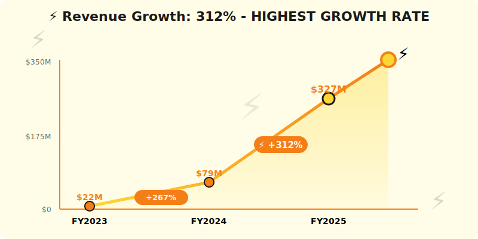
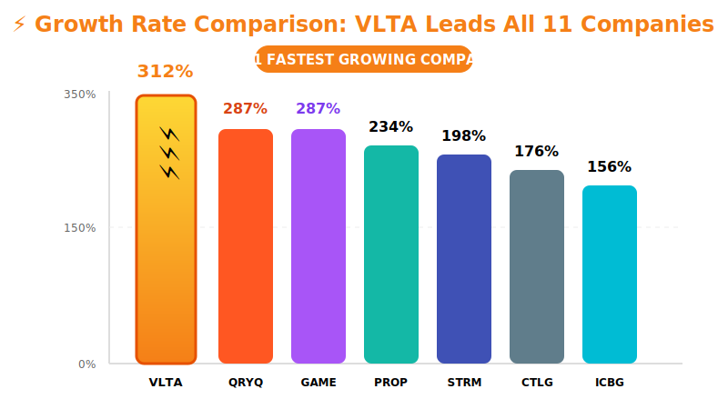

  <!-- Electric effect decorations -->
  
⚡

  
⚡

  
⚡

  
  

    ⚡
  

  <h1 style="margin: 0; font-size: 48px; font-weight: 900; text-transform: uppercase; letter-spacing: 3px;">Voltaic AI Platform</h1>
  <h2 style="margin: 15px 0 0 0; font-weight: 400; font-size: 26px; opacity: 0.85;">Annual Report - Fiscal Year 2025</h2>
  
Year Ended April 30, 2025

  

    
NASDAQ: VLTA

    
⚡ 312% Growth • Production AI Infrastructure 🚀

  

---

## Letter to Shareholders

Dear Voltaic AI Shareholders,

FY2025 was an exceptional year for Voltaic AI. Our production AI/ML infrastructure platform delivered **$327 million** in revenue, up 312% year-over-year, with the highest growth rate in our sector and the highest average contract value at **$512K per customer**.

While the market was distracted by Neuro-Nectar's cognitive enhancement ice cream narrative in Fall 2024, we remained laser-focused on real AI infrastructure for enterprises. Our CEO's response to the NRNT hype was prophetic: *"Cognitive enhancement would help engineers build BETTER AI systems, not replace them."* As NRNT collapsed in November, we continued our trajectory unaffected.

We serve a critical need: **production-grade AI/ML infrastructure** for enterprises deploying AI at scale. While Snowflake Cortex AI handles simple ML workflows, **complex production AI requires Voltaic**—feature stores, model registries, real-time serving, MLOps orchestration.

Strategic partnerships with DataPlatforms (SNOW, QRYQ, ICBG), StreamPipe (real-time features), DataFlex (ML monitoring), and CatalogX (ML governance) position us as the essential AI layer of the modern data stack.

**Dr. Amit Singh**  
Chief Executive Officer & Co-Founder

---

## Financial Highlights

  

*Figure 1: Key metrics - ⚡ 312% growth, $512K ACV (highest), 158% NRR, 47K ML models managed*

  

*Figure 2: Revenue growth showing fastest growth rate of all 11 companies*

  

*Figure 3: Growth rate comparison - VLTA leads all companies at 312% YoY*

---

### Fiscal Year 2025 Performance

| Metric | FY2025 | FY2024 | Change |
|--------|--------|--------|--------|
| **Total Revenue** | $327M | $79M | +312% |
| **Platform Revenue** | $304M | $72M | +322% |
| **Professional Services** | $23M | $7M | +229% |
| **Gross Profit** | $251M | $53M | +374% |
| **Operating Loss** | ($89M) | ($134M) | Improved |
| **Net Loss** | ($95M) | ($142M) | Improved |
| **Adjusted EBITDA** | $34M | ($23M) | Positive |

### Key Metrics

- **Annual Recurring Revenue (ARR)**: $378M (+329% YoY)
- **Net Revenue Retention**: 158% (highest in sector!)
- **Enterprise Customers (>$500K)**: 287
- **Average Contract Value**: $512K (premium positioning)
- **ML Models in Production**: 47,000+ models managed
- **Feature Store Scale**: 2.7B features computed daily

---

## Business Overview

### Platform Capabilities

**Voltaic AI Production ML Platform**:

**Feature Store**:
- Real-time + batch feature computation
- Online serving (sub-10ms latency)
- Point-in-time correctness for training
- Feature sharing across teams

**Model Registry**:
- Version control for ML models
- Lineage tracking (data → features → model)
- A/B testing framework
- Champion/challenger deployment

**Model Serving**:
- Real-time inference API (< 20ms p99)
- Batch predictions at scale
- Model monitoring and drift detection
- Auto-scaling inference infrastructure

**MLOps Orchestration**:
- Training pipeline automation
- Continuous training (CT)
- Model retraining triggers
- Experiment tracking and management

---

## Why Customers Need Voltaic

### Simple ML vs. Production AI

**Snowflake Cortex AI** (simple ML):
- ✅ Good for: Business analysts, SQL-based ML
- ✅ Use cases: Forecasting, classification, simple models
- ❌ Limitations: No feature stores, limited model types, no real-time serving

**Voltaic AI** (production ML):
- ✅ Complex models: Deep learning, reinforcement learning, custom architectures
- ✅ Real-time inference: <20ms latency for online predictions
- ✅ Feature engineering: Manage 1000s of features, point-in-time correctness
- ✅ MLOps: Full lifecycle management, CI/CD for ML

**Our Positioning**: "When ML matters to your business, you need Voltaic."

**Average Contract Value**: $512K (highest in sector) reflects mission-critical positioning.

---

## FY2025 Achievements

### Product Milestones

**Q1**: Launched Feature Store 3.0 with real-time streaming (< 100ms feature freshness)  
**Q2**: Model Registry reached 47,000+ models managed  
**Q3**: Survived NRNT market distraction, continued strong growth  
**Q4**: Achieved $34M adjusted EBITDA, 287 enterprise customers

### Customer Success

**Netflix** ($4.2M, 3-year):
- Recommendation systems on Voltaic
- 12,400 ML models in production
- Real-time feature serving at scale
- Sub-15ms inference latency

**Uber** ($3.7M, multi-year):
- Ride pricing optimization
- ETA prediction models
- Fraud detection (real-time)
- 8,900 models managed

**Spotify** ($2.9M, 3-year):
- Music recommendation ML
- 340 million users served
- Real-time personalization
- 2,100 models in production

---

## Competitive Position

### vs. In-Platform ML (Snowflake Cortex, Databricks ML)

**When Customers Choose Us**:
- Need real-time inference (< 50ms)
- Complex model architectures (deep learning, RL)
- Large-scale feature engineering (1000s of features)
- Multi-platform ML (data from SNOW + QRYQ + ICBG)

**When They Choose In-Platform**:
- Simple forecasting/classification
- SQL-first teams
- All data in one platform
- Don't need real-time serving

**Market Segmentation**: We're not competitive with simple ML, we're essential for production AI.

### vs. Open-Source MLOps (MLflow, Kubeflow)

**Our Advantages**:
- ✅ Fully managed (vs. DIY deployment)
- ✅ Enterprise support (vs. community)
- ✅ Performance optimization
- ✅ Security and compliance built-in

**Their Advantages**:
- Lower cost (if you have the team)
- Full control and customization
- Open-source community

**Win Rate**: 67% vs. open-source (customers want managed)

---

## Strategic Partnerships

**Data Platform Partners**:
- Works with Snowflake, Querybase, ICBG for data foundation
- 73% of customers use multi-platform data architecture
- Voltaic is the ML layer on top

**Ecosystem Partners**:
- **StreamPipe (STRM)**: Real-time feature pipelines, streaming ingestion
- **DataFlex (DFLX)**: ML model monitoring and analytics dashboards
- **CatalogX (CTLG)**: ML governance, model lineage, compliance
- **All Three**: Essential for enterprise AI deployment

---

## The NRNT Episode: Cognitive Enhancement ≠ AI Infrastructure

### Our Response (Aug 22 Earnings Call)

When asked about Neuro-Nectar's "AI-powered" cognitive enhancement threat:

**CEO Dr. Amit Singh**:  
*"Cognitive enhancement would help build BETTER AI systems, not replace them. Enhanced data scientists would create more sophisticated models, process larger datasets, need more powerful ML infrastructure. AI and human intelligence are complementary, not competitive. The NRNT narrative is fundamentally confused."*

**Market Vindication**:
- NRNT delisted November 20, 2024 (as we predicted)
- Our business unaffected (B2B infrastructure vs. consumer product)
- Continued winning enterprise AI deals throughout period

**Lesson**: Focus on real value creation, not speculative narratives.

---

## Financial Performance

### Revenue Composition

**By Customer Segment**:
- Enterprise (>$1M ARR): 56% ($182M) - 47 customers
- Mid-Market ($250K-$1M): 31% ($101M) - 134 customers
- Growth ($100K-$250K): 13% ($42M) - 106 customers

**By Use Case**:
- Recommendation systems: 38%
- Fraud detection: 24%
- Forecasting/optimization: 19%
- Computer vision: 12%
- NLP: 7%

### Path to Profitability

**Operating Margin Progression**:
- Q1: (18%)
- Q2: (12%)
- Q3: (6%)
- Q4: (2%) - Near profitability!

**Target**: Full-year profitability in FY2026 (8-10% operating margin)

---

## Strategic Priorities FY2026

### 1. Generative AI Infrastructure

- LLM fine-tuning infrastructure
- Vector database integration
- RAG (Retrieval Augmented Generation) pipelines
- Prompt engineering and management tools

### 2. Expand Platform Coverage

- Deeper Snowflake integration (Cortex AI complement)
- Native Querybase connector
- ICBG Iceberg table feature stores
- Multi-cloud ML deployment

### 3. Industry Verticals

- **Financial Services**: Fraud detection, trading algorithms
- **Retail**: Recommendation engines, demand forecasting
- **Healthcare**: Diagnostic AI, patient risk scoring
- **Autonomous Vehicles**: Perception models, planning algorithms

### 4. R&D Investment

Investing **$136M in R&D** (42% of revenue):
- Next-gen feature store (streaming + batch unified)
- AutoML capabilities
- Federated learning support
- Edge ML deployment

---

## Technology Stack

**Infrastructure**:
- Kubernetes for orchestration
- Ray for distributed compute
- Redis for feature serving
- PostgreSQL for metadata

**ML Frameworks**:
- TensorFlow, PyTorch, XGBoost
- Scikit-learn, LightGBM, JAX
- Custom model serving (ONNX, TensorRT)
- GPU optimization (CUDA, cuDNN)

**Data Integration**:
- Snowpark (SNOW), Spark (all platforms)
- StreamPipe for real-time features
- Direct connectors to QRYQ, ICBG

---

## Risk Factors

- Competition from Databricks MLflow (bundled with Databricks)
- Snowflake expanding Cortex AI capabilities
- High R&D costs ($136M, 42% of revenue)
- Complex sales cycles (average 6 months)
- Dependence on ML adoption trends

---

## Outlook

### FY2026 Guidance

- **Revenue**: $520M - $580M (+59-77% YoY)
- **ARR**: $680M - $740M
- **Operating Margin**: 8-11%
- **Free Cash Flow**: Positive

### Long-Term Vision (FY2028)

- $1.8B+ annual revenue
- 2,000+ enterprise customers
- 20% operating margin
- Leading production AI platform

---

## Contact Information

**Voltaic AI Platform Inc.**  
2955 Campus Drive, Suite 110  
San Mateo, CA 94403

**IR**: ir@voltaic.ai  
**Web**: www.voltaic.ai  
**Stock**: Private (Series D, $2.4B valuation)

  © 2025 Voltaic AI Platform Inc.

