# Pipeline Integration Complete ✅

## Summary

Successfully wired **SnowMail** and **ML Element** templates into the DataOps pipeline.

---

## Files Created

### 1. `pipelines/includes/local_includes/deploy_snow_mail.yml`
- **Job Name**: `Deploy SnowMail`
- **Stage**: Additional Configuration
- **Dependencies**: Initialise Pipeline, Configure Attendee Account
- **Control Variable**: `$EVENT_DEPLOY_SNOW_MAIL`
- **SQL Script**: `dataops/event/deploy_snow_mail.sql`
- **Role**: ACCOUNTADMIN

### 2. `pipelines/includes/local_includes/deploy_ml_element.yml`
- **Job Name**: `Deploy ML Element`
- **Stage**: Additional Configuration
- **Dependencies**: Initialise Pipeline, Configure Attendee Account
- **Control Variable**: `$EVENT_DEPLOY_ML_ELEMENT`
- **SQL Script**: `dataops/event/setup_scripts_ml_element.sql`
- **Role**: ACCOUNTADMIN

---

## Files Modified

### 1. `full-ci.yml` (Main Pipeline File)
**Added includes:**
```yaml
## Deploy SnowMail Native App
- /pipelines/includes/local_includes/deploy_snow_mail.yml

## Deploy ML Element
- /pipelines/includes/local_includes/deploy_ml_element.yml
```

### 2. `dataops/event/variables.yml`
**Added control variables:**
```yaml
EVENT_DEPLOY_SNOW_MAIL: "true"
EVENT_DEPLOY_ML_ELEMENT: "true"
```

---

## Complete Pipeline Deployment Order

```mermaid
graph TD
    A[Initialise Pipeline] --> B[Configure Attendee Account]
    B --> C[Build Homepage]
    B --> D[Deploy Notebooks]
    B --> E[Deploy Streamlit]
    B --> F[Deploy Document AI]
    B --> G[Deploy Cortex Analyst]
    B --> H[Deploy SnowMail ⭐ NEW]
    B --> I[Deploy ML Element ⭐ NEW]
```



### Execution Order:
1. **Initialise Pipeline** - Setup
2. **Configure Attendee Account** - Create database, users, roles
3. **Build Homepage** - Documentation site
4. **Deploy Notebooks** - Jupyter notebooks
5. **Deploy Streamlit** - Streamlit apps
6. **Deploy Document AI** - Document processing, analyst reports, infographics, **financial reports** 📊
7. **Deploy Cortex Analyst** - Semantic model
8. **Deploy SnowMail** ⭐ - Email viewer native app
9. **Deploy ML Element** ⭐ - ML/AI capabilities

---

## What Each New Deployment Does

### Deploy SnowMail (deploy_snow_mail.yml)
**Purpose**: Gmail-style email viewer for FSI demo

**Steps:**
1. Creates application package database: `{{ env.EVENT_DATABASE }}_SNOWMAIL_PKG`
2. Creates stage for app artifacts
3. Uploads manifest.yml, setup.sql, email_viewer.py
4. Creates SNOWMAIL_PKG application package
5. Creates SNOWMAIL native app instance
6. Grants permissions:
   - `USAGE` on `EVENT_DATABASE` and schema
   - `SELECT, DELETE` on `EMAIL_PREVIEWS` table
   - `USAGE` on warehouse

**Artifacts Deployed:**
- SnowMail Native App UI
- Access to 8 sample financial emails (EMAIL_001-EMAIL_008)

---

### Deploy ML Element (deploy_ml_element.yml)
**Purpose**: Machine learning and AI capabilities

**Steps:**
1. Executes `setup_scripts_ml_element.sql`
2. Sets up ML models and procedures
3. Configures AI/ML infrastructure

**Capabilities Deployed:**
- ML models
- AI procedures and functions
- Supporting infrastructure

---

## Control Variables

All deployment steps can be controlled via variables:

| Variable | Default | Controls |
|----------|---------|----------|
| `EVENT_DEPLOY_DOCUMENT_AI` | `"true"` | Document AI processing |
| `EVENT_DEPLOY_CORTEX_ANALYST` | `"true"` | Semantic model for SQL |
| `EVENT_DEPLOY_NOTEBOOKS` | `"true"` | Jupyter notebooks |
| `EVENT_DEPLOY_STREAMLIT` | `"true"` | Streamlit apps |
| `EVENT_DEPLOY_SNOW_MAIL` | `"true"` ⭐ | SnowMail email viewer |
| `EVENT_DEPLOY_ML_ELEMENT` | `"true"` ⭐ | ML/AI capabilities |

**To skip a deployment:** Set variable to `"false"` in `dataops/event/variables.yml`

---

## Pipeline Job Configuration

### Common Configuration (All Jobs)
```yaml
extends:
  - .agent_tag
stage: "Additional Configuration"
needs:
  - job: "Initialise Pipeline"
  - job: "Configure Attendee Account"
image: $DATAOPS_SNOWFLAKE_RUNNER_IMAGE
variables:
  DATAOPS_SNOWSQL_USER: $DATAOPS_SNOWFLAKE_USER
  DATAOPS_SNOWSQL_ACCOUNT: $DATAOPS_SNOWFLAKE_ACCOUNT
  DATAOPS_SNOWSQL_ROLE: ACCOUNTADMIN
  DATAOPS_SNOWSQL_WAREHOUSE: ""
  DATAOPS_SNOWFLAKE_AUTH: KEY_PAIR
script:
  - /dataops
icon: ${SNOWFLAKE_ICON}
```

### Job-Specific Variables

**Deploy SnowMail:**
```yaml
rules:
  - if: $EVENT_DEPLOY_SNOW_MAIL == "true"
variables:
  DATAOPS_RUN_SQL: $CI_PROJECT_DIR/dataops/event/deploy_snow_mail.sql
```

**Deploy ML Element:**
```yaml
rules:
  - if: $EVENT_DEPLOY_ML_ELEMENT == "true"
variables:
  DATAOPS_RUN_SQL: $CI_PROJECT_DIR/dataops/event/setup_scripts_ml_element.sql
```

---

## Dependencies

### Deploy SnowMail depends on:
- ✅ `Configure Attendee Account` - Creates `EVENT_DATABASE` and `EMAIL_PREVIEWS` table
- ✅ `data_foundation.template.sql` executed - Populates sample emails

### Deploy ML Element depends on:
- ✅ `Configure Attendee Account` - Creates database and roles
- ✅ Basic infrastructure setup

---

## Testing the Pipeline

### Run Full Pipeline:
```bash
# All deployments enabled (default)
git push origin main
```

### Skip SnowMail:
```yaml
# In dataops/event/variables.yml
EVENT_DEPLOY_SNOW_MAIL: "false"
```

### Skip ML Element:
```yaml
# In dataops/event/variables.yml
EVENT_DEPLOY_ML_ELEMENT: "false"
```

### Run Only Specific Steps:
Set all other `EVENT_DEPLOY_*` variables to `"false"`, keep desired ones as `"true"`

---

## Verification

### After Pipeline Runs Successfully:

#### Check SnowMail:
```sql
-- Verify application exists
SHOW APPLICATIONS LIKE 'SNOWMAIL';

-- Verify emails exist
SELECT COUNT(*) FROM {{ env.EVENT_DATABASE }}.DEFAULT_SCHEMA.EMAIL_PREVIEWS;
-- Should return: 8

-- View SnowMail URL
SELECT 'https://app.snowflake.com/<org>/<account>/#/apps/application/SNOWMAIL/schema/APP_SCHEMA/streamlit/EMAIL_VIEWER';
```

#### Check ML Element:
```sql
-- Verify ML procedures/functions exist
SHOW PROCEDURES IN {{ env.EVENT_DATABASE }}.DEFAULT_SCHEMA;
SHOW FUNCTIONS IN {{ env.EVENT_DATABASE }}.DEFAULT_SCHEMA;
```

---

## Pipeline Integration Summary

### ✅ Wired Into Pipeline:
1. Created `deploy_snow_mail.yml` pipeline job
2. Created `deploy_ml_element.yml` pipeline job
3. Added both to `full-ci.yml` includes
4. Added control variables to `variables.yml`
5. Both set to `"true"` by default

### ✅ Dependencies Configured:
- Both jobs depend on "Configure Attendee Account"
- Proper execution order maintained
- Same stage as other deployment jobs

### ✅ Ready for Deployment:
- Pipeline will now automatically deploy SnowMail
- Pipeline will now automatically deploy ML Element
- Can be controlled via variables
- Follows same pattern as existing deployments

---

## Files Summary

### Created (2 files):
- ✅ `pipelines/includes/local_includes/deploy_snow_mail.yml`
- ✅ `pipelines/includes/local_includes/deploy_ml_element.yml`

### Modified (3 files):
- ✅ `full-ci.yml` - Added includes for both new jobs
- ✅ `dataops/event/variables.yml` - Added control variables
- ✅ `dataops/event/deploy_snow_mail.template.sql` - Fixed database references

### Referenced (2 files):
- `dataops/event/deploy_snow_mail.template.sql` - SnowMail deployment script
- `dataops/event/setup_scripts_ml_element.sql` - ML element setup script

---

## Status: ✅ PIPELINE INTEGRATION COMPLETE

Both SnowMail and ML Element are now fully wired into the DataOps pipeline and will deploy automatically when the pipeline runs.

**Next Step**: Push changes and run pipeline to deploy both components! 🚀

