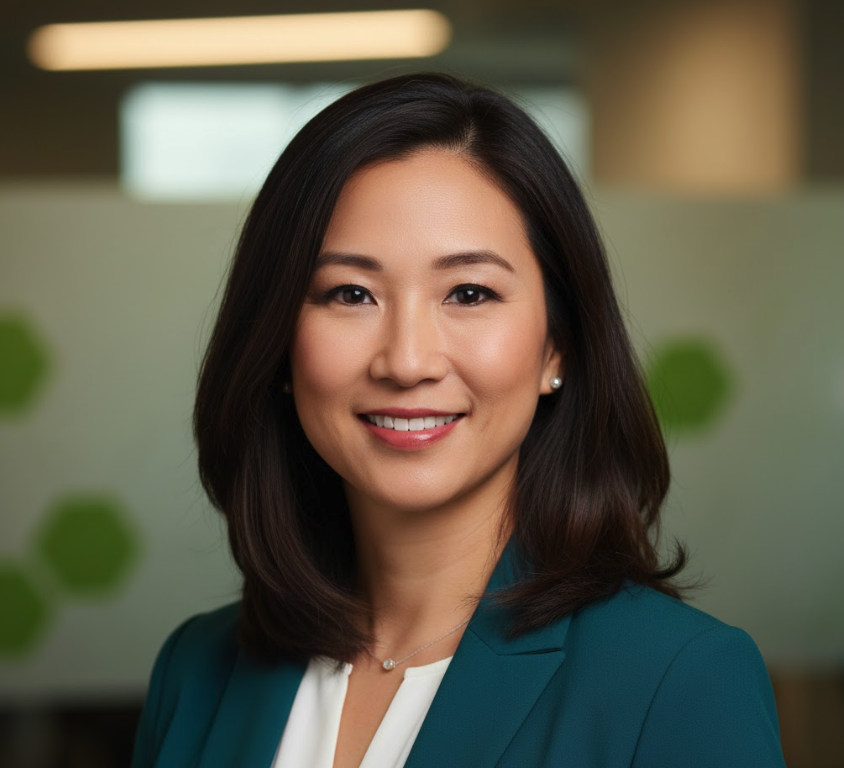

  <h1 style="margin: 0; font-size: 48px; font-weight: 700;">📊 DataFlex Analytics</h1>
  <h2 style="margin: 15px 0 0 0; font-weight: 300; font-size: 28px;">Executive Leadership Team</h2>
  
NASDAQ: DFLX • ✅ PROFITABLE

  
🇨🇭 The Switzerland of BI • Platform Agnostic

---

##  Sarah Chen

**CEO** | Age: 42  
**Education**: MBA, Stanford GSB; BS Computer Science, UC Berkeley

**Previous**: VP Product, Looker (2016-2019, acquired by Google); Product Manager, Tableau  
**Founded DataFlex**: March 2019

**Achievements**: First profitable year FY2025 ($34M FCF); Works with SNOW, QRYQ, ICBG; 1,847 customers; "Switzerland of BI" positioning

**Philosophy**: *"We're not in the data storage business—we extract insights. Whether your data is in Snowflake, Querybase, or ICBG, DataFlex provides the same exceptional BI experience."*

**Based In**: San Francisco, CA

---

##  Robert Kim

**CFO** | Age: 48  
**Education**: MBA, Wharton; BS Economics, Yale

**Previous**: CFO, Mode Analytics (2017-2019); VP Finance, Chartio  
**Joined**: June 2019

**Achievements**: Achieved profitability Q2 FY2025; 84% gross margin; Reduced CAC from $124K to $87K; Strong unit economics

**Based In**: San Francisco, CA

---

##  Maria Garcia

**Chief Product Officer** | Age: 39  
**Education**: MS HCI, Carnegie Mellon; BS Computer Science, Stanford

**Previous**: Director of Product, Sisense (2018-2020); Senior PM, Qlik  
**Joined**: August 2020

**Achievements**: Built cross-platform connector framework (40+ platforms); Launched embedded analytics (22% of revenue); Led UI/UX innovation

**Based In**: San Mateo, CA

---

© 2025 DataFlex Analytics Inc. | NASDAQ: DFLX

