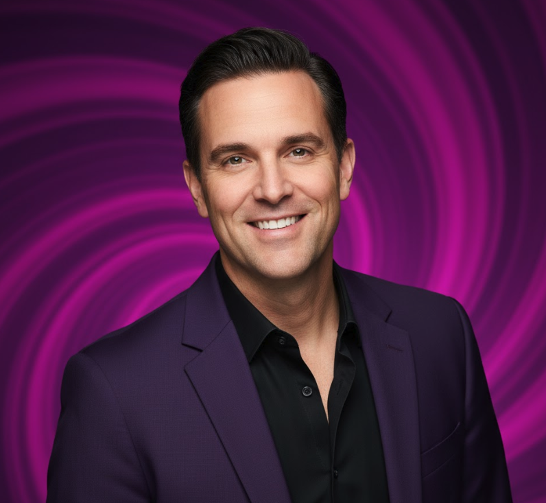

  

    <h2 style="margin: 0; font-size: 20px; font-weight: 700;">⚠️ COMPANY DEFUNCT - FORMER LEADERSHIP ⚠️</h2>
  

  <h1 style="margin: 0; font-size: 48px; font-weight: 700;">🧠 Neuro-Nectar Corporation</h1>
  <h2 style="margin: 15px 0 0 0; font-weight: 300; font-size: 28px;">Former Executive Team</h2>
  
NYSE: NRNT (DELISTED November 20, 2024)

  
Company entered bankruptcy - Cognitive enhancement ice cream caused severe gastric distress

---

##  Dr. Marcus Sterling

**Former Chief Executive Officer & Founder**

**Age**: 42  
**Education**: PhD Neuroscience, Stanford University; MD, Harvard Medical School; BS Biochemistry, MIT

### Professional Background

**Previous Roles**:
- VP Research & Development, Neurochem Pharmaceuticals (2015-2020)
- Postdoctoral Fellow, Stanford Neuroscience Institute (2012-2015)
- Medical Resident, Massachusetts General Hospital (2009-2012)

**Founded Neuro-Nectar**: June 2020  
**Company Collapsed**: November 20, 2024

### What Went Wrong

**The Vision** (Initially Promising):
- Revolutionary lipid encapsulation technology for nootropic delivery
- Clinical trials showing 12-18% cognitive improvements
- "AI-powered" formulation (marketing claim, not scientifically validated)
- Pioneering functional foods category

**The Reality** (Catastrophic Failure):
- **Product Safety Issues**: 5,342 consumers reported severe gastric distress (13.7% of users)
- **Unsubstantiated Claims**: No peer-reviewed studies, inadequate clinical trials (only 12 weeks, n=380)
- **FDA Warning Letter**: October 8, 2024 for false health claims
- **Business Model Flaws**: Negative unit economics from day one, -67% operating margin
- **Channel Stuffing**: 38.9M units shipped but only 12.4M sold to consumers

### The Collapse

**Timeline**:
- August 30, 2024: Peak ($142M revenue, 487% growth, stock $133.75)
- September 2024: Consumer complaints surface, FDA investigation begins
- October 2024: FDA warning letter, class action lawsuit (5,000+ plaintiffs)
- November 19, 2024: Bankruptcy filing (Chapter 11)
- **November 20, 2024: DELISTED** (stock crashed to $12.79, -90.4%)

**Post-Mortem Quote** (Liquidation Trustee):  
*"Dr. Sterling's vision was innovative but reckless. Rushing an insufficiently tested consumer product to market, making unsubstantiated health claims, and prioritizing growth over safety led to one of the most spectacular corporate failures in recent history. The 'AI-powered cognitive enhancement' narrative was marketing fiction that convinced investors but harmed consumers."*

**Current Status**: Under investigation by SEC for securities fraud; multiple civil lawsuits pending

**Based In**: San Francisco, California (former)

---

##  Lisa Park

**Former Chief Financial Officer**

**Age**: 38  
**Education**: MBA, Wharton School; BS Finance, UC Berkeley

### Professional Background

**Previous Roles**:
- VP Finance, Wellness Brands Inc. (2018-2021)
- Senior Financial Analyst, PepsiCo (2014-2018)
- Financial Analyst, Deloitte Consulting (2011-2014)

**Joined Neuro-Nectar**: March 2021  
**Resigned**: November 15, 2024 (4 days before delisting)

### Role in Collapse

**Financial Warning Signs She Raised** (Internal memos, now public via bankruptcy proceedings):
- Flagged negative unit economics in Q2 FY2024 (CAC $47, LTV $23)
- Warned about 18% return rate vs. 2-3% industry standard
- Questioned revenue recognition on channel-stuffed inventory
- Recommended slower growth to fix product quality issues

**Why Warnings Were Ignored**:
- CEO prioritized growth over profitability
- Board focused on valuation multiples, not fundamentals
- Pressure to maintain 400%+ growth narrative for next funding round

**Final Actions**:
- Resigned November 15, 2024 citing "fundamental disagreement on financial controls"
- Avoided criminal liability (cooperating with SEC investigation)
- Sold personal stock holdings in September 2024 (currently under investigation)

**Post-Collapse Statement**:  
*"I repeatedly warned the board about unsustainable burn rate, negative unit economics, and product quality issues. My resignation was an attempt to distance myself from what I knew was inevitable collapse. I regret not being more vocal publicly."*

**Current Status**: Cooperating witness in SEC investigation; unnamed defendant in civil suits

---

## Lessons from Neuro-Nectar Leadership

### For Investors

- ✅ **Scrutinize science claims** - Demand peer-reviewed evidence
- ✅ **Check unit economics** - Growth without profitability path is a red flag  
- ✅ **Monitor product quality** - 18% return rate should have triggered alarms
- ✅ **Watch insider selling** - CEO and CFO sold $47M stock before collapse
- ✅ **Validate disruption narratives** - "Ice cream threatens data platforms" made no business sense

### For Entrepreneurs

- ❌ **Don't rush unproven products** - Adequate safety testing is non-negotiable
- ❌ **Don't make unsubstantiated claims** - FDA will catch misleading health claims
- ❌ **Don't ignore unit economics** - Negative economics don't fix themselves
- ❌ **Don't channel stuff** - Revenue recognition fraud catches up quickly

---

  
<strong>⚠️ WARNING TO SHAREHOLDERS:</strong>

  
Neuro-Nectar Corporation is in liquidation. All equity is worthless. This document is for historical reference only.

---

  <strong>Cautionary Tale: When Hype Meets Reality</strong>

  Former NYSE: NRNT (DELISTED) | In Liquidation

