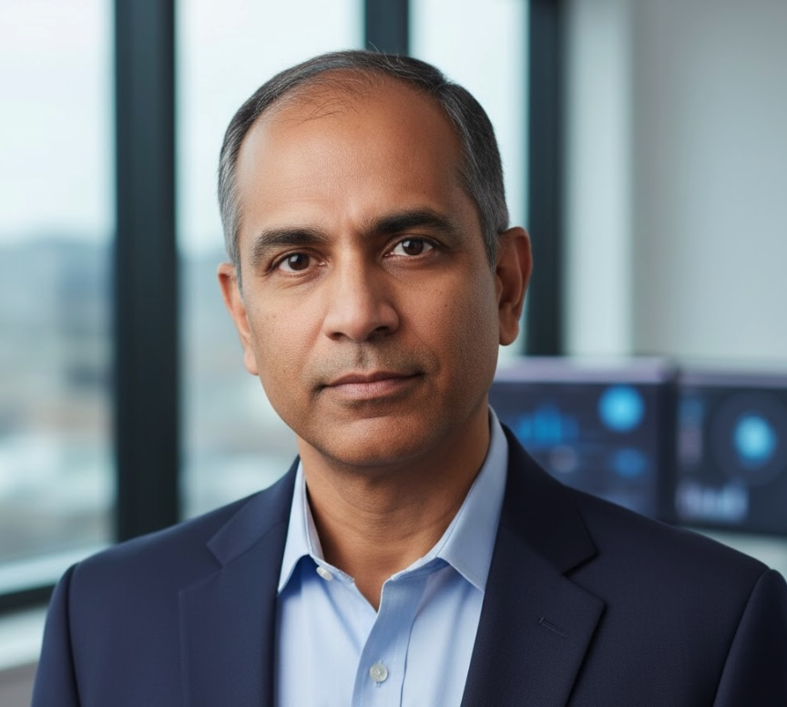
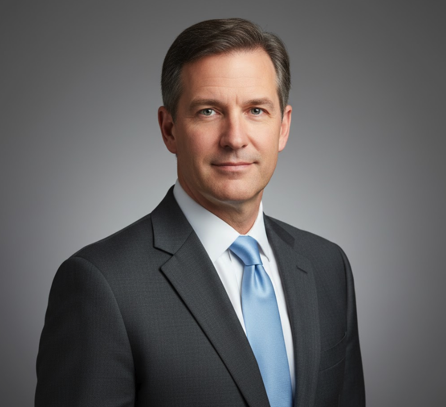
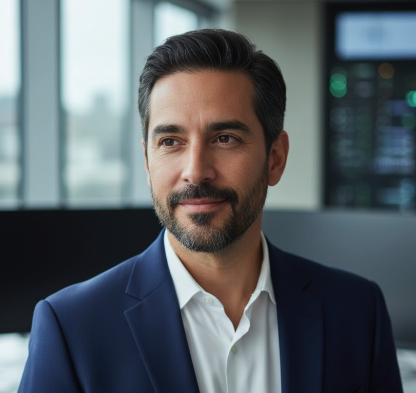

  <h1 style="margin: 0; font-size: 48px; font-weight: 700;">❄️ Snowflake Inc.</h1>
  <h2 style="margin: 15px 0 0 0; font-weight: 300; font-size: 28px;">Executive Leadership Team</h2>
  
NASDAQ: SNOW

---

##  Sridhar Ramaswamy

**Chief Executive Officer**

**Age**: 56  
**Education**: PhD Computer Science, Brown University; B.Tech, Indian Institute of Technology Madras

### Professional Background

**Previous Roles**:
- SVP Engineering, Google (2003-2018) - Led Google Ads engineering, built $100B+ business
- CEO & Co-Founder, Neeva (2019-2023) - Privacy-focused search engine
- Distinguished Engineer, Google (early career)

**Joined Snowflake**: May 2024 (appointed CEO, succeeding Frank Slootman)

### Notable Achievements

- **At Google**: Led transformation of Google Ads from desktop to mobile, built world's largest advertising platform
- **At Neeva**: Raised $80M, pioneered ad-free search model, acquired by Snowflake 2023
- **At Snowflake**: Launched Snowflake Intelligence, navigated NRNT market distraction successfully, achieved profitability in first year as CEO

### Leadership Philosophy

**On the NRNT Episode** (September 2024):  
*"The suggestion that a consumer ice cream product threatens enterprise data infrastructure is absurd. Enterprise workflows require scalable, governable, auditable systems—not enhanced individual cognition. We're competing with ICBG's open lakehouse and QRYQ's price-performance, not consumer products."*

**Vision Statement**:  
*"The AI Data Cloud represents the most important infrastructure shift since cloud computing itself. Snowflake is uniquely positioned to enable every organization's AI transformation. Our integrated platform approach, combined with Cortex AI, gives us a sustainable competitive advantage against fragmented alternatives."*

**Based In**: Palo Alto, California

---

##  Michael Scarpelli

**Chief Financial Officer**

**Age**: 52  
**Education**: MBA, Stanford Graduate School of Business; BS Accounting, Santa Clara University

### Professional Background

**Previous Roles**:
- CFO, ServiceNow (2011-2019) - Led through IPO and scale to $3B+ revenue
- VP Finance, NetApp (2007-2011)
- Senior roles at Oracle, Ernst & Young

**Joined Snowflake**: April 2019

### Notable Achievements

- **IPO Success**: Led Snowflake's historic IPO in September 2020 (largest software IPO ever at the time)
- **Financial Discipline**: Improved operating margin from -100%+ to +6% in 5 years
- **Capital Efficiency**: Generated $931M free cash flow in FY2025 (29% margin)
- **Path to Profitability**: First full year of profitability achieved under his financial stewardship

### Financial Strategy

**On Profitability**:  
*"We've proven that consumption-based SaaS can be both high-growth and profitable. Our 38% revenue growth with 6% operating margin in FY2025 demonstrates sustainable unit economics. The path forward is expanding margins while maintaining growth."*

**On Competition**:  
*"ICBG and QRYQ are growing, but they lack our scale, ecosystem, and AI differentiation. Our Cortex AI revenue of $127M in first year shows customers value integrated innovation. Price-only competition is a race to the bottom."*

**Based In**: San Mateo, California

---

##  Christian Kleinerman

**Chief Technology Officer**

**Age**: 48  
**Education**: MS Computer Science, Technion - Israel Institute of Technology; BS Computer Science, Universidad de Buenos Aires

### Professional Background

**Previous Roles**:
- VP Engineering, Microsoft (2016-2019) - Led Azure SQL Database
- Distinguished Engineer, Oracle (2008-2016) - Database kernel development
- Senior Engineer, IBM Research

**Joined Snowflake**: October 2019

### Notable Achievements

- **Cortex AI Architecture**: Led development of Snowflake's AI platform - Document AI, Cortex Search, Cortex Analyst, Snowflake Intelligence
- **Iceberg Tables**: Shipped native Apache Iceberg support (addressing ICBG's open standard positioning)
- **Performance**: Delivered 3.2x query performance improvement FY2023-2025
- **Innovation**: 147 patents filed in FY2025 under his technical leadership

### Technical Vision

**On AI Integration**:  
*"AI isn't a feature, it's a fundamental capability layer. Cortex AI delivers LLM functions, Document AI, semantic search, and conversational agents—all native to the platform. Competitors bolt AI on; we integrate it deeply into the data cloud architecture."*

**On Open Standards**:  
*"We're embracing Apache Iceberg not because ICBG forced our hand, but because interoperability strengthens the ecosystem. Customers can use Iceberg tables in Snowflake while still benefiting from our managed service, governance, and AI capabilities. Openness and integration aren't mutually exclusive."*

**Based In**: San Francisco, California

---

## Board of Directors

- **Frank Slootman** - Former CEO, Chairman Emeritus
- **6 Independent Directors** - Expertise in technology, finance, operations, cybersecurity

---

## Contact Information

**Snowflake Inc.**  
106 East Babcock Street, Suite 3A  
Bozeman, MT 59715

**Investor Relations**: investors@snowflake.com  
**Corporate Communications**: press@snowflake.com

---

  <strong>Leadership Team driving the AI Data Cloud revolution</strong>

  © 2025 Snowflake Inc. | NASDAQ: SNOW

