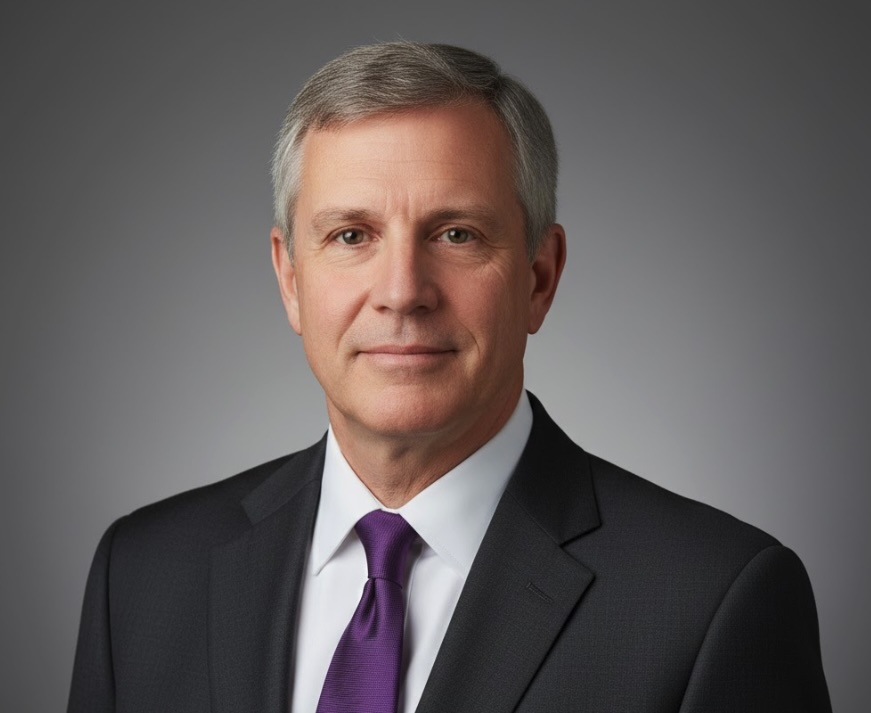
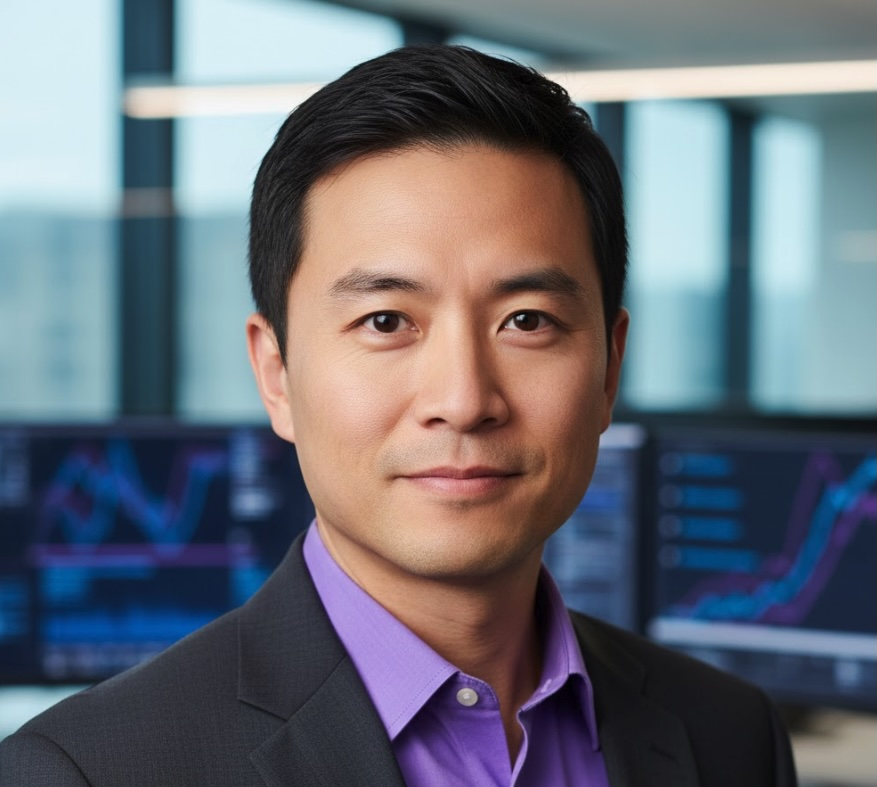

  <h1 style="margin: 0; font-size: 48px; font-weight: 700;">〰️ StreamPipe Systems</h1>
  <h2 style="margin: 15px 0 0 0; font-weight: 300; font-size: 28px;">Executive Leadership Team</h2>
  
NYSE: STRM

  
Real-Time Data Integration • The Circulatory System

---

##  Priya Sharma

**CEO & Founder** | Age: 38  
**Education**: MS Computer Science, Stanford; B.Tech, IIT Bombay  
**Previous**: Engineering Manager, Segment (2017-2020); Senior Engineer, Apache Kafka project  
**Founded**: May 2020  
**Achievements**: 342 connectors; 847B events/month; Partners with SNOW, QRYQ, ICBG, DFLX, VLTA, CTLG  
**Vision**: *"We're the circulatory system of the modern data stack. Whether data flows into Snowflake, Querybase, or ICBG doesn't matter to us—we move it reliably in real-time."*  
**Based In**: San Francisco, CA

---

##  Tom Anderson

**CFO** | Age: 54  
**Education**: MBA, University of Chicago Booth; BS Finance, Notre Dame  
**Previous**: CFO, Airbyte (2019-2021); VP Finance, Fivetran  
**Joined**: August 2020  
**Achievements**: First CF+ quarter Q3 FY2025; Managed Series C; Strong unit economics (LTV/CAC 7.1x)  
**Based In**: San Francisco, CA

---

##  Alex Wu

**CTO** | Age: 42  
**Education**: MS Distributed Systems, MIT; BS, Peking University  
**Previous**: Principal Engineer, Confluent; Senior Engineer, LinkedIn (Kafka team)  
**Joined**: June 2020  
**Achievements**: Built 342-connector framework; Sub-second latency; Apache Kafka/Flink expertise  
**Based In**: Palo Alto, CA

---

© 2025 StreamPipe Systems Inc. | NYSE: STRM

