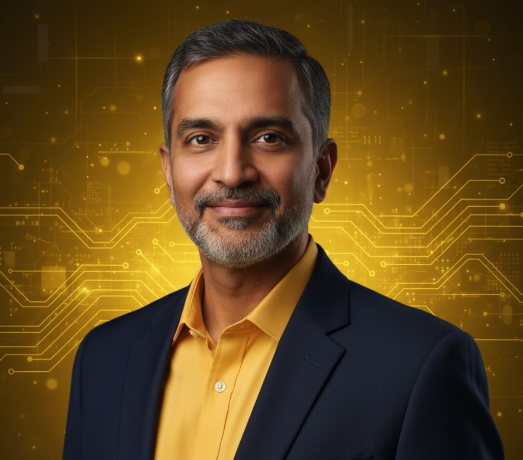
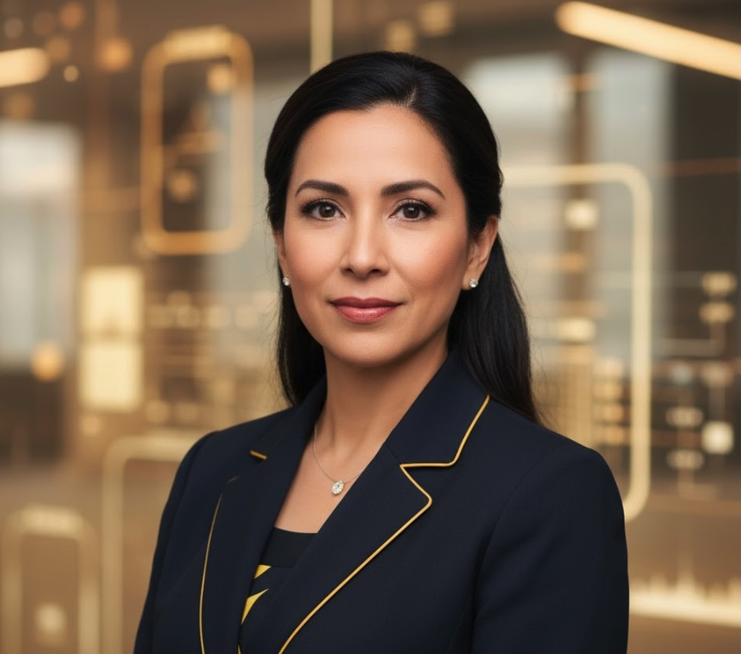
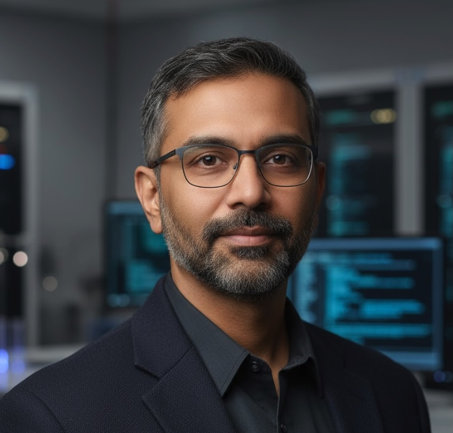

  <h1 style="margin: 0; font-size: 48px; font-weight: 900; text-transform: uppercase; letter-spacing: 3px;">⚡ VOLTAIC AI PLATFORM</h1>
  <h2 style="margin: 15px 0 0 0; font-weight: 300; font-size: 28px;">Executive Leadership Team</h2>
  
NASDAQ: VLTA

  
⚡ 312% Growth • #1 Fastest Growing Company

---

##  Dr. Amit Singh

**CEO & Co-Founder** | Age: 52  
**Education**: PhD Machine Learning, Stanford; MS CS, IIT Delhi; BS, IIT Delhi  
**Previous**: VP Engineering, Databricks (2016-2019); Research Scientist, Google Brain  
**Founded**: January 2019  
**Achievements**: 312% growth (highest of 11 companies); $512K ACV; 47K ML models managed; 158% NRR  
**Vision**: *"Cognitive enhancement would help build BETTER AI systems, not replace them. Enhanced data scientists would create more sophisticated models. AI and human intelligence are complementary."*  
**Based In**: San Mateo, CA

---

##  Jessica Martinez

**CFO** | Age: 41  
**Education**: MBA, Harvard; BS Accounting, UT Austin  
**Previous**: VP Finance, Scale AI (2019-2020); Finance Director, C3.ai  
**Joined**: March 2020  
**Achievements**: Managed hyper-growth (267% → 312%); $136M R&D investment (42% of revenue); Approaching profitability  
**Based In**: San Francisco, CA

---

##  Dr. Kevin Patel

**Chief AI Officer** | Age: 49  
**Education**: PhD AI/ML, MIT; MS CS, Stanford; BS, IIT Kanpur  
**Previous**: Director of AI, Uber (2017-2019); Research Scientist, OpenAI (2016-2017)  
**Joined**: August 2019  
**Achievements**: Built feature store (2.7B features/day); Real-time inference <20ms; Production ML at scale  
**Based In**: Palo Alto, CA

---

© 2025 Voltaic AI Platform Inc. | NASDAQ: VLTA

