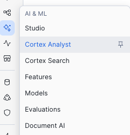
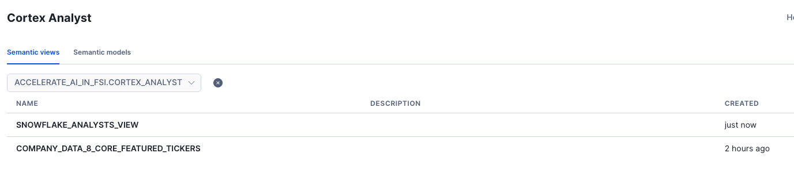
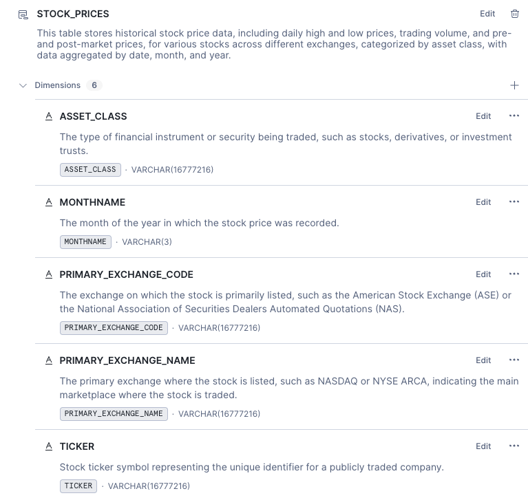
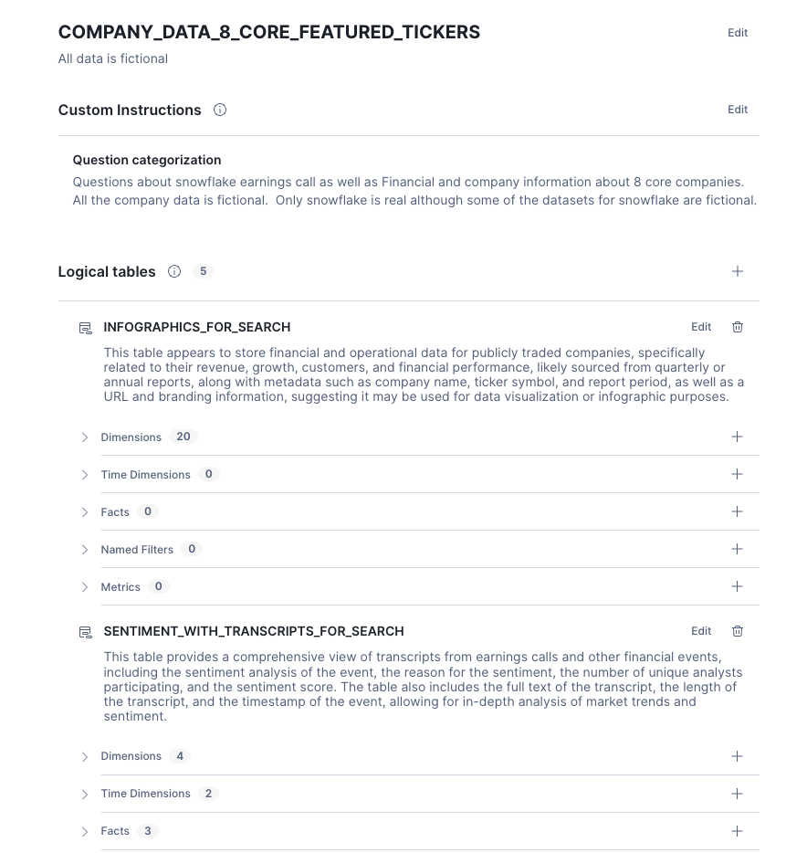
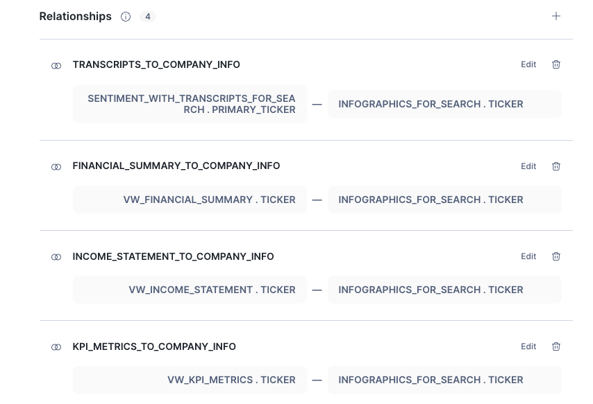
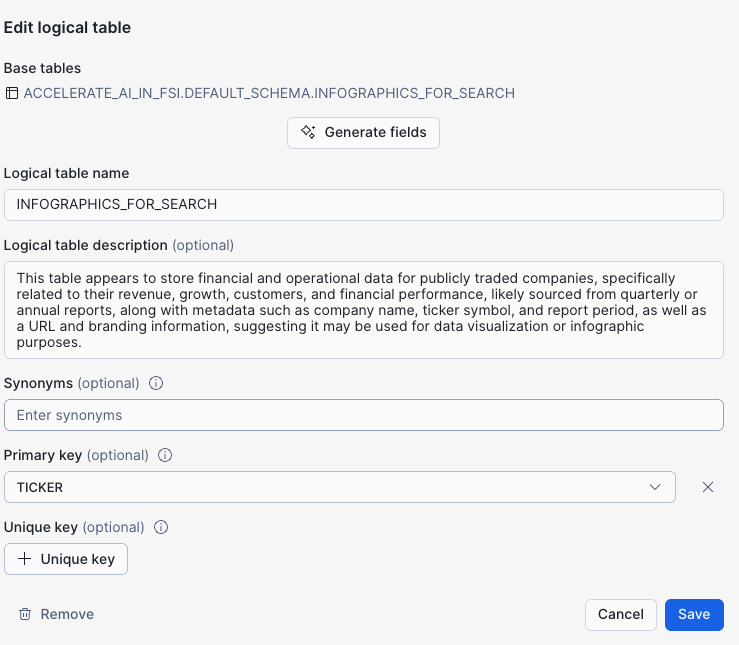
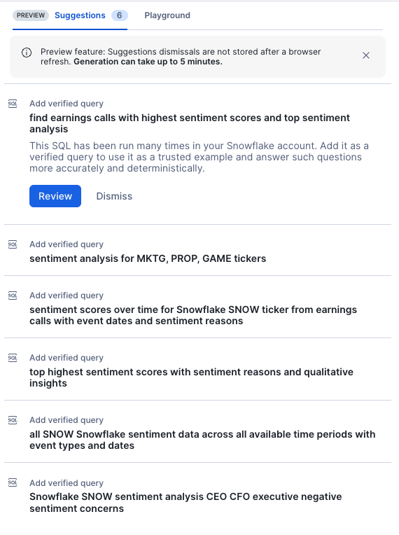
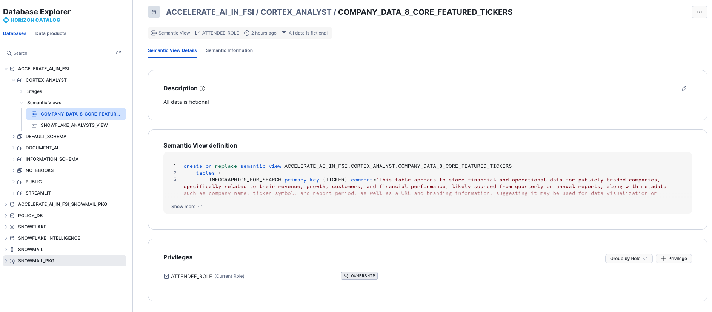

# <h1black>Analyse your data with</h1black> <h1blue>Cortex Analyst</h1blue>

In this section you will learn how to build a dynamic data explorer using Cortex Analyst. Traditionally, users would digest structured information through reports. Over time, reports turned into dashboards and self service capabilities became more and more in demand. However, in order to self serve, users would normally require extensive report building and data engineering expertise. 

Cortex Analyst's AI allows views to be generated by simply asking questions about the data

### <h1sub>Examine the Structured Marketplace Data</h1sub>

First of all, navigate to the Cortex Analyst notebook by navigating to the **projects > Notebooks**.

- Open the notebook and press Start in the top right hand corner to start the compute. 

Within the self contained notebook, you will perform the following:

-   Create a new dataset from the market place
-   Visualise the data in Streamlit

Once you have completed the notebook, return here

### <h1sub>Use Cortex Analyst to Explore the data</h1sub>
It is easy to create an app in order to gain insights from structured data.  **Cortex Analyst** allows the user to ask questions in natural language and will return the result in an appropiate format.  Let's Begin:

- From the navigation bar on the right, hover over the **AI & ML** icon and click on **Studio**

- When prompted, end the notebook session to proceed.

- Through the AI & ML navigator, open up **Cortex Analyst**.

You will see two Semantic Views have been setup.  These have been setup in advanced and work with the tables and views which you have processed in the previous exercises.

The Snowflake Analysts View has information that is specific to snowflake - such as the synthetic analyst reports, SNOW stock data and also the transcribed earnings calls.

The Company Data 8 Core Featured Tickers has additional ficticous information about other tickers which we captured earlier on such as infographic data, analyst reports and emails.

### <h1sub>Snowflake Analysts View</h1sub>

-   Click on the Snowflake Analyst View to see how it'ss been structured

You will see that logical tables have been assigned as well as clear descriptions for each of them.  Descriptions help the agent find the data.

As well table descriptions, aliases and descriptions are assigned to each field name.

Fields are sorted into Dimensions, Time Dimensions and Facts.  Additional filters such as Named Filters and Metrics can also be added.

Click on the **back** button at the top right hand corner of the screen to return to the semantic view selection. 

### <h1sub>Company Data 8 Core Featured Tickers</h1sub>

-   Click on the Company Data 8 Core Featured Tickers to see how the view has been structured. 
  

If you scroll down to Relationships, you will see that 4 relationships has been defined.  All relationships are pointing to the infographics table where it's uniqueness is based on the ticker.  The Right hand side of the join **must** either be a primary key or unique.

Looking at the Infographics for Search table, you will notice where this primary key is defined.

You will notice on the right you might have suggested queries.  As you run through questions in Snowflake Intelligence, you can keep the verified queries in the semantic view to help the agent for future challenges.

After completion of the lab and have explored the tools, navigate back to the analyst and see what suggestions will be made - which you can then choose to keep as a verified query.

If you click on the Playground button, you will be able to try out questions and see what happens.  The agent will see this as **One Tool**.  The agent you will explore in the next lab within Snowflake Intelligence has 10 tools and chooses the best tool to answer the question (and it can sometimes be more than one.)

### <h1sub> What's Next <h1sub>

On a final note, **did you know** that Cortex Analyst Models can be shared on both Internal and External Market place?

Also, within horizon data Explorer, you will  also have quick access to semantic views in the same way as you would access other database objects

Now lets see how these semantic views will form part of a bigger selection of other tools used in **Snowflake Intelligence**

