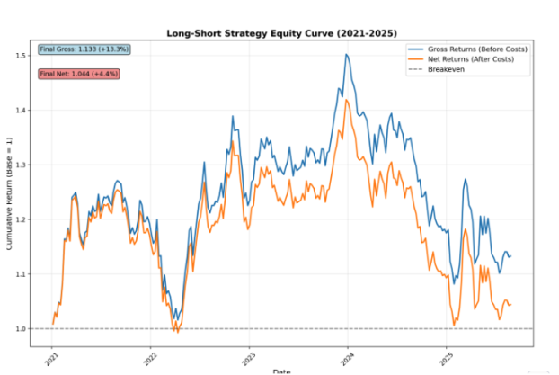

# <h1black>Build a Quantitive Model with </h1black> <h1blue>Snowflake ML </h1blue>

## <h1sub>Introduction</h1sub>

In this section, you'll learn how to build, train, and deploy machine learning models for stock price prediction using **Snowflake ML**. You'll work with financial time series data to create a quantitative trading model that ranks stocks by predicted future performance.

### What You'll Learn

- **Feature Engineering**: Create technical indicators (momentum ratios, moving averages) from raw price data
- **Model Training**: Build gradient boosting models using Snowflake ML
- **Model Registry**: Version and deploy models to Snowflake's Model Registry
- **Batch Predictions**: Apply trained models to generate stock rankings
- **Function Deployment**: Package predictions as a SQL function for agent use

### The Data

The dataset includes historical stock prices with derived technical indicators:
- **Momentum ratios**: r_1, r_5_1, r_10_5, r_21_10, r_63_21 (short to long-term trends)
- **Return calculations**: Forward-looking returns for prediction targets
- **Split adjustments**: Handling stock splits in historical data

While the data is **synthetic for demonstration**, it mirrors the structure of real financial datasets like those in the Snowflake Public Dataset (Paid) that you explored in the marketplace section.

### What You'll Build

By the end of this notebook, you'll have:

1. ✅ **Trained ML Model** - Gradient boosting model predicting stock returns
2. ✅ **Registered Model** - Versioned in Snowflake Model Registry
3. ✅ **SQL Function** - `GET_TOP_BOTTOM_STOCK_PREDICTIONS` callable from SQL or agents
4. ✅ **Agent Integration** - Model available to the "One Ticker" agent

**⚡ Time-Saving Note:** To streamline the lab experience, the ML model (`STOCK_RETURN_PREDICTOR_GBM`) has been **pre-trained and registered** for you. This saves 10-15 minutes of training time while still allowing you to explore the notebook cells to understand the complete model building process. You can still review all the training code and re-run cells if you want to train a fresh model.

### Real-World Application

This quantitative model powers the agent's ability to answer:
> "Give me top 3 vs bottom 3 trade predictions for the next period."

The model analyzes technical indicators for all stocks, ranks them by predicted performance, and returns actionable insights for portfolio managers and traders.

---

## <h1sub>Getting Started</h1sub>

### Navigate to the Notebook

1. Go to **Projects > Notebooks** from the home page
2. Open **Notebook 3: Build a Quantitive Model**
3. The notebook uses a **GPU-powered compute environment** for accelerated model training

**💡 GPU Acceleration:** This notebook leverages Snowflake's GPU-enabled notebooks for faster model training. While the pre-trained model saves you time in the demo, the GPU infrastructure enables rapid iteration if you choose to experiment with different model parameters or retrain from scratch.

**Benefits of GPU Notebooks:**
- **10-100x faster** training compared to CPU-only compute
- Ideal for gradient boosting and deep learning models
- Real-time experimentation with hyperparameters
- Production-grade ML infrastructure without setup

The notebook contains all code and visualizations for building and deploying your stock prediction model, optimized to take advantage of GPU acceleration.

