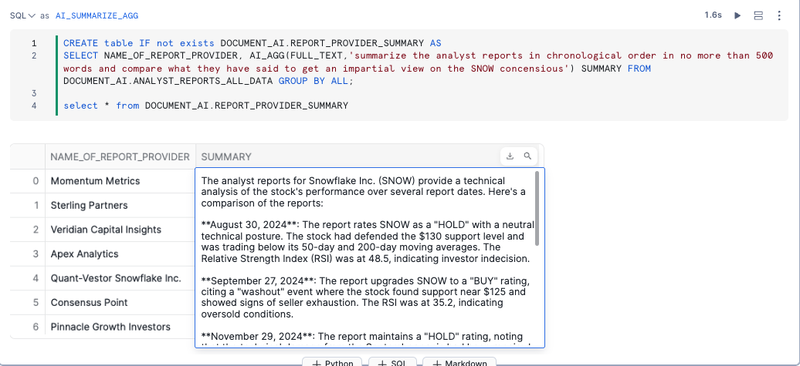
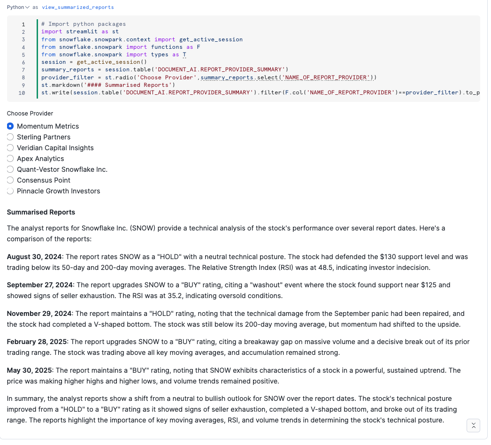

# <h1black>Cortex AI </h1black><h1blue>Process Documents</h1blue>
## <h1sub>Extract, Parse, and Analyze Documents at Scale</h1sub>

In this section you will learn how to use **Cortex AI functions** to process different types of documents including PDFs, financial reports, and infographics. You'll extract structured data, parse text, and generate insights using AI—all within Snowflake Notebooks.

## <h1sub>Overview</h1sub>

You will work with three types of documents:

1. **Analyst Reports (PDFs)** - Multi-page research reports containing analysis, ratings, and recommendations
2. **Financial Reports (PDFs)** - Structured financial statements with tables of metrics and KPIs
3. **Infographics (PNGs)** - Visual earnings infographics for multiple companies

### <h1sub>Cortex AI Functions You'll Use</h1sub>

- **AI_PARSE_DOCUMENT** - Extract all text from documents preserving layout and structure
- **AI_COMPLETE** - Generate structured data extraction using LLMs with response formats
- **AI_EXTRACT** - Extract specific fields, entities, or tables from documents
- **AI_AGG** - Summarize and aggregate unstructured text across multiple documents

---

## <h1sub>Getting Started</h1sub>

### Navigate to the Notebook

- Go back to the home page and click on **Projects > Notebooks**
- Click on the **Extract Data From Documents** notebook (also called "Cortex AI Process Documents")


This notebook contains all the code and visualizations for processing the three document types.

---

## <h1sub>Part 1: Analyst Reports - AI_PARSE_DOCUMENT</h1sub>

### What You'll Learn

- Parse multi-page PDF analyst reports to extract all text
- Extract structured fields like ratings, price targets, and growth metrics
- Summarize long documents using AI_AGG
- Build an interactive PDF viewer with extracted data

### The Documents

You'll work with **6 synthetic analyst reports** from research firms analyzing Snowflake:

- Apex Analytics
- Sterling Partners
- Veridian Capital
- Pinnacle Growth Investors
- Momentum Metrics
- Quant-Vestor Consensus Point

### Step 1: List Available Reports

The notebook first shows you all analyst reports stored in the `@DOCUMENT_AI.ANALYST_REPORTS` stage.

```sql
SELECT 
    BUILD_SCOPED_FILE_URL('@DOCUMENT_AI.ANALYST_REPORTS', RELATIVE_PATH), 
    * 
FROM DIRECTORY(@DOCUMENT_AI.ANALYST_REPORTS)
```

### Step 2: Parse Documents with AI_PARSE_DOCUMENT

**AI_PARSE_DOCUMENT** extracts all text from PDFs while preserving layout structure using markdown formatting:

```sql
CREATE TABLE IF NOT EXISTS DOCUMENT_AI.PARSED_ANALYST_REPORTS AS
SELECT 
    RELATIVE_PATH,
    AI_PARSE_DOCUMENT(
        TO_FILE('@DOCUMENT_AI.ANALYST_REPORTS', RELATIVE_PATH),
        {'mode': 'LAYOUT'}
    ) AS EXTRACTED_DATA
FROM DIRECTORY('@DOCUMENT_AI.ANALYST_REPORTS');
```

This extracts:

- Full text content with markdown formatting
- Page count
- Document structure and layout

### Step 3: Extract Structured Fields with AI_COMPLETE

Use **AI_COMPLETE** with structured response formats to extract specific fields:

```sql
AI_COMPLETE(
    model => 'claude-4-sonnet',
    prompt => CONCAT('Extract the following information...', CONTENT),
    response_format => {
        'type': 'json',
        'schema': {
            'type': 'object',
            'properties': {
                'date_report': {'type': 'string'},
                'name_of_report_provider': {'type': 'string'},
                'rating': {'type': 'string', 'enum': ['BUY', 'SELL', 'HOLD', 'EQUAL-WEIGHT']},
                'close_price': {'type': 'number'},
                'price_target': {'type': 'number'},
                'growth': {'type': 'number'}
            }
        }
    }
)
```

This creates a structured table with:

- **DATE_REPORT** - Report creation date
- **NAME_OF_REPORT_PROVIDER** - Research firm name
- **RATING** - Stock recommendation (BUY/SELL/HOLD/EQUAL-WEIGHT)
- **CLOSE_PRICE** - Current stock price
- **PRICE_TARGET** - Analyst price target
- **GROWTH** - Revenue growth percentage (YoY)

### Step 4: Summarize Documents with AI_AGG

**AI_AGG** summarizes long text across rows. This is perfect for condensing multi-page reports:

```sql
SELECT 
    RELATIVE_PATH,
    NAME_OF_REPORT_PROVIDER,
    AI_AGG(FULL_TEXT, 'summarize the analyst reports in no more than 100 words') AS SUMMARY
FROM DOCUMENT_AI.AI_EXTRACT_REPORTS_STRUCTURED_ADVANCED
GROUP BY RELATIVE_PATH, NAME_OF_REPORT_PROVIDER, FULL_TEXT;
```

You can also aggregate across **all reports from each research firm** to compare perspectives:

```sql
SELECT 
    NAME_OF_REPORT_PROVIDER, 
    AI_AGG(
        FULL_TEXT,
        'summarize the analyst reports in chronological order and compare perspectives'
    ) AS SUMMARY 
FROM DOCUMENT_AI.ANALYST_REPORTS_ALL_DATA 
GROUP BY NAME_OF_REPORT_PROVIDER;
```



You can also view these summaries in an interactive Streamlit interface:



### Step 5: Interactive PDF Viewer

The notebook includes a **Streamlit PDF viewer** that displays:

- Report metadata (date, firm, rating, prices, growth)
- Generated AI summary
- Original PDF side-by-side with extracted markdown text
- Page navigation controls


This allows you to validate extraction quality by comparing the AI output against the source document.

---

## <h1sub>Part 2: Financial Reports - AI_EXTRACT Tables</h1sub>

### What You'll Learn

- Extract structured **tables** from financial PDFs
- Process income statements, customer metrics, and KPIs
- Transform extracted arrays into queryable database tables
- Handle multiple companies and time periods

### The Documents

You'll work with **8 synthetic quarterly financial reports** in PDF format:

- SNOW (Snowflake)
- ICBG (Iceberg Data Systems)
- QRYQ (Querybase Technologies)
- DFLX (DataFlex Analytics)
- STRM (StreamPipe Systems)
- VLTA (Voltaic AI)
- CTLG (CatalogX)
- NRNT (Neuro-Nectar Corporation)

Each report contains:

- **Consolidated Statement of Operations** (Income Statement)
- **Customer Growth and Retention Metrics**
- **Key Performance Indicators** (KPIs)

### Step 1: List Financial Reports

```sql
SELECT 
    BUILD_SCOPED_FILE_URL('@DOCUMENT_AI.FINANCIAL_REPORTS', RELATIVE_PATH), 
    * 
FROM DIRECTORY(@DOCUMENT_AI.FINANCIAL_REPORTS)
```

### Step 2: Preview Financial Reports

The notebook includes a **PDF viewer** to inspect the financial reports before extraction. This helps you understand the table structure.

### Step 3: Extract Tables with AI_EXTRACT

**AI_EXTRACT** is purpose-built for structured data extraction. Here's how to extract financial tables:

```sql
CREATE OR REPLACE TABLE DOCUMENT_AI.FINANCIAL_REPORTS AS
SELECT 
    RELATIVE_PATH,
    AI_EXTRACT(
        file => TO_FILE('@DOCUMENT_AI.FINANCIAL_REPORTS', RELATIVE_PATH),
        responseFormat => {
            'schema': {
                'type': 'object',
                'properties': {
                    'company_name': {'type': 'string'},
                    'report_period': {'type': 'string'},
                    'income_statement': {
                        'type': 'object',
                        'properties': {
                            'line_item': {'type': 'array'},
                            'q2_fy2025': {'type': 'array'},
                            'q2_fy2024': {'type': 'array'}
                        }
                    },
                    'customer_metrics': {
                        'type': 'object',
                        'properties': {
                            'metric': {'type': 'array'},
                            'q2_fy2025': {'type': 'array'}
                        }
                    },
                    'kpi_metrics': {
                        'type': 'object',
                        'properties': {
                            'metric': {'type': 'array'},
                            'value': {'type': 'array'}
                        }
                    }
                }
            }
        }
    ) AS EXTRACTED_DATA
FROM DIRECTORY('@DOCUMENT_AI.FINANCIAL_REPORTS');
```

This extracts:

- **Income Statement** - Revenue, costs, operating income across quarters
- **Customer Metrics** - Total customers, $1M+ customers, retention rates
- **KPI Metrics** - RPO, free cash flow, gross margin, etc.

### Step 4: Create Views from Extracted Arrays

The extracted data is stored as JSON arrays. Create views to make it queryable:

```sql
CREATE OR REPLACE VIEW DOCUMENT_AI.VW_INCOME_STATEMENT AS
WITH income_data AS (
    SELECT 
        RELATIVE_PATH,
        EXTRACTED_DATA:response:company_name::text AS COMPANY,
        EXTRACTED_DATA:response:income_statement:line_item AS LINE_ITEMS,
        EXTRACTED_DATA:response:income_statement:q2_fy2025 AS Q2_2025,
        EXTRACTED_DATA:response:income_statement:q2_fy2024 AS Q2_2024
    FROM DOCUMENT_AI.FINANCIAL_REPORTS
)
SELECT 
    COMPANY,
    idx.VALUE::text AS LINE_ITEM,
    Q2_2025[idx.INDEX]::text AS Q2_FY2025,
    Q2_2024[idx.INDEX]::text AS Q2_FY2024
FROM income_data,
LATERAL FLATTEN(input => LINE_ITEMS) idx;
```

Now you can query the financial data like any other table:

```sql
SELECT * FROM DOCUMENT_AI.VW_INCOME_STATEMENT
WHERE COMPANY = 'Snowflake Inc.'
ORDER BY LINE_ITEM;
```

---

## <h1sub>Part 3: Infographics - AI_EXTRACT from Images</h1sub>

### What You'll Learn

- Extract data from **PNG images** (not just PDFs!)
- Process visual infographics with charts and metrics
- Extract multiple fields from a single image
- Handle diverse visual layouts

### The Documents

You'll work with **8 earnings infographics** in PNG format, one for each company:


Each infographic contains:

- Company name and ticker
- Report period
- Revenue metrics (total, product, services)
- Customer counts
- Financial KPIs (NRR, margins, cash flow, RPO)
- Company mission and business strategy

### Step 1: List Infographics

```sql
SELECT 
    BUILD_SCOPED_FILE_URL('@DOCUMENT_AI.INFOGRAPHICS', RELATIVE_PATH), 
    * 
FROM DIRECTORY('@DOCUMENT_AI.INFOGRAPHICS')
WHERE RELATIVE_PATH LIKE '%FY25-Q2.png';
```

### Step 2: View Infographics

The notebook includes a **Streamlit gallery** displaying all 8 infographics in a grid layout. This lets you see the visual diversity before extraction.

### Step 3: Extract Data with AI_EXTRACT

**AI_EXTRACT** works on images too! Use question-answer format for best results:

```sql
CREATE OR REPLACE TABLE DOCUMENT_AI.INFOGRAPHIC_METRICS_EXTRACTED AS
SELECT 
    RELATIVE_PATH,
    SPLIT_PART(RELATIVE_PATH, '_', 1) AS COMPANY_TICKER,
    AI_EXTRACT(
        file => TO_FILE('@DOCUMENT_AI.INFOGRAPHICS', RELATIVE_PATH),
        responseFormat => {
            'text': 'Describe what is said by the business',
            'company_name': 'What is the full company name?',
            'ticker': 'What is the ticker symbol?',
            'report_period': 'What is the report period shown?',
            'total_revenue': 'What is the Total Revenue amount shown?',
            'yoy_growth': 'What is the YoY Growth percentage shown?',
            'product_revenue': 'What is the Product Revenue amount?',
            'services_revenue': 'What is the Services Revenue amount?',
            'total_customers': 'What is the Total Customers number?',
            'customers_1m_plus': 'How many customers with $1M+ Revenue?',
            'nrr': 'What is the Net Revenue Retention percentage?',
            'gross_margin': 'What is the Gross Margin percentage?',
            'operating_margin': 'What is the Operating Margin percentage?',
            'free_cash_flow': 'What is the Free Cash Flow amount?',
            'rpo': 'What is the RPO amount?',
            'rpo_growth': 'What is the RPO Growth percentage?'
        }
    ) AS EXTRACTED_DATA
FROM DIRECTORY('@DOCUMENT_AI.INFOGRAPHICS')
WHERE RELATIVE_PATH LIKE '%FY25-Q2.png';
```

### Step 4: Create Clean View

Transform the JSON response into a structured table:

```sql
CREATE OR REPLACE VIEW DOCUMENT_AI.VW_INFOGRAPHIC_METRICS AS
SELECT 
    COMPANY_TICKER,
    RELATIVE_PATH,
    EXTRACTED_DATA:response:company_name::text AS COMPANY_NAME,
    EXTRACTED_DATA:response:ticker::text AS TICKER,
    EXTRACTED_DATA:response:total_revenue::text AS TOTAL_REVENUE,
    EXTRACTED_DATA:response:yoy_growth::text AS YOY_GROWTH,
    EXTRACTED_DATA:response:total_customers::text AS TOTAL_CUSTOMERS,
    EXTRACTED_DATA:response:nrr::text AS NET_REVENUE_RETENTION,
    EXTRACTED_DATA:response:gross_margin::text AS GROSS_MARGIN,
    EXTRACTED_DATA:response:rpo::text AS RPO
FROM DOCUMENT_AI.INFOGRAPHIC_METRICS_EXTRACTED
ORDER BY COMPANY_TICKER;
```

---

## <h1sub>Part 4: Email Analysis - AI_EXTRACT and AI_SENTIMENT</h1sub>

### What You'll Learn

- Extract metadata from HTML email content using AI
- Identify stock tickers mentioned in financial analyst emails
- Extract investment ratings from unstructured text
- Analyze sentiment of financial communications
- Build interactive email analytics dashboards

### The Data

You'll work with **324 financial analyst emails** containing:

- Market updates and earnings analysis
- Investment recommendations and rating changes
- Competitive analysis and sector commentary
- Risk alerts and portfolio implications
- Professional analyst correspondence (300-500 words each)

### Step 1: Extract Ticker and Rating with AI_EXTRACT

**AI_EXTRACT** can parse unstructured HTML email content to extract structured fields:

```sql
CREATE OR REPLACE TABLE EMAIL_PREVIEWS_EXTRACTED AS
WITH extracted AS (
    SELECT 
        *,
        AI_EXTRACT(
            HTML_CONTENT,
            {
                'ticker': 'Extract ALL stock ticker symbols mentioned in this email. 
                          Return as comma-separated list. Examples: SNOW, CTLG, ICBG, DFLX',
                'rating': 'investment rating recommendation if mentioned 
                          (BUY, SELL, HOLD, OVERWEIGHT, EQUAL-WEIGHT, UNDERWEIGHT, OUTPERFORM)'
            }
        ) AS extracted_data,
        AI_SENTIMENT(HTML_CONTENT) AS sentiment_data
    FROM EMAIL_PREVIEWS
)
```

This extracts:
- **Tickers** - Stock symbols mentioned anywhere in the email
- **Ratings** - Investment recommendations (7 types)
- **Sentiment** - Overall tone (positive, negative, mixed, neutral)

### Step 2: Analyze Sentiment with AI_SENTIMENT

**AI_SENTIMENT** analyzes the emotional tone and opinion expressed in text:

```sql
AI_SENTIMENT(HTML_CONTENT) AS sentiment_data
```

Returns sentiment categories:
- **positive** - Bullish outlook, strong recommendations
- **negative** - Bearish concerns, downgrades
- **mixed** - Balanced view with pros and cons
- **neutral** - Objective analysis without strong opinion

### Step 3: Flatten Results for Analysis

Since emails can mention multiple tickers, use LATERAL FLATTEN to create one row per ticker:

```sql
SELECT 
    EMAIL_ID,
    RECIPIENT_EMAIL,
    SUBJECT,
    HTML_CONTENT,
    CREATED_AT,
    TRIM(f.value::STRING) AS TICKER,
    extracted_data:response:rating::STRING AS RATING,
    sentiment_data:categories[0]:sentiment::STRING AS SENTIMENT
FROM extracted,
LATERAL FLATTEN(
    input => SPLIT(ticker_clean, ','),
    outer => TRUE
) f
WHERE TRIM(f.value::STRING) IS NOT NULL;
```

### Step 4: Interactive Email Analytics Dashboard

The notebook includes a **Streamlit email analytics dashboard** that visualizes:

- Total emails, tickers covered, date range, positive sentiment percentage
- Rating distribution across all 7 types (BUY, OVERWEIGHT, OUTPERFORM, HOLD, EQUAL-WEIGHT, UNDERWEIGHT, SELL)
- Sentiment distribution (positive, mixed, negative, neutral)
- Sentiment and rating trends over time
- Ticker-specific analysis


The dashboard provides:
- **Filter Controls** - Select ticker, time grouping (week/month), filter by rating
- **Key Metrics** - Compact cards showing total emails, tickers, date range, positive %
- **Distribution Charts** - Visual breakdown of ratings and sentiments
- **Time Series** - Track sentiment and rating changes over time
- **Ticker Analysis** - Compare sentiment and ratings across companies

### Real-World Example: SNOW Timeline

The email dataset includes a complete narrative arc tracking Snowflake (SNOW):

1. **July 2024**: BUY rating - Strong fundamentals
2. **August 2024**: Downgraded to HOLD - Competitor concerns
3. **September 2024**: Downgraded to SELL - Market disruption fears
4. **November 2024**: Upgraded to HOLD - Threats eliminated
5. **November 2024**: Upgraded to BUY - Strong recovery
6. **December 2024**: Raised to OVERWEIGHT - Top pick for 2025

This timeline demonstrates how AI can track sentiment shifts and rating changes across analyst communications.

### Advanced Features

**Multi-Ticker Analysis**:
- Single email can mention multiple tickers (SNOW, QRYQ, ICBG)
- Each ticker gets separate row with same sentiment
- Enables cross-company competitive analysis

**Rating Granularity**:
- 7 different rating types vs traditional BUY/HOLD/SELL
- Captures subtle analyst opinions (OVERWEIGHT, OUTPERFORM, etc.)
- More nuanced investment signals

**Sentiment Nuance**:
- "mixed" sentiment captures balanced analysis
- Distinguishes between neutral (no opinion) and mixed (pros & cons)
- Better reflects real analyst communications

---

## <h1sub>Summary</h1sub>

You've now explored multiple AI-powered document processing capabilities:

### ✅ **AI_PARSE_DOCUMENT**

Extract text and structure from multi-page PDF documents while preserving layout with markdown formatting.

### ✅ **AI_COMPLETE**

Generate structured data extraction using LLMs with custom response formats and schemas for precise field extraction.

### ✅ **AI_EXTRACT**

Pull structured data from PDFs, images, and HTML content using entity extraction (question-answer) or table extraction (schema-based). Perfect for emails, reports, and documents.

### ✅ **AI_SENTIMENT**

Analyze emotional tone and opinion in text to classify as positive, negative, mixed, or neutral. Ideal for financial communications and analyst reports.

### ✅ **AI_AGG**

Summarize and aggregate unstructured text across multiple documents to generate insights.

### Key Takeaways

1. **All processing happens in Snowflake** - No external tools or data movement required
2. **Multiple document types supported** - PDFs, images, HTML emails, and more
3. **Structured outputs** - AI functions return JSON that can be transformed into tables
4. **Scalable** - Process thousands of documents using SQL
5. **Interactive** - Build Streamlit apps directly in notebooks to visualize results
6. **Sentiment analysis built-in** - AI_SENTIMENT provides instant emotional tone classification
7. **Flexible extraction** - AI_EXTRACT works on any text format with natural language prompts

---

## <h1sub>Next Steps</h1sub>

Continue to the next notebook to explore **audio transcription** with **AI_TRANSCRIBE** for processing earnings call recordings.


