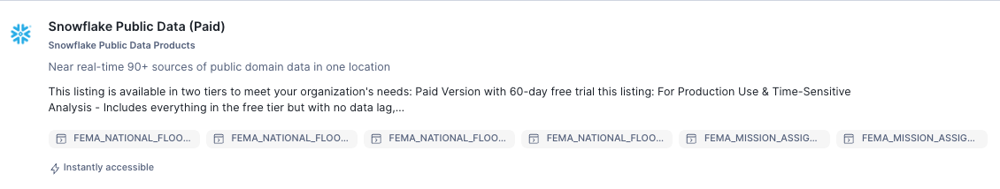
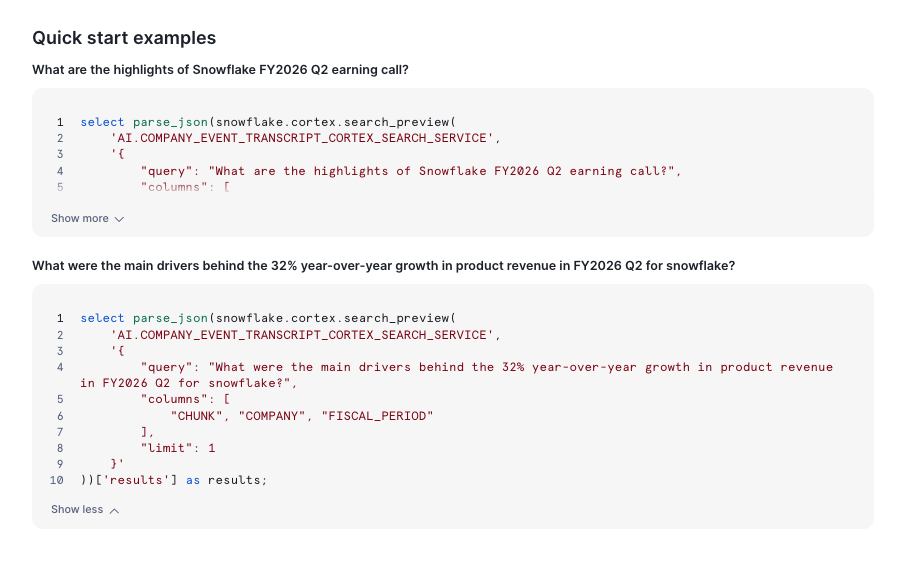

# <h1black>Get Data from the </h1black><h1blue>MarketPlace</h1blue>

I would be good to get some data from the marketplace to understand the latest stock prices of **Snowflake shares**.

- In the Home page, go to **Data Products** and then **Marketplace**.
- In the Search Menu, type in **share prices snowflake**.
- Click on the **Snowflake Public Data (Paid)** dataset.

This Listing has a selection of Datasets that you can try for 60 days which includes financial data such as:

-   STOCK_PRICE_TIMESERIES
  
This is the dataset you will be using for the this part of the lab.  If you choose to skip the marketplace element of the lab, a snapshot of the snowflake stock history has been ingested in this account.

As well as stock prices there are other datasets such as SEC reporting data.

There is also an additional listing - Cortex Knowledge Extensions.  This includes a wealth of unstructured datasets such as earnings call transcripts - which have already been pre chunked.

- Press **Get** to get the data. You will be prompted to type in your email address if you have not already completed your profile.

- Press **Done**

We now have some structured data available for analysis and can also be used to support predictive models.

- Navigate to **Build a Quantitive Model** with Snowflake ML.

