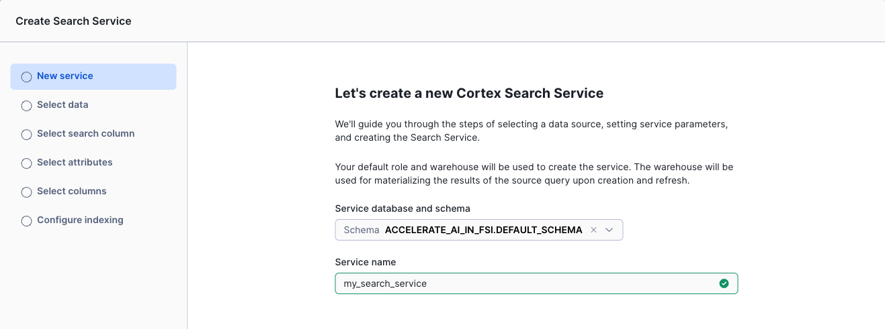
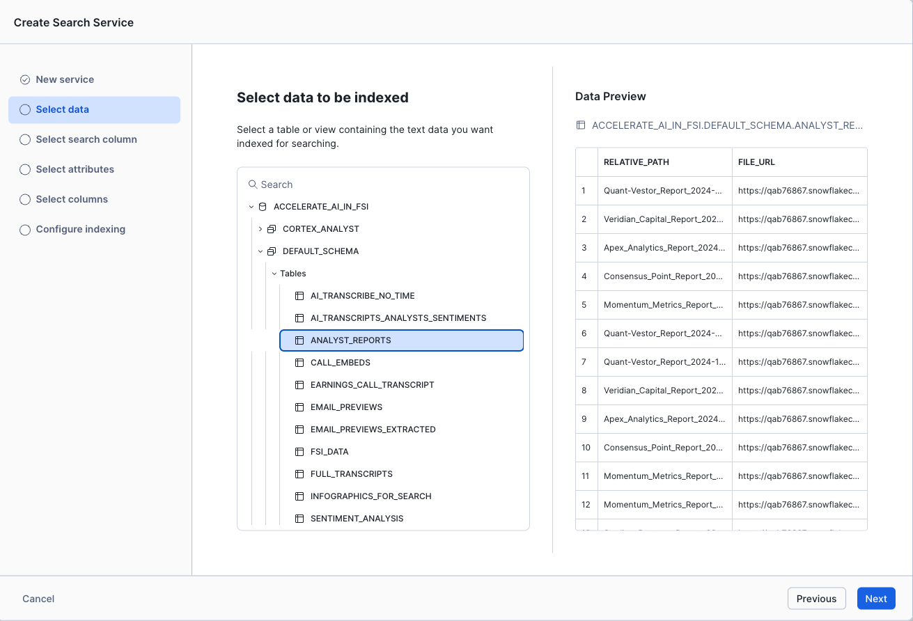
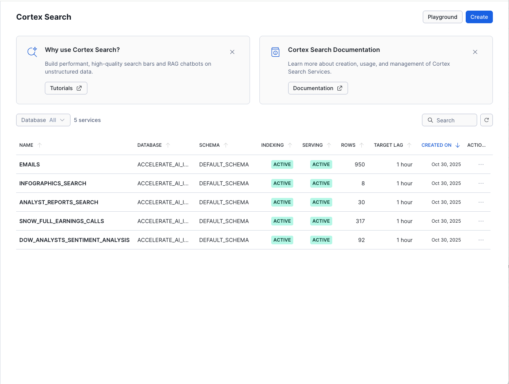

# <h1black>Create a </h1black><h1blue>Search Service</h1blue>

## <h1sub>Introduction</h1sub>

In this section, you will create a powerful search service that makes your unstructured financial data instantly accessible and queryable. This is a critical step in building intelligent AI applications that can quickly find and retrieve relevant information from large document collections.

### **What You'll Accomplish**

By the end of this section, you will have created **5 intelligent search services** covering all your financial data:

1. **Analyst Sentiment Search** - Search 92 earnings call transcripts with sentiment analysis
2. **Full Earnings Calls** - Semantic search across chunked Snowflake earnings transcripts  
3. **Analyst Reports** - Search 30 analyst reports with ratings and price targets
4. **Infographics** - Search 11 company earnings infographics and KPI data
5. **Email Content** - Search 950+ analyst emails with ratings and sentiment

**Key Capabilities:**
- **Hybrid Search Engine**: Combines vector (semantic) and keyword search across all data types
- **Instant Document Retrieval**: Search across 11 companies and multiple document types in seconds
- **RAG Foundations**: Core infrastructure for Retrieval Augmented Generation powering AI responses
- **Agent Integration**: Search services ready for the "One Ticker" agent to use

### **The Challenge: Finding Information in Unstructured Data**

You've successfully processed and extracted valuable insights from multiple types of financial documents:
- **30 Analyst Reports**: From 6 research firms with structured data extraction plus full text
- **92 Earnings Call Transcripts**: From 11 companies with audio-to-text conversion and sentiment analysis
- **11 Financial Infographics**: With key metrics extraction from visual content
- **950+ Analyst Emails**: With AI-extracted tickers, ratings, and sentiment
- **7 Investment Research Papers**: Federal Reserve and NBER publications

But now you face a common challenge: **How do you quickly find specific information within this growing collection of unstructured data across 11 companies?**

### **The Solution: Intelligent Search Services**

Traditional keyword search falls short when dealing with financial content because:
- Important concepts may be expressed in different ways ("revenue growth" vs "top-line expansion")
- Users need to find documents by meaning, not just exact word matches
- Context and semantic understanding are crucial for financial analysis

**Cortex Search** solves this by providing:
- **Semantic Search**: Understands meaning and context, not just keywords
- **Hybrid Approach**: Combines the precision of keyword search with the intelligence of vector search
- **Zero Infrastructure**: No need to manage embeddings, indexes, or search infrastructure
- **Real-time Updates**: Automatically refreshes as your data changes

### **Building Blocks for AI Intelligence**

The search service you create here will become a fundamental component of your final AI agent, enabling it to:
- **Find Relevant Context**: Quickly locate information needed to answer user questions
- **Provide Citations**: Reference specific documents and passages that support its responses
- **Cross-reference Information**: Connect insights from multiple documents and data sources
- **Support Complex Queries**: Handle sophisticated financial analysis requests

Let's begin building your intelligent search capability.

## <h1sub>Understanding Your Data Assets</h1sub>

We now have a comprehensive collection of unstructured financial data:

**Document Types:**
- 📄 Analyst reports (30 documents from 6 firms)
- 🎙️ Earnings call transcripts (92 calls from 11 companies)
- 📊 Financial infographics (11 company visuals)
- 📧 Analyst emails (950+ messages)
- 📚 Investment research papers (7 academic publications)

**Companies Covered:**
- **8 Core Companies**: SNOW, CTLG, DFLX, ICBG, QRYQ, STRM, VLTA, NRNT (full materials)
- **3 Bottom Performers**: PROP, GAME, MKTG (limited disclosures)

**The Challenge:** How do we efficiently search across this diverse collection to find relevant insights?

This is where you will build **5 specialized search services** - each optimized for a specific data type.

You have experienced the key principle of RAG based searching while you were searching for relevant pieces of information in the **earnings call transcripts** section.

A search service uses this principle but simplifies the setup.

**Cortex Search** gets you up and running with a hybrid (vector and keyword) search engine on your text data in minutes, without having to worry about embedding, infrastructure maintenance, search quality parameter tuning, or ongoing index refreshes. This means you can spend less time on infrastructure and search quality tuning, and more time developing high-quality chat and search experiences using your data. 

## <h1sub>Implementing Your Search Service</h1sub>

Now let's put this into practice by creating your search service using the data you've processed in previous sections.

### **Two Approaches to Creating Search Services**

Snowflake provides flexibility in how you create and manage Cortex Search Services:

**1. UI-Based Creation (Point-and-Click)**
- Navigate to Cortex Search from the AI and ML navigation bar
- Add a new search service
- Use the visual interface to configure your search
  

- Select source tables, search columns, and attributes via dropdowns

- Ideal for quick prototypes and exploration

**2. Programmatic Creation (SQL/Notebook)**
- Define search services using SQL CREATE statements
- Version control your search configurations as code
- Automate deployment across environments
- Integrate into CI/CD pipelines

**In this lab, you'll use the programmatic approach** via notebooks, which offers several advantages:
- ✅ **Reproducibility**: Search services defined as code can be deployed consistently
- ✅ **Documentation**: SQL statements serve as clear documentation
- ✅ **Version Control**: Track changes to search configurations over time
- ✅ **Automation**: Deploy search services as part of your data pipeline

This programmatic approach mirrors how you'd implement search services in production environments, making the skills directly transferable to real-world projects.

### **Navigate to the Notebook**

- Go back to the home page and click on **Projects > Notebooks**

- Open the **CREATE_SEARCH_SERVICE** notebook
- Follow the instructions provided in the notebook.  Once you have completed the notebook, you will see that the search services will also be available within the user interface.

## <h1sub>Next Steps: Connecting to Structured Data</h1sub>

Excellent! You have now created **5 powerful search services** for your unstructured financial documents:

1. ✅ **dow_analysts_sentiment_analysis** - Search earnings transcripts with sentiment context
2. ✅ **snow_full_earnings_calls** - Search chunked Snowflake earnings calls
3. ✅ **ANALYST_REPORTS_SEARCH** - Search 30 analyst reports with full text
4. ✅ **INFOGRAPHICS_SEARCH** - Search 11 company infographics and branding analysis
5. ✅ **EMAILS** - Search 950+ analyst emails by ticker, rating, or sentiment

Your search services can now:
- Find relevant analyst reports based on semantic meaning across 6 research firms
- Retrieve earnings call segments from 11 companies related to specific topics
- Search through infographic content and extracted KPIs
- Query analyst emails by investment ratings (7 types) and sentiment
- Cross-reference information across multiple document types

However, comprehensive financial analysis requires both unstructured insights and structured data analysis. While you've used Cortex Search to find information within unstructured documents, there are also many structured datasets that you'll want to include in your analysis. Some structured tables you have already created using Document AI, but there will be additional structured datasets from external sources.

- Proceed to **Structured Data Processing** where you will start by transforming stock prices and trading datasets from the **marketplace**.

    Click [Here](analyst.md) to continue

