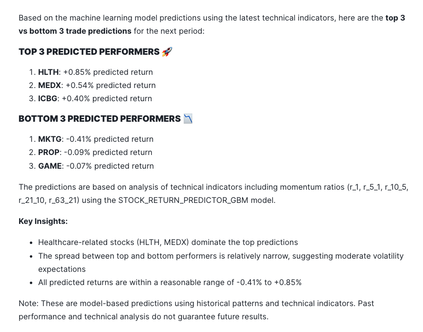
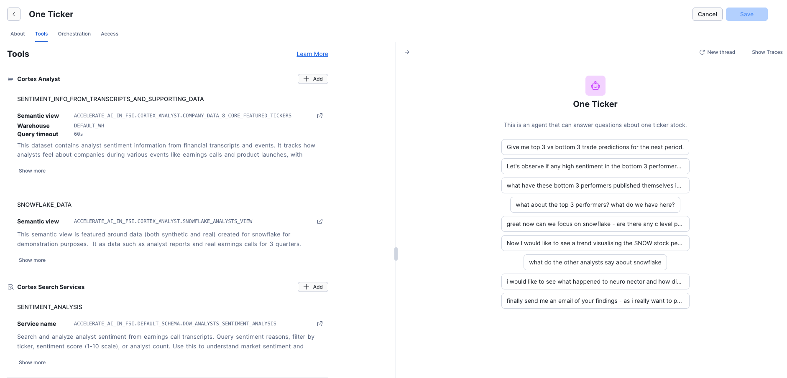

# <h1black>Configure and use </h1black> <h1blue>Snowflake Intelligence</h1blue>
## <h1sub>AI Agents for Financial Analysis</h1sub>


In this section, you'll learn how to use the **"One Ticker" Stock Agent** - a sophisticated AI agent that combines multiple data sources, search capabilities, and analytical tools to provide comprehensive insights about stocks and companies.

## <h1sub>Overview</h1sub>

The One Ticker agent is your AI-powered financial analyst assistant that can:

- 📊 Analyze company financial data and performance metrics
- 📈 Track stock price trends and generate predictions
- 💬 Review analyst sentiment from earnings calls
- 📧 Search through analyst emails and reports
- 🔍 Perform web searches for fact-checking
- ✉️ Generate and send email summaries via SnowMail

---

## <h1sub>Getting Started</h1sub>

### Access the Agent

1. Navigate to **Snowflake Intelligence** in your Snowflake account
2. The **One Ticker** agent will be available to you.  The sources of information that the tool will use is automatic and will depend on the question.

You will see 4 sample questions in the interface.  Once you have clicked on the first question, open the Agent details which will open up all the other questions for this demonstration.



Initially ask the questions in order as there are some follow on questions.  Of course, after asking all the sample questions, experiment and ask any other question.

---

## <h1sub>What the Agent Can Do</h1sub>

### 1. Stock Performance Predictions

**Try asking:**
> "Give me top 3 vs bottom 3 trade predictions for the next period."

The agent will:
- Use machine learning models to analyze technical indicators
- Rank stocks by predicted performance
- Show you the top 3 expected winners and bottom 3 underperformers
- Display results in a visual chart

**Behind the scenes:** Uses the `STOCK_PERFORMANCE_PREDICTOR` function with gradient boosting models trained on historical price data (r_1, r_5_1, r_10_5, r_21_10, r_63_21 momentum ratios).

### 2. Sentiment Analysis

**Try asking:**
> "Let's observe if any high sentiment in the bottom 3 performers, and summarize the qualitative insights from the earnings call that shows top sentiment."

The agent will:
- Identify bottom performing companies
- Analyze earnings call transcripts for sentiment
- Extract positive insights from analyst discussions
- Summarize key qualitative findings

**Data sources:** Searches across 92 earnings call transcripts from 11 companies with AI-extracted sentiment scores.

### 3. Company Material Review

**Try asking:**
> "What have these bottom 3 performers published themselves in terms of reports?"

The agent will:
- Search infographics, financial reports, and earnings materials
- Show what investor relations materials exist
- Compare to top performers' comprehensive disclosures
- Explain the limited IR approach of smaller companies

**Demonstrates:** PROP, GAME, and MKTG have minimal published materials (realistic for growth-stage companies).

### 4. Stock Price Trend Visualization

**Try asking:**
> "Now I would like to see a trend visualising the SNOW stock performance over time"

The agent will:
- Query the STOCK_PRICES table (84M+ data points)
- Filter to Snowflake (SNOW ticker) using TICKER_SNOW filter
- Create time-series visualizations
- Show high, low, volume, and closing prices over time

**Data coverage:** Historical stock prices from 2020-present with daily granularity.

### 5. Analyst Opinion Research

**Try asking:**
> "What do the other analysts say about snowflake?"

The agent will:
- Search 30 analyst reports across 6 research firms
- Search 950+ analyst emails
- Summarize consensus opinions
- Show rating distribution (BUY, HOLD, SELL, etc.)

**Research firms covered:** Apex Analytics, Sterling Partners, Veridian Capital, Pinnacle Growth Investors, Momentum Metrics, Quant-Vestor.

### 6. Narrative Analysis with Web Fact-Checking

**Try asking:**
> "I would like to see what happened to neuro nector and how did this impact Snowflake. Present the information based on what we have - then fact check with any available data from the web."

The agent will:
- Review internal data about Neuro-Nectar (NRNT)
- Show the bankruptcy timeline (July-Nov 2024)
- Analyze impact on Snowflake stock
- Use WEB_SEARCH to fact-check details
- Cross-reference with external sources

**Demonstrates:** How AI agents can combine internal data with external web searches for comprehensive analysis.

### 7. Email Report Generation

**Try asking:**
> "Finally send me an email of your findings - as i really want to put neuro nector drama to bed!!!"

The agent will:
- Summarize all previous analysis
- Format as professional email with markdown
- Save to EMAIL_PREVIEWS table
- Return SnowMail URL for viewing

**Email features:**
- Markdown converted to HTML automatically
- Snowflake brand styling applied
- Viewable in Gmail-style SnowMail interface
- Includes all charts and findings

---

## <h1sub>Agent Tools & Capabilities</h1sub>

Once you have had a go at using Snowflake Intelligence, please navigate back to Snowsight and click on **Agents** via the **AI and ML** pane. You will the agent called One Ticker - which is what you have been using within Snowflake Intelligence.

-   Click on One Ticker and press Edit
-   You will see the Example questions which you have explored, the tools available to the agent, any special instructions on how to orchestrate the questions are in the Orchestration pane and finally, access is controlled via the access tab. 

The One Ticker agent has access to **10 powerful tools**:




### Semantic Analysis Tools (2)

**1. SENTIMENT_INFO_FROM_TRANSCRIPTS_AND_SUPPORTING_DATA**
- Queries 11 companies' data
- Financial reports, infographics, earnings transcripts
- Email content with ratings and sentiment
- Uses: COMPANY_DATA_8_CORE_FEATURED_TICKERS semantic view

**2. snowflake_data**
- Snowflake-specific data (real and synthetic)
- 3 quarters of earnings calls
- Analyst reports
- Stock price history
- Uses: SNOWFLAKE_ANALYSTS_VIEW semantic view

### Search Services (5)

**3. Sentiment_Analysis**
- Searches across earnings call transcripts
- 92 transcripts with sentiment scores
- Filter by ticker, score, analyst count
- Service: DOW_ANALYSTS_SENTIMENT_ANALYSIS

**4. Analyst_Reports_Snowflake**
- 30 analyst reports about Snowflake
- Full text search capability
- Ratings, price targets, summaries
- Service: ANALYST_REPORTS_SEARCH

**5. Latest_infographics_8_core_stocks**
- 11 company earnings infographics
- Visual KPI summaries
- Brand analysis and mission statements
- Service: INFOGRAPHICS_SEARCH

**6. Email_Content**
- 950+ analyst emails
- 7 rating types, sentiment analysis
- 11 companies covered
- Service: EMAILS

**7. snowflake_full_earnings_calls**
- Full Snowflake earnings call transcripts
- Chunked for semantic search
- Q1, Q2, Q3 FY2025
- Service: SNOW_FULL_EARNINGS_CALLS

### Generic Functions (3)

**8. STOCK_PERFORMANCE_PREDICTOR**
- ML-powered stock predictions
- Uses gradient boosting model (STOCK_RETURN_PREDICTOR_GBM)
- Returns top N and bottom N predicted performers
- Function: GET_TOP_BOTTOM_STOCK_PREDICTIONS

**9. SEND_EMAIL**
- Creates formatted emails
- Converts markdown to HTML
- Saves to SnowMail for viewing
- Returns clickable viewing URL
- Procedure: SEND_EMAIL_NOTIFICATION

**10. WEB_SEARCH** 🆕
- Searches the web for fact-checking
- Uses DuckDuckGo search
- Returns top 3 results with summaries
- Function: WEB_SEARCH

---

## <h1sub>Sample Conversation Flow</h1sub>

Here's an example conversation demonstrating the agent's capabilities:

**You:** "Give me top 3 vs bottom 3 trade predictions for the next period."

**Agent:** *Runs ML model, shows chart with top performers (e.g., VLTA, QRYQ, ICBG) and bottom performers (e.g., PROP, GAME, MKTG)*

**You:** "What have these bottom 3 performers published themselves in terms of reports?"

**Agent:** *Searches infographics and reports, explains PROP/GAME/MKTG have limited investor materials compared to core 8 companies*

**You:** "Now can we focus on snowflake - are there any c level people at snowflake that are negative on earnings calls?"

**Agent:** *Analyzes earnings transcripts by speaker, shows C-level sentiment scores*

**You:** "I would like to see a trend visualising the SNOW stock performance over time"

**Agent:** *Queries STOCK_PRICES with TICKER_SNOW filter, creates time-series chart showing price trends*

**You:** "What do the other analysts say about snowflake?"

**Agent:** *Searches analyst reports and emails, summarizes ratings distribution, shows consensus*

**You:** "I would like to see what happened to neuro nector and how did this impact Snowflake. Present the information based on what we have - then fact check with any available data from the web."

**Agent:** *Reviews NRNT bankruptcy timeline from internal data, searches web for external verification, shows SNOW recovery pattern*

**You:** "Finally send me an email of your findings - as i really want to put neuro nector drama to bed!!!"

**Agent:** *Generates comprehensive email summary, returns SnowMail URL for viewing*

---

## <h1sub>Data Coverage</h1sub>

### Companies Analyzed (11 Total)

**Core 8** (Full materials):
- **SNOW** - Snowflake (market leader)
- **CTLG** - CatalogX (governance)
- **DFLX** - DataFlex Analytics (BI)
- **ICBG** - ICBG Data Systems (open lakehouse)
- **QRYQ** - Querybase (price/performance)
- **STRM** - StreamPipe Systems (streaming)
- **VLTA** - Voltaic AI (ML platform)
- **NRNT** - Neuro-Nectar (bankruptcy case study)

**Bottom 3** (Limited materials):
- **PROP** - PropTech Analytics (real estate)
- **GAME** - GameMetrics (gaming analytics)
- **MKTG** - Marketing Analytics (challenged)

### Data Assets

- **📊 Financial Reports:** 11 companies
- **📈 Infographics:** 11 companies
- **🎙️ Earnings Calls:** 92 transcripts (3 Snowflake, 89 other companies)
- **📧 Analyst Emails:** 950 emails with ratings and sentiment
- **📝 Analyst Reports:** 30 detailed reports (Snowflake-focused)
- **💹 Stock Prices:** 6,420 Snowflake data points (2020-2025)
- **📑 Investment Docs:** 7 Federal Reserve & NBER research papers

---

## <h1sub>Advanced Features</h1sub>

### TICKER_SNOW Named Filter

When querying stock prices, the agent can use the `TICKER_SNOW` filter to quickly focus on Snowflake data:

**Synonyms supported:**
- snow_equity_code
- snow_security_id
- snow_stock_code
- snow_stock_ticker
- stock_symbol_snow

This makes queries like "show me SNOW stock performance" work seamlessly with natural language.

### Multi-Source Intelligence

The agent automatically:
- Searches across 5 different data sources simultaneously
- Cross-references findings between sources
- Validates data consistency
- Provides confidence levels for insights

### Visual-First Responses

Per the agent's instruction: *"Whenever you can answer visually with a chart, always choose to generate a chart even if the user didn't specify to"*

Most responses include:
- 📊 Bar charts for comparisons
- 📈 Line charts for trends
- 📉 Performance rankings
- 🎯 KPI visualizations

---

## <h1sub>Tips for Best Results</h1sub>

### Ask Specific Questions

✅ **Good:** "What was Snowflake's NRR in Q2 FY2025?"  
❌ **Too vague:** "Tell me about Snowflake"

### Request Visualizations

✅ **Good:** "Show me a chart of SNOW stock price trends"  
✅ **Better:** The agent will create charts automatically!

### Use Follow-up Questions

The agent maintains context, so you can:
1. Ask initial question
2. Drill deeper on specific findings
3. Request different visualizations
4. Ask for comparisons
5. Request email summary

### Leverage Web Search

For fact-checking or current events:
> "Fact check this with web search"
> "What does the web say about..."

### Request Email Summaries

End your research session with:
> "Send me an email summarizing our findings"

You'll get a professional email with all insights accessible via SnowMail!

---

## <h1sub>Technical Architecture</h1sub>

### How It Works

```
User Question
    ↓
Agent Orchestration (Auto)
    ↓
Tool Selection (AI chooses appropriate tools)
    ↓
┌─────────────┬──────────────┬─────────────┬──────────────┐
│ Semantic    │ Search       │ ML          │ Web         │
│ Views       │ Services     │ Predictions │ Search      │
│ (Cortex     │ (Cortex      │ (Python     │ (External   │
│ Analyst)    │ Search)      │ UDF)        │ API)        │
└─────────────┴──────────────┴─────────────┴─────────────┘
    ↓
Results Aggregation & Analysis
    ↓
Response Generation (with charts if applicable)
    ↓
User receives comprehensive answer
```

### Data Flow

1. **Structured Queries** → Cortex Analyst → SQL generation → Semantic views
2. **Unstructured Search** → Cortex Search → Embedded search → Relevant documents
3. **Predictions** → ML Function → Model inference → Ranked stocks
4. **Fact Checking** → Web Search → External APIs → Verified information
5. **Email Delivery** → Python Procedure → SnowMail → Viewable email

---

## <h1sub>Example Use Cases</h1sub>

### Portfolio Manager Use Case

**Scenario:** Weekly portfolio review

**Questions to ask:**
1. "Give me top 3 vs bottom 3 trade predictions"
2. "Show me SNOW stock price trends for the last quarter"
3. "What's the analyst consensus on SNOW?"
4. "How do the bottom performers compare to top performers on NRR?"
5. "Send me an email summary of this week's insights"

**Time saved:** 2-3 hours of manual research → 5 minutes with agent

### Risk Analyst Use Case

**Scenario:** Investigating potential red flags

**Questions to ask:**
1. "Which companies have negative free cash flow?"
2. "Show me sentiment from analyst earnings calls for companies with FCF < 0"
3. "What concerns do analysts mention most frequently?"
4. "Search web for recent news about these companies"
5. "Email me a risk assessment summary"

**Benefit:** Rapid identification of potential issues across 11 companies

### Research Analyst Use Case

**Scenario:** Deep dive on Snowflake

**Questions to ask:**
1. "What do analyst reports say about Snowflake's competitive position?"
2. "Show me earnings call sentiment trends over 3 quarters"
3. "How does SNOW compare to ICBG and QRYQ on key metrics?"
4. "Search web for latest Snowflake news"
5. "What was the Neuro-Nectar situation and how did it affect SNOW?"
6. "Send me a comprehensive Snowflake analysis email"

**Output:** Complete research report with internal data + external validation

---

## <h1sub>Best Practices</h1sub>

### Start Broad, Then Focus

```
1. "Give me an overview of top performers"
2. "Tell me more about VLTA"
3. "Show me VLTA's financial metrics in detail"
4. "Compare VLTA to STRM on growth rate"
```

### Combine Multiple Tools

Ask questions that require the agent to use multiple tools:
> "Compare analyst sentiment from earnings calls with analyst report ratings, and show me if they align"

This will trigger:
- Sentiment_Analysis search service
- Analyst_Reports_Snowflake search
- SENTIMENT_INFO_FROM_TRANSCRIPTS_AND_SUPPORTING_DATA semantic view
- Generates comparison chart

### Save Your Research

Always end with:
> "Send me an email of your findings"

This creates a permanent record in SnowMail that you can:
- Review later
- Share with colleagues
- Reference in future sessions

---

## <h1sub>Understanding Agent Responses</h1sub>

### When You See Charts

The agent automatically generates visualizations because:
> "Whenever you can answer visually with a chart, always choose to generate a chart"

This is intentional for better data comprehension!


**What to do:**
1. Right-click the URL
2. Select "Open in new tab" (or CMD+Click / CTRL+Click)
3. View your email in the SnowMail interface

**Note:** The email wasn't "sent" externally - it's saved for demo viewing.

### When You See "Checking multiple sources..."

The agent is:
- Querying semantic views
- Searching multiple search services
- Running ML predictions
- Performing web searches

This ensures comprehensive, validated answers.

---

## <h1sub>Data Limitations & Disclaimers</h1sub>

### Synthetic Data

- **8 core companies:** Entirely fictional (except Snowflake)
- **Snowflake data:** Mix of real earnings calls (outdated) and synthetic reports
- **Stock prices:** Real historical data for SNOW
- **Bottom 3 performers:** Fictional companies demonstrating smaller players

### Purpose

This is a **demonstration environment** showing FSI AI capabilities:
- Document AI extraction
- Cortex Search
- Cortex Analyst semantic views
- Agent orchestration
- Multi-source intelligence

**Do not make actual investment decisions based on this data!**

### Data Currency

- Earnings calls: 2024-2025 (may be outdated)
- Analyst reports: Fictional but realistic
- Stock prices: Historical data through 2025
- Financial metrics: Synthetic but industry-realistic

---

## <h1sub>Next Steps</h1sub>

### Explore Other Capabilities

After mastering the One Ticker agent:
1. **Create Search Services** - Build your own custom search
2. **Use Cortex Analyst** - Query semantic views directly
3. **Build Streamlit Apps** - Visualize agent insights
4. **Extend the Agent** - Add your own tools and data sources

### Customize the Agent

You can modify the agent to:
- Add more semantic views
- Include additional search services
- Integrate custom ML models
- Add your own company data

See the agent specification in `deploy_cortex_analyst.template.sql` for configuration details.

---

## <h1sub>Summary</h1sub>

The One Ticker agent demonstrates:

✅ **Multi-tool orchestration** - Seamlessly combines 10 different tools  
✅ **Natural language interface** - Ask questions in plain English  
✅ **Automatic visualization** - Charts created without explicit requests  
✅ **Cross-source validation** - Internal data + web fact-checking  
✅ **Professional output** - Email summaries with SnowMail delivery  
✅ **Real-world scenarios** - Portfolio analysis, risk assessment, research  

---

**Next:** Explore creating your own custom agents or dive deeper into Cortex Analyst semantic views.  
