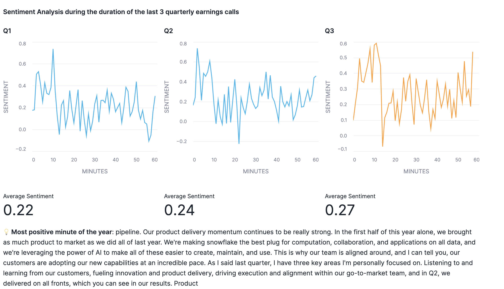
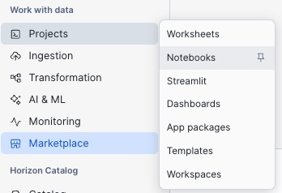

# <h1black>Analyst </h1black><h1blue>Investor Calls</h1blue>

Snowflake Inc., like all publicly listed companies, conducts public announcements of its quarterly financial results. In this project, we will process the Q3 earnings call recording featuring Snowflake’s CEO and CFO. The workflow involves converting the MP3 audio file into text using **AI_TRANSCRIBE**. Once transcribed, the text will be summarized to extract key insights. Finally, this summary will be stored in a dedicated **Summary** table for further analysis. We will add this unstructured data summary into our Cortex Agent at the end of the lab. This will show you the power of converted calls into text and then into Summary using cortex and then front ending them using Snowflake intelligence.

**Let's Begin analysing sound transcript data**
- Go back to the home page and click on **Projects > Notebooks**

- Click on the **ANALYSE_SOUND** notebook
- Run through the notebook to analyse the sound transcripts which also includes sentiment analysis and an introduction to how **Vector Embeddings** enhances search capabilities.

